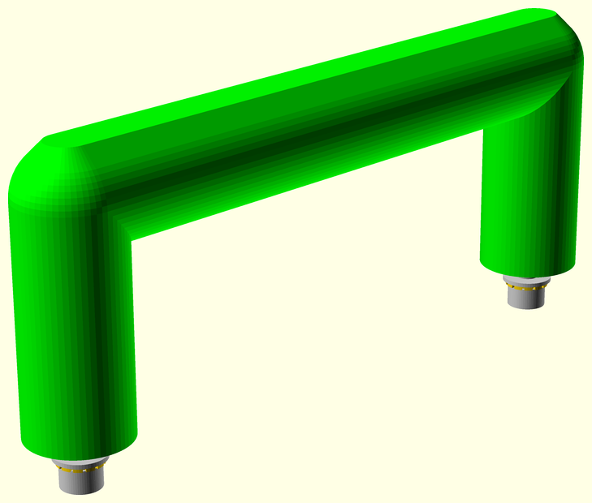

# NopSCADlib usage

## Requirements
1. OpenSCAD 2021.01 or later, download it from here: https://www.openscad.org/downloads.html
1. Python 3.6+ from https://www.python.org/downloads/
1. ImageMagick 7 www.imagemagick.org

These are all cross platform tools so NopSCADlib should work on any platform that supports them, although it has currently only been tested on Win7.
They all need to be included in the executable search path so that they work from the command line.

### Python packages

The following Python modules are used and can be installed with pip:

```
pip install colorama
pip install codespell
pip install markdown
```

The 7 SEGMENT.TTF font from the docs directory is needed for simulating 7 segment displays and needs to be installed.

## Installation

OpenSCAD has to be setup to find libraries by setting the `OPENSCADPATH` environment variable to where you want to file your libraries and NopSCADlib needs to be installed
in the directory it points to. This can be done with `git clone https://github.com/nophead/NopSCADlib.git` while in that directory or, if you don't want to use GIT,
by downloading https://github.com/nophead/NopSCADlib/archive/master.zip and unzipping it to a directory called NopSCADlib.

The `NopSCADlib/scripts` directory needs to be added to the executable search path, `PATH` on Windows and `path` on Linux and Mac.

Note that on Linux and OSX the full file name including the `.py` will be needed.

The installation can be tested by opening `NopSCADlib/libtest.scad` in the OpenSCAD GUI. It should render all the objects in the library in about 2 minutes.

Running `tests` from the command line will run all the tests in the `tests` directory and build the `readme.md` catalog for GitHub and render it to `readme.html`
for local preview.

## Directory structure

| Path | Contents |
|:-----|:------|
| `NopSCADlib` | Top level scad files, e.g. `lib.scad` |
| `NopSCADlib/doc` | Documentation like this that is not automatically generated |
| `NopSCADlib/examples` | Example projects |
| `NopSCADlib/gallery` | Pictures of items that have been made with the library |
| `NopSCADlib/printed` | Scad files for making reusable printed parts |
| `NopSCADlib/scripts` | Python scripts |
| `NopSCADlib/tests` | A stand alone test for each type of vitamin and most of the utilities |
| `NopSCADlib/utils`   | Utility scad files |
| `NopSCADlib/utils/core` | Core utilities used by nearly everything |
| `NopSCADlib/vitamins` | Generally a pair of .scad files for each type of vitamin. The plural version contains object definitions to be included and it uses the singular version. |


## Making a project

Each project has its own directory and that is used to derive the project's name.
There should also be a subdirectory called `scad` with a scad file in it that contains the main assembly.
A skeleton project looks like this: -

    //! Project description in Markdown format before the first include.
    $pp1_colour = "grey";           // Override any global defaults here if required, see NopSCADlib/global_defs.scad.
    include <NopSCADlib/lib.scad>   // Includes all the vitamins and utilities in NopSCADlib but not the printed parts.

    ...

    //! Assembly instructions in Markdown format in front of each module that makes an assembly.
    module main_assembly()
    assembly("main") {
        ...
    }

    if($preview)
        main_assembly();

Other scad files can be added to the scad directory and included or used as required.

* Subassemblies can be added in the same format as `main_assembly()`, i.e. a module called `something_assembly()`, taking no parameters and calling `assembly("something")`
 with the rest of its contents passed as children.
It needs to be called directly or indirectly from `main_assembly()` to appear in the view and on the BOM.
Assembly instructions should be added directly before the module definition in comments marked with `//!`.

* Any printed parts should be made by a module called `something_stl()`, taking no parameters and calling `stl("something")` so they appear on the BOM when called from
an assembly. Printed parts are usually `color`ed and `render`ed at the point they are used in the assembly.

* Any 2D routed parts should be made by a module called `something_dxf()`, taking no parameters and calling `dxf("something")` so they appear on the BOM when called from an
assembly. They are generally made from a `sheet_2D()` with holes subtracted from it. That will also put the sheet material on the BOM.
They are then expanded to 3D using `render_2D_sheet()` when they are placed in an assembly.

When `make_all` is run from the top level directory of the project it will create the following sub-directories and populate them:-

| Directory | Contents |
|:----------|:---------|
| assemblies | For each assembly: an assembled view and an exploded assembly view, in large and small formats |
| bom | A flat BOM in `bom.txt` for the whole project, flat BOMs in text format for each assembly and a hierarchical BOM in JSON format: `bom.json`.|
| deps | Dependency files for each scad file in the project, so that subsequent builds can be incremental |
| dxfs | DXF files for all the CNC routed parts in the project and small PNG images of them |
| stls | STL files for all the printed parts in the project and small PNG images of them |

It will also make a Markdown assembly manual called `readme.md` suitable for GitHub, a version rendered to HTML for viewing locally called `readme.html` and a second
HTML version called `printme.html`. This has page breaks instead of horizontal rules between sections and can be converted to PDF using Chrome to make a stand alone manual.

Each time OpenSCAD is run to produce STL files, DXF files or assembly views, the time it takes is recorded and compared with the previous time.
At the end the times are printed with the delta from the last run and coloured red or green if they have got significantly faster or slower.
This is useful for optimising the scad code for speed.

When PNG files are made they are compared with the previous version and only updated if they have changed. When that happens a PNG difference file is created, so you can
review the changes graphically. They will be deleted on the next run.

## Notes

### Including the library

All the vitamins and utilities are included if you include [NopSCADlib/lib.scad](../lib.scad).
Printed parts are not included and need to be used or included explicitly, their documentation states which files need to be included rather than used.

This is the easiest way to use the library and is reasonably efficient because the only files included are the object list definitions, all the functions and modules are used, so
get shared if other files in the project include `lib.scad` as well, or if you have multiple projects open in the same instance of OpenSCAD.

One downside is that any change to the library will mean all the project files need regenerating.
A more optimised approach for large projects is to include [NopSCADlib/core.scad](../core.scad) instead.
That only has the a small set of utilities and the global settings in [global_defs.scad](../global_defs.scad) plus screws, nuts and washers that are required by a lot of other vitamins.
Any other vitamins used need to be included explicitly. One can copy the includes or use a line from [NopSCADlib/lib.scad](../lib.scad).

### Project Description

A description of the project can be placed in comments in Markdown format before the first include file.
By default this is followed by a picture of the main assembly unless the description contains any pictures.

The description can be divided into two or three sections using //! ***, which is a Markdown horizontal rule in a comment.
If there is a second section it is placed after the table of contents and a third section will be placed after the parts list.

If an actual horizontal rule is desired the alternative Markdown markup //! --- can be used.

### Parametric parts.

Modules that generate parts and assemblies need to take no parameters so that they can be called from the framework to make the STL files and assembly views, etc.
Sometimes parts or asemblies need to be parametric, for example fan guards take the fan as a parameter.
To work around this the `fan_guard()` module calls the `stl()` module with a variable name which has a suffix of the fan width, e.g. "fan_guard_60".
This ensures that if there are different sized fans in the same project the STL files have unique names.
It is then up to the user to add a wrapper to their project called `fan_guard_60_stl()` that calls `fan_guard()` with a 60mm fan: -

    module fan_guard_60_stl() fan_guard(fan60x15);

Calling `fan_guard(fan60x15)` draws a fan guard for a 60mm fan and puts `fan_guard_60.stl` on the BOM. The framework then looks for a module `fan_guard_60_stl()` to
generate it.

This is OK if the fan will always be 60mm but what if the project is parametric and the fan size can vary?
To cater for that `fan_guard()` can be passed a `name` parameter to name the STL.
For example a 3D printer might have a bed cooling fan and different sized machines might have different size fans.

    bed_fan = fan80x38;

    module bed_fan_guard_stl() fan_guard(bed_fan, name = "bed_fan_guard");

In this case the STL file has a constant name related to its use, regardless of what size it is.

### Assembly boundaries

The `assembly()` module is used to mark assemblies that correspond to a step of construction.
Each assembly named in this way gets a page in the build manual with a list of the parts and sub-assemblies that it uses, an exploded view,
some build instructions and then the assembled view.
This doesn't always correspond with how one would want to structure the code.
For example, consider a 3D printed handle with inserts and screws and washers to attach it.
It is convenient to have an assembly module that includes all the fasteners, so that a single module call adds the handle and its fasteners, specifying the panel thickness.



In terms of assembling it though you don't add all the fasteners and then use that as a sub-assembly.
You actually insert the Heatfit inserts first and then the handle with its inserts becomes a sub-assembly.
The other fasteners need to be added to the parent assembly and inserting them becomes a build step of that parent assembly.
This is achieved by having a pair of modules: -

    //
    //! Place inserts in the bottom of the posts and push them home with a soldering iron with a conical bit heated to 200&deg;C.
    //
    module handle_assembly() pose([225, 0, 150], [0, 0, 14]) //! Printed part with inserts in place
    assembly("handle", ngb = true) {
        translate_z(handle_height())
            stl_colour(pp1_colour) vflip() handle_stl();

        handle_screw_positions()
            vflip()
                insert(insert);
    }

    module handle_fastened_assembly(thickness) { //! Assembly with fasteners in place
        screw_length = screw_length(screw, thickness, 2, true, longer = true);

        handle_assembly();

        handle_screw_positions()
            vflip()
                translate_z(thickness)
                    screw_and_washer(screw, screw_length, true);
    }

Notice how the first module `handle_assembly()` uses `assembly()` and has a build instruction. It isn't used directly in a project though, `handle_fastened_assembly()` is
what is actually called from the parent assembly.
Because it doesn't have a call to `assembly()`, the fasteners are added to the parent but the STL and the inserts become a sub-assembly.

When the parent assembly is shown exploded the handle's screws will be exploded but the inserts won't. They only explode when the sub-assembly is shown exloded.

Note also the `pose([225, 0, 150], [0, 0, 14])` call before the `assembly()` call. This allows the sub-assembly to be posed differently in its build step but doesn't
affect its orientation in the parent assembly. The pose parameters are the rotation and the translation taken from the GUI.

Setting `ngb = true` in the `assembly()` prevents the handle assembly appearing as a columun in the top level BOM in the build instructions.
Instead its parts are merged into the parent BOM so the correct quantites are listed.

### Exploded diagrams

A lot of vitamins explode themselves when `$explode=1`. This is done with module `explode()` that can be passed a Z offset, or a 3D vector that gives the displacement
and it draws a line from the original position to the exploded position. The line can be offset from the origin of the component by specifying an offset vector.

Often user assemblies need to add `explode()` in various places to explode printed parts, for example.

### Creating vitamins

Most vitamins are parametric and use a named list of properties to describe them is a pseudo OO style.
These lists are passed to every function or module related to the vitamin as the first parameter called `type`.
They need to be included in the user code, so that the list names are visible. The functions and modules however only need to be used, not included.

This leads to a pair of files for each vitamin. One with a plural name that defines the objects and then uses the file with a singular name
that includes the implementation functions and modules.

A few vitamins are non-parametric one offs, for example the MicroView. In these cases there is only one file with the singular name that needs to be used directly.
Similarly simple vitamins like rods that only need two parameters don't need named lists, so only have a single file.

Each property in the object type list is accessed by a function to give it a name and isolate the rest of the code from changes to the list order.
Only the property accessor functions need to be kept in sync with the object definitions.
These functions take a particular form, so they can be scraped out and added to the documentation as properties. E.g.

    function spring_od(type)     = type[1]; //! Outside diameter

Other functions and modules with `//!` comments will be added to the documentation as functions and modules.
Functions and modules without these special comments are considered private and do not appear in the documentation.

A vitamin announces itself to the BOM by calling the `vitamin()` module with a string description composed of two parts separated by a colon.
The first part is a string representation of the module instantiation.
This is used in the documentation to show how to instantiate every part available.
To facilitate this the first element in the type list is the name of the list as a string and is simply accessed as `type[0]`.

The part of the description after the colon is free format text that appears on the BOM. Since vitamins are listed alphabetically starting the description with the broad
category of the part and leaving the more refined description to the end generates tidier parts lists.
For example `Screw M3 pan x 30mm` ensures all the screws appear together and are ordered by their diameter before length, although `M3 x 30mm pan screw` would be
more natural.

Vitamins are only ever previewed, so they are optimised to draw quickly in F5 and don't need to worry about being manifold.
In OpenCSG 3D difference and intersection are relatively slow and the negative volumes interfere with nearby objects when they are composed into assemblies. For this reason as much
as possible is done by unioning primitives and extruded 2D shapes. Any 3D differences or intersections are wrapped in `render()` so that CGAL will compute a polyhedron
that is cached and reused. This will be very slow the first time it renders but very fast afterwards.

### Panels and Platters

The `stls` and `dxfs` scripts produce a file for each part but often it is desirable to print or route collections of parts laid out together.
This can be done by adding scad files to folders called `platters` for STL files and `panels` for DXF files.
These can aggregate and lay out parts by including `NopSCADlib/core.scad` and using modules `use_stl(name)` and `use_dxf(name)`.
These modules import the already generated singular STL and DXF files, so they are relatively fast. The name does not include the suffix.
The scad files typically also need to include other files from the project to get the dimensions of the parts to calculate their positions.

The composite part files have the same name as the scad file that generates them, with the suffix changed to `.stl` or `.dxf`.

The generated files are placed in `stls/printed` and `dxfs/routed`.
Any parts that are not covered by the platters / panels are copied into the `printed` / `routed` directories, so that they contain everything to be made.

### Multiple configurations

Some parametric designs might have several configurations, for example a 3D printer with different size options. If several configurations need to be supported at the
 same time multiple sets of BOMS, STLS and DXFs need to be generated in separate diectories. NopSCADlib supports this by having multiple configuration files named
`config_<target_name>.scad`. All the scripts take an optional first parameter that selects one of these config files by specifying `target_name`.

The target config file is selected by generating `target.scad` that includes `config_<target_name>.scad`.
The rest of the project includes `target.scad` to use the configuration.
Additionally all the generated file directories (assemblies, bom, stls, dxfs, etc.) are placed in a sub-directory called `<target_name>`.

The build system will look for a `<target_name>_assembly` module and use it as the top level module instead of `main_assembly` if it it exists.
That allows the project description to be target specific if the top level modules are in different scad files.
The top level assembly instructions and assembly contents could also be different if appropriate.

If the top level module is just a shell wrapper that simply includes one other assembly, with no additional parts, then it is removed from the build instructions and
the assembly it calls becomes the top level. This allows a different project description for each target but only one set of top level instructions without repeating them.

### Costed BOMs

A costed bill of materials can be made by opening the generated file `bom/bom.csv` in a spreadsheet program using a single quote as the string delimiter and comma as the field separator.
That gets a list of part descriptions and quantities to which prices can be added to get the total cost and perhaps a URL of where to buy each part.

If a Python file called `parts.py` is found then `bom.py` will attempt to call functions for each part to get a price and URL.
Any functions not found are printed, so you can see the format expected.
The function are passed the quantity to allow them to calculate volume discounts, etc.

### Other libraries

The build scripts need to be able to locate the source files where the modules to generate the STL files and assemblies reside. They will search all the scad files
in the project plus any `printed` directories outside the project. This covers the printed parts in NopSCADlib but also allows other libraries of printed parts.

Other libraries of vitamins and utilities can be used provided they follow the same convensions of NopSCADlib. The build scripts don't need to search those.
