
# EnviroPlus
Environmental monitor using Enviro+ sensor board and a Raspberry Pi Zero.

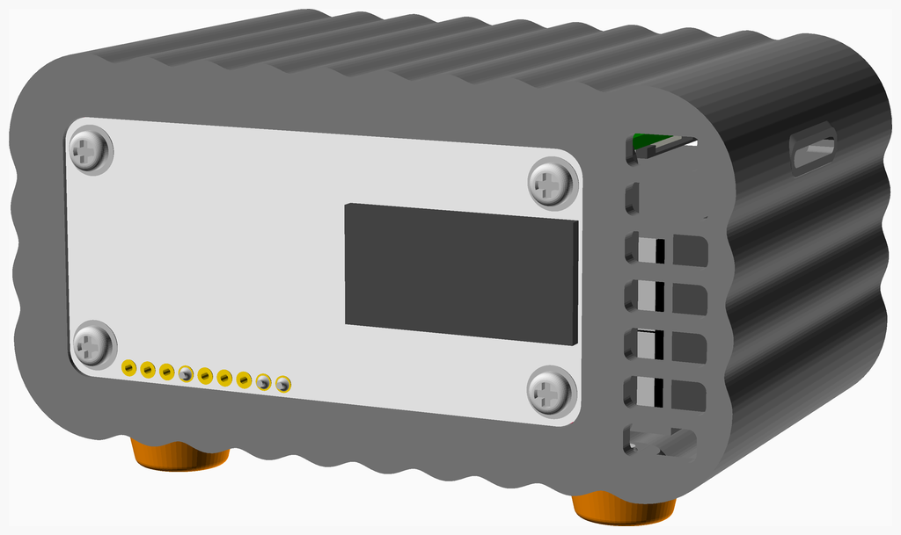

---
## Table of Contents
1. [Parts list](#Parts_list)
1. [Back Assembly](#back_assembly)
1. [RPI Assembly](#RPI_assembly)
1. [Fan Controller Assembly](#fan_controller_assembly)
1. [Enviro Assembly](#enviro_assembly)
1. [Case Assembly](#case_assembly)
1. [Enviro Case Assembly](#enviro_case_assembly)
1. [RPI Case Assembly](#RPI_case_assembly)
1. [Main Assembly](#main_assembly)

[Top](#TOP)

---

## Parts list
| Back | RPI | Fan&nbsp;Controller | Enviro | Case | Enviro&nbsp;Case | RPI&nbsp;Case | Main | TOTALS |  |
|---:|---:|---:|---:|---:|---:|---:|---:|---:|:---|
|  |  |  |  |  |  |  |  | | **Vitamins** |
| &nbsp;&nbsp;.&nbsp; | &nbsp;&nbsp;.&nbsp; | &nbsp;&nbsp;.&nbsp; | &nbsp;&nbsp;1&nbsp; | &nbsp;&nbsp;.&nbsp; | &nbsp;&nbsp;.&nbsp; | &nbsp;&nbsp;.&nbsp; | &nbsp;&nbsp;.&nbsp; |  &nbsp;&nbsp;1&nbsp; | &nbsp;&nbsp; Enviro+ |
| &nbsp;&nbsp;1&nbsp; | &nbsp;&nbsp;.&nbsp; | &nbsp;&nbsp;.&nbsp; | &nbsp;&nbsp;.&nbsp; | &nbsp;&nbsp;.&nbsp; | &nbsp;&nbsp;.&nbsp; | &nbsp;&nbsp;.&nbsp; | &nbsp;&nbsp;.&nbsp; |  &nbsp;&nbsp;1&nbsp; | &nbsp;&nbsp; Fan 17mm x 8mm |
| &nbsp;&nbsp;.&nbsp; | &nbsp;&nbsp;.&nbsp; | &nbsp;&nbsp;.&nbsp; | &nbsp;&nbsp;.&nbsp; | &nbsp;&nbsp;4&nbsp; | &nbsp;&nbsp;.&nbsp; | &nbsp;&nbsp;.&nbsp; | &nbsp;&nbsp;.&nbsp; |  &nbsp;&nbsp;4&nbsp; | &nbsp;&nbsp; Heatfit insert M2 x 4mm |
| &nbsp;&nbsp;.&nbsp; | &nbsp;&nbsp;1&nbsp; | &nbsp;&nbsp;.&nbsp; | &nbsp;&nbsp;.&nbsp; | &nbsp;&nbsp;.&nbsp; | &nbsp;&nbsp;.&nbsp; | &nbsp;&nbsp;.&nbsp; | &nbsp;&nbsp;.&nbsp; |  &nbsp;&nbsp;1&nbsp; | &nbsp;&nbsp; Micro SD card |
| &nbsp;&nbsp;.&nbsp; | &nbsp;&nbsp;.&nbsp; | &nbsp;&nbsp;.&nbsp; | &nbsp;&nbsp;.&nbsp; | &nbsp;&nbsp;.&nbsp; | &nbsp;&nbsp;4&nbsp; | &nbsp;&nbsp;.&nbsp; | &nbsp;&nbsp;.&nbsp; |  &nbsp;&nbsp;4&nbsp; | &nbsp;&nbsp; Nut M2.5 x 2.2mm nyloc |
| &nbsp;&nbsp;1&nbsp; | &nbsp;&nbsp;.&nbsp; | &nbsp;&nbsp;.&nbsp; | &nbsp;&nbsp;.&nbsp; | &nbsp;&nbsp;.&nbsp; | &nbsp;&nbsp;.&nbsp; | &nbsp;&nbsp;.&nbsp; | &nbsp;&nbsp;.&nbsp; |  &nbsp;&nbsp;1&nbsp; | &nbsp;&nbsp; PMS5003 particle detector |
| &nbsp;&nbsp;.&nbsp; | &nbsp;&nbsp;1&nbsp; | &nbsp;&nbsp;.&nbsp; | &nbsp;&nbsp;.&nbsp; | &nbsp;&nbsp;.&nbsp; | &nbsp;&nbsp;.&nbsp; | &nbsp;&nbsp;.&nbsp; | &nbsp;&nbsp;.&nbsp; |  &nbsp;&nbsp;1&nbsp; | &nbsp;&nbsp; Pin header 20 x 2 right_angle |
| &nbsp;&nbsp;.&nbsp; | &nbsp;&nbsp;1&nbsp; | &nbsp;&nbsp;.&nbsp; | &nbsp;&nbsp;.&nbsp; | &nbsp;&nbsp;.&nbsp; | &nbsp;&nbsp;.&nbsp; | &nbsp;&nbsp;.&nbsp; | &nbsp;&nbsp;.&nbsp; |  &nbsp;&nbsp;1&nbsp; | &nbsp;&nbsp; Raspberry Pi Zero |
| &nbsp;&nbsp;.&nbsp; | &nbsp;&nbsp;.&nbsp; | &nbsp;&nbsp;1&nbsp; | &nbsp;&nbsp;.&nbsp; | &nbsp;&nbsp;.&nbsp; | &nbsp;&nbsp;.&nbsp; | &nbsp;&nbsp;.&nbsp; | &nbsp;&nbsp;.&nbsp; |  &nbsp;&nbsp;1&nbsp; | &nbsp;&nbsp; SMD capacitor 1206 10uF |
| &nbsp;&nbsp;.&nbsp; | &nbsp;&nbsp;.&nbsp; | &nbsp;&nbsp;1&nbsp; | &nbsp;&nbsp;.&nbsp; | &nbsp;&nbsp;.&nbsp; | &nbsp;&nbsp;.&nbsp; | &nbsp;&nbsp;.&nbsp; | &nbsp;&nbsp;.&nbsp; |  &nbsp;&nbsp;1&nbsp; | &nbsp;&nbsp; SMD resistor 0805 3K3 0.125W |
| &nbsp;&nbsp;.&nbsp; | &nbsp;&nbsp;.&nbsp; | &nbsp;&nbsp;1&nbsp; | &nbsp;&nbsp;.&nbsp; | &nbsp;&nbsp;.&nbsp; | &nbsp;&nbsp;.&nbsp; | &nbsp;&nbsp;.&nbsp; | &nbsp;&nbsp;.&nbsp; |  &nbsp;&nbsp;1&nbsp; | &nbsp;&nbsp; SOT223 package FZT851 |
| &nbsp;&nbsp;.&nbsp; | &nbsp;&nbsp;.&nbsp; | &nbsp;&nbsp;.&nbsp; | &nbsp;&nbsp;.&nbsp; | &nbsp;&nbsp;.&nbsp; | &nbsp;&nbsp;.&nbsp; | &nbsp;&nbsp;.&nbsp; | &nbsp;&nbsp;4&nbsp; |  &nbsp;&nbsp;4&nbsp; | &nbsp;&nbsp; Screw M2 cap x  6mm |
| &nbsp;&nbsp;.&nbsp; | &nbsp;&nbsp;.&nbsp; | &nbsp;&nbsp;.&nbsp; | &nbsp;&nbsp;.&nbsp; | &nbsp;&nbsp;.&nbsp; | &nbsp;&nbsp;.&nbsp; | &nbsp;&nbsp;2&nbsp; | &nbsp;&nbsp;.&nbsp; |  &nbsp;&nbsp;2&nbsp; | &nbsp;&nbsp; Screw M2.5 pan x  6.4mm |
| &nbsp;&nbsp;.&nbsp; | &nbsp;&nbsp;.&nbsp; | &nbsp;&nbsp;.&nbsp; | &nbsp;&nbsp;.&nbsp; | &nbsp;&nbsp;.&nbsp; | &nbsp;&nbsp;4&nbsp; | &nbsp;&nbsp;.&nbsp; | &nbsp;&nbsp;.&nbsp; |  &nbsp;&nbsp;4&nbsp; | &nbsp;&nbsp; Screw M2.5 pan x  8mm |
| &nbsp;&nbsp;.&nbsp; | &nbsp;&nbsp;.&nbsp; | &nbsp;&nbsp;.&nbsp; | &nbsp;&nbsp;.&nbsp; | &nbsp;&nbsp;3&nbsp; | &nbsp;&nbsp;.&nbsp; | &nbsp;&nbsp;.&nbsp; | &nbsp;&nbsp;.&nbsp; |  &nbsp;&nbsp;3&nbsp; | &nbsp;&nbsp; Screw M3 pan x  6mm |
| &nbsp;&nbsp;.&nbsp; | &nbsp;&nbsp;.&nbsp; | &nbsp;&nbsp;1&nbsp; | &nbsp;&nbsp;.&nbsp; | &nbsp;&nbsp;.&nbsp; | &nbsp;&nbsp;.&nbsp; | &nbsp;&nbsp;.&nbsp; | &nbsp;&nbsp;.&nbsp; |  &nbsp;&nbsp;1&nbsp; | &nbsp;&nbsp; Veroboard 6 holes x 6 strips |
| &nbsp;&nbsp;.&nbsp; | &nbsp;&nbsp;.&nbsp; | &nbsp;&nbsp;.&nbsp; | &nbsp;&nbsp;.&nbsp; | &nbsp;&nbsp;.&nbsp; | &nbsp;&nbsp;.&nbsp; | &nbsp;&nbsp;.&nbsp; | &nbsp;&nbsp;4&nbsp; |  &nbsp;&nbsp;4&nbsp; | &nbsp;&nbsp; Washer  M2 x 5mm x 0.3mm |
| &nbsp;&nbsp;.&nbsp; | &nbsp;&nbsp;.&nbsp; | &nbsp;&nbsp;.&nbsp; | &nbsp;&nbsp;.&nbsp; | &nbsp;&nbsp;.&nbsp; | &nbsp;&nbsp;4&nbsp; | &nbsp;&nbsp;.&nbsp; | &nbsp;&nbsp;.&nbsp; |  &nbsp;&nbsp;4&nbsp; | &nbsp;&nbsp; Washer  M2.5 x 5.9mm x 0.5mm |
| &nbsp;&nbsp;.&nbsp; | &nbsp;&nbsp;.&nbsp; | &nbsp;&nbsp;.&nbsp; | &nbsp;&nbsp;.&nbsp; | &nbsp;&nbsp;3&nbsp; | &nbsp;&nbsp;.&nbsp; | &nbsp;&nbsp;.&nbsp; | &nbsp;&nbsp;.&nbsp; |  &nbsp;&nbsp;3&nbsp; | &nbsp;&nbsp; Washer  M3 x 7mm x 0.5mm |
| &nbsp;&nbsp;.&nbsp; | &nbsp;&nbsp;.&nbsp; | &nbsp;&nbsp;1&nbsp; | &nbsp;&nbsp;.&nbsp; | &nbsp;&nbsp;.&nbsp; | &nbsp;&nbsp;.&nbsp; | &nbsp;&nbsp;.&nbsp; | &nbsp;&nbsp;.&nbsp; |  &nbsp;&nbsp;1&nbsp; | &nbsp;&nbsp; Wire link 0.8mm x 0.4" |
| &nbsp;&nbsp;.&nbsp; | &nbsp;&nbsp;.&nbsp; | &nbsp;&nbsp;3&nbsp; | &nbsp;&nbsp;.&nbsp; | &nbsp;&nbsp;.&nbsp; | &nbsp;&nbsp;.&nbsp; | &nbsp;&nbsp;.&nbsp; | &nbsp;&nbsp;.&nbsp; |  &nbsp;&nbsp;3&nbsp; | &nbsp;&nbsp; Wire link 0.8mm x 6.5mm |
| &nbsp;&nbsp;2&nbsp; | &nbsp;&nbsp;3&nbsp; | &nbsp;&nbsp;8&nbsp; | &nbsp;&nbsp;1&nbsp; | &nbsp;&nbsp;10&nbsp; | &nbsp;&nbsp;12&nbsp; | &nbsp;&nbsp;2&nbsp; | &nbsp;&nbsp;8&nbsp; | &nbsp;&nbsp;46&nbsp; | &nbsp;&nbsp;Total vitamins count |
|  |  |  |  |  |  |  |  | | **3D printed parts** |
| &nbsp;&nbsp;.&nbsp; | &nbsp;&nbsp;.&nbsp; | &nbsp;&nbsp;.&nbsp; | &nbsp;&nbsp;.&nbsp; | &nbsp;&nbsp;1&nbsp; | &nbsp;&nbsp;.&nbsp; | &nbsp;&nbsp;.&nbsp; | &nbsp;&nbsp;.&nbsp; |  &nbsp;&nbsp;1&nbsp; | &nbsp;&nbsp;bulkhead.stl |
| &nbsp;&nbsp;.&nbsp; | &nbsp;&nbsp;.&nbsp; | &nbsp;&nbsp;.&nbsp; | &nbsp;&nbsp;.&nbsp; | &nbsp;&nbsp;1&nbsp; | &nbsp;&nbsp;.&nbsp; | &nbsp;&nbsp;.&nbsp; | &nbsp;&nbsp;.&nbsp; |  &nbsp;&nbsp;1&nbsp; | &nbsp;&nbsp;enviro_plus_case.stl |
| &nbsp;&nbsp;1&nbsp; | &nbsp;&nbsp;.&nbsp; | &nbsp;&nbsp;.&nbsp; | &nbsp;&nbsp;.&nbsp; | &nbsp;&nbsp;.&nbsp; | &nbsp;&nbsp;.&nbsp; | &nbsp;&nbsp;.&nbsp; | &nbsp;&nbsp;.&nbsp; |  &nbsp;&nbsp;1&nbsp; | &nbsp;&nbsp;enviro_plus_case_base.stl |
| &nbsp;&nbsp;1&nbsp; | &nbsp;&nbsp;.&nbsp; | &nbsp;&nbsp;.&nbsp; | &nbsp;&nbsp;.&nbsp; | &nbsp;&nbsp;.&nbsp; | &nbsp;&nbsp;.&nbsp; | &nbsp;&nbsp;.&nbsp; | &nbsp;&nbsp;.&nbsp; |  &nbsp;&nbsp;1&nbsp; | &nbsp;&nbsp;fan_duct.stl |
| &nbsp;&nbsp;.&nbsp; | &nbsp;&nbsp;.&nbsp; | &nbsp;&nbsp;.&nbsp; | &nbsp;&nbsp;.&nbsp; | &nbsp;&nbsp;3&nbsp; | &nbsp;&nbsp;.&nbsp; | &nbsp;&nbsp;.&nbsp; | &nbsp;&nbsp;.&nbsp; |  &nbsp;&nbsp;3&nbsp; | &nbsp;&nbsp;foot.stl |
| &nbsp;&nbsp;2&nbsp; | &nbsp;&nbsp;.&nbsp; | &nbsp;&nbsp;.&nbsp; | &nbsp;&nbsp;.&nbsp; | &nbsp;&nbsp;5&nbsp; | &nbsp;&nbsp;.&nbsp; | &nbsp;&nbsp;.&nbsp; | &nbsp;&nbsp;.&nbsp; | &nbsp;&nbsp;7&nbsp; | &nbsp;&nbsp;Total 3D printed parts count |

[Top](#TOP)

---

## Back Assembly
### Vitamins
|Qty|Description|
|---:|:----------|
|1| Fan 17mm x 8mm|
|1| PMS5003 particle detector|

### 3D Printed parts

| 1 x [enviro_plus_case_base.stl](stls/enviro_plus_case_base.stl) | 1 x [fan_duct.stl](stls/fan_duct.stl) |
|---|---|
| 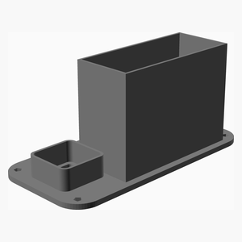 | 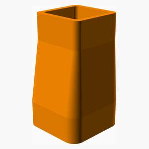 

### Assembly instructions
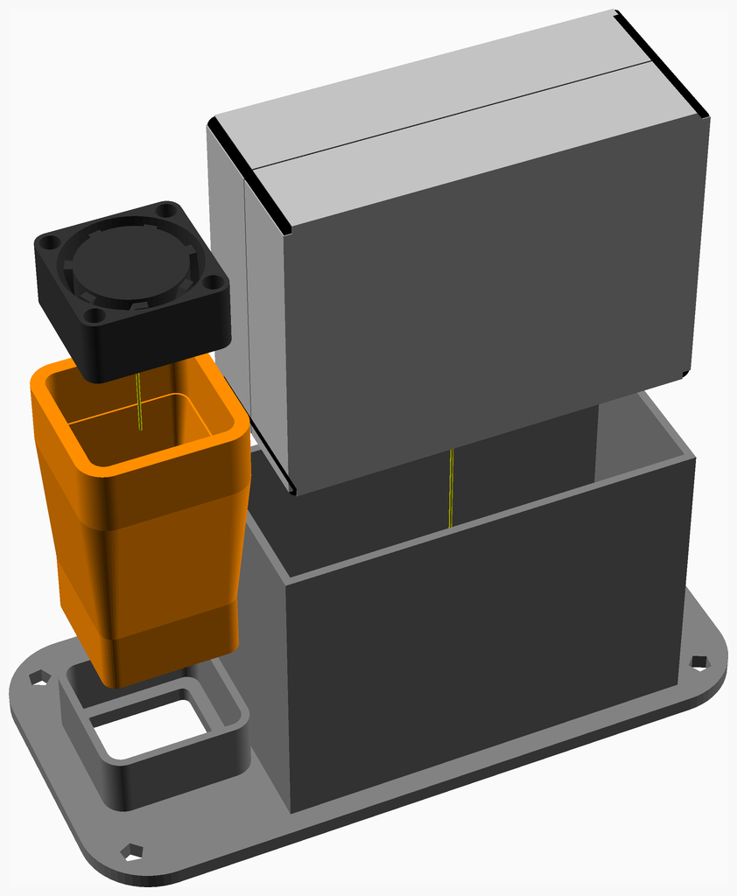

1. Print the fan duct in flexible TPE with low infill.
1. Slide the pms5003 into the printed receptacle with the fan to the outside. Secure with tape if it is loose.
1. Slide the fan into the fan duct.
1. Slide the fan duct into the printed recepacle.

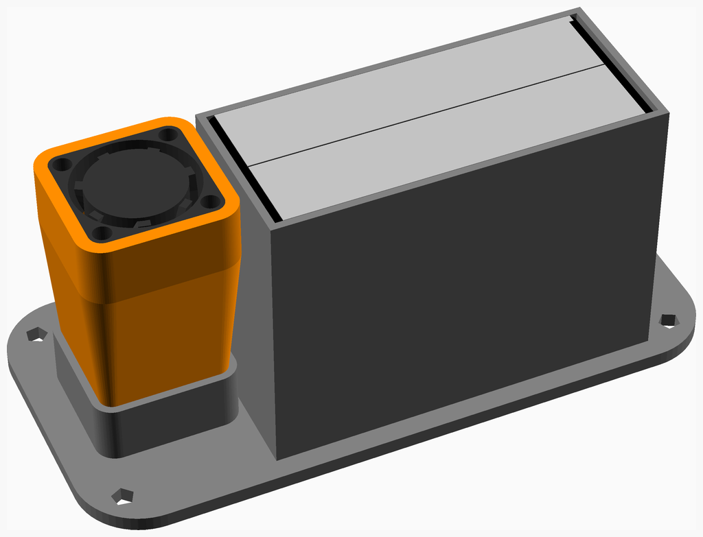

[Top](#TOP)

---

## RPI Assembly
### Vitamins
|Qty|Description|
|---:|:----------|
|1| Micro SD card|
|1| Pin header 20 x 2 right_angle|
|1| Raspberry Pi Zero|

### Assembly instructions
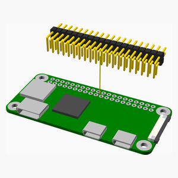

* Solder a right angle connector to the Raspberry Pi Zero.

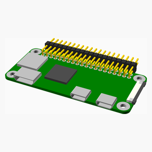

[Top](#TOP)

---

## Fan Controller Assembly
### Vitamins
|Qty|Description|
|---:|:----------|
|1| SMD capacitor 1206 10uF|
|1| SMD resistor 0805 3K3 0.125W|
|1| SOT223 package FZT851|
|1| Veroboard 6 holes x 6 strips|
|1| Wire link 0.8mm x 0.4"|
|3| Wire link 0.8mm x 6.5mm|

### Assembly instructions
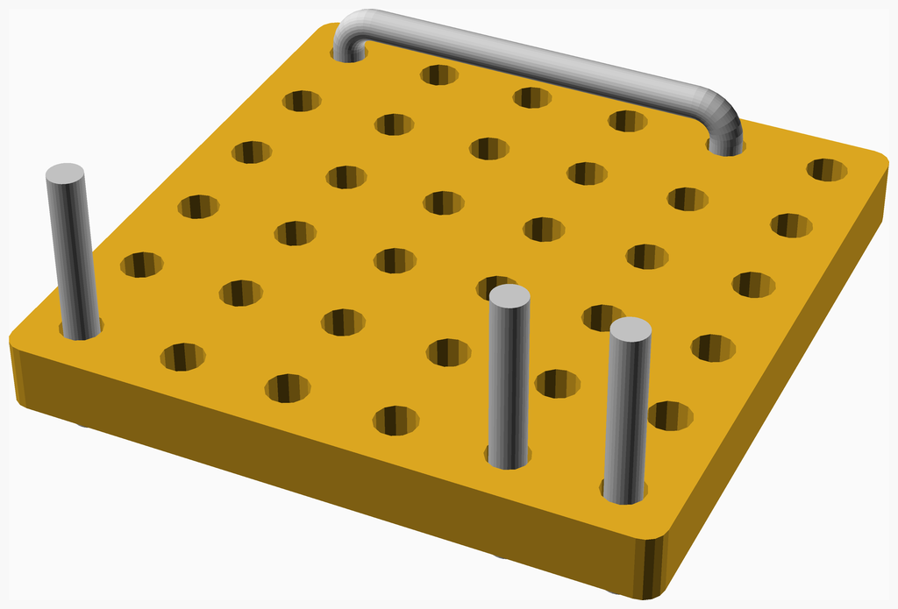

The fan controller is a single transistor wired as a Miller integrator that effectively multiplies the capacitor value by the gain of the transistor.
It converts the PWM signal on GPI4 to a stead DC voltage so that the fan doesn't whine, or stutter.

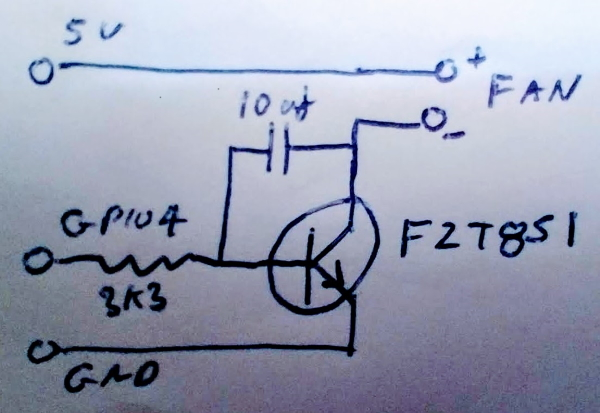

***
* Make two track cuts as shown, one wide and the other narrow.

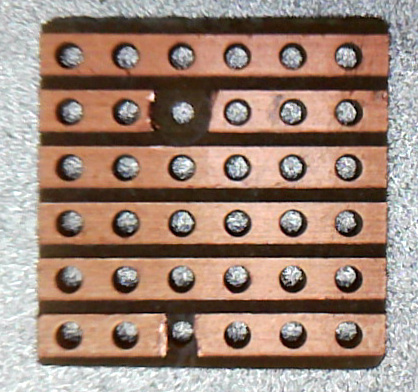

1. Add the SMT compeonents and then the wire links.
1. Add more solder around the transistor to act as a heatsink.

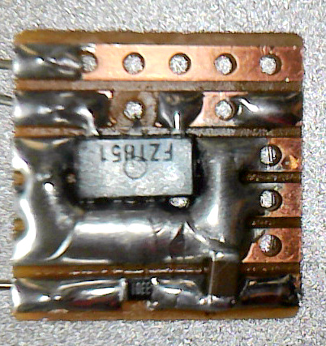

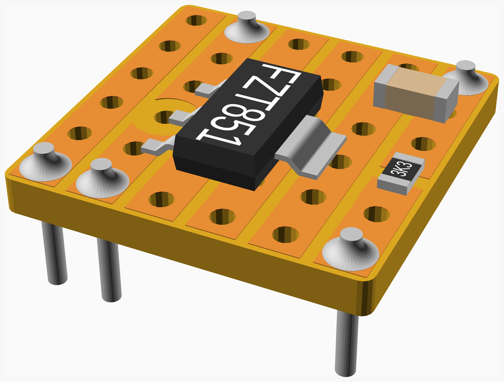

[Top](#TOP)

---

## Enviro Assembly
### Vitamins
|Qty|Description|
|---:|:----------|
|1| Enviro+|

### Sub-assemblies

| 1 x fan_controller_assembly |
|---|
| 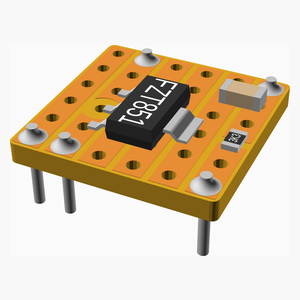 

### Assembly instructions
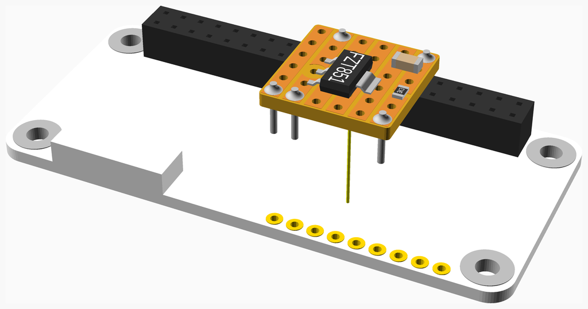

* Solder the fan_controller to the Enviro+ expansion connector at the 5V, GND and #4 pins.

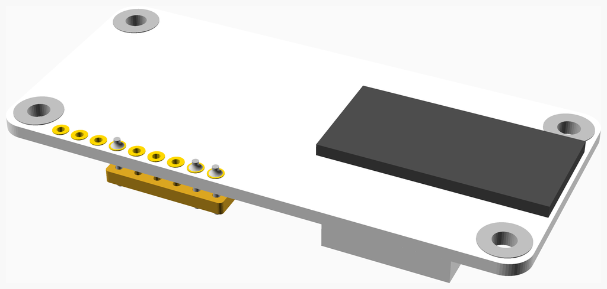

[Top](#TOP)

---

## Case Assembly
### Vitamins
|Qty|Description|
|---:|:----------|
|4| Heatfit insert M2 x 4mm|
|3| Screw M3 pan x  6mm|
|3| Washer  M3 x 7mm x 0.5mm|

### 3D Printed parts

| 1 x [bulkhead.stl](stls/bulkhead.stl) | 1 x [enviro_plus_case.stl](stls/enviro_plus_case.stl) | 3 x [foot.stl](stls/foot.stl) |
|---|---|---|
| 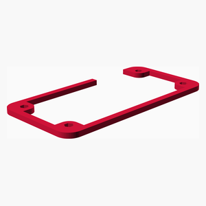 | 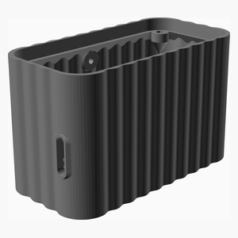 | 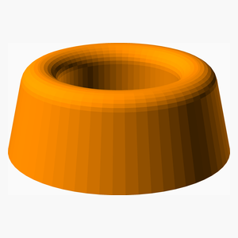 

### Assembly instructions
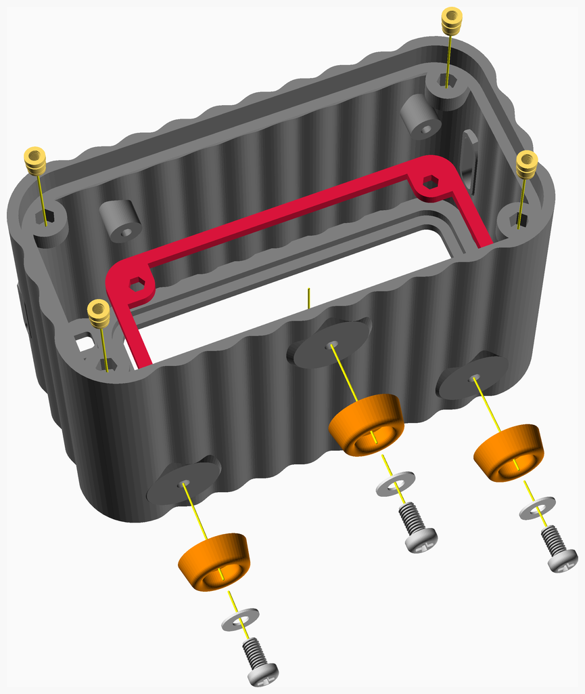

1. Solvent weld or glue the bulkhead into the recess in the bottom of the case.
1. Fit the heatfit inserts with a soldering iron with a conical bit heated to about 200&deg;C.
1. Tap the three holes for the feet with an M3 tap.
1. Screw on the three feet with M3 x 6mm pan screws and washers.

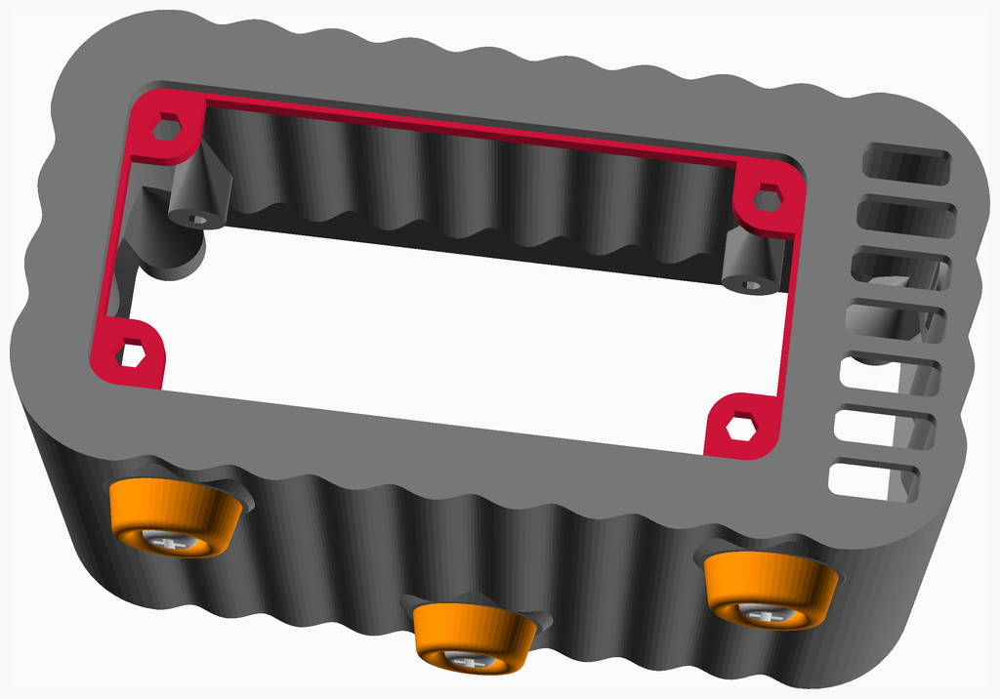

[Top](#TOP)

---

## Enviro Case Assembly
### Vitamins
|Qty|Description|
|---:|:----------|
|4| Nut M2.5 x 2.2mm nyloc|
|4| Screw M2.5 pan x  8mm|
|4| Washer  M2.5 x 5.9mm x 0.5mm|

### Sub-assemblies

| 1 x case_assembly | 1 x enviro_assembly |
|---|---|
| 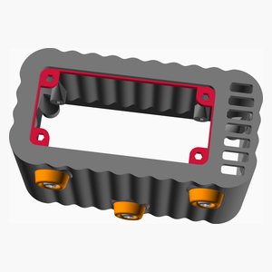 | 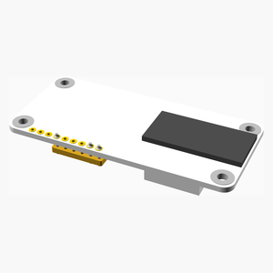 

### Assembly instructions
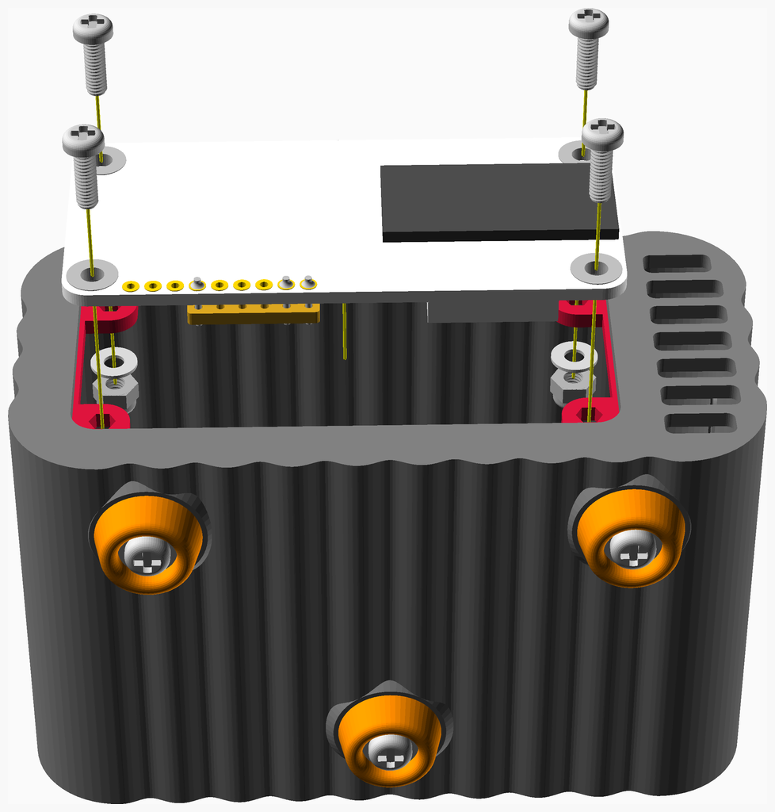

* Screw the Enviro+ PCB to the front of the case using M2.5 x 8mm pan screws with washer and nuts on the inside.

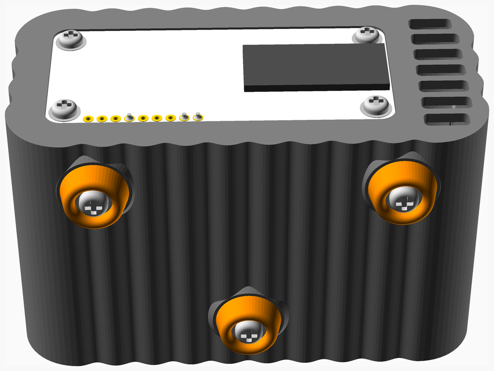

[Top](#TOP)

---

## RPI Case Assembly
### Vitamins
|Qty|Description|
|---:|:----------|
|2| Screw M2.5 pan x  6.4mm|

### Sub-assemblies

| 1 x RPI_assembly | 1 x enviro_case_assembly |
|---|---|
|  | 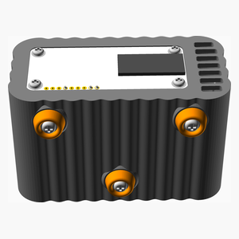 

### Assembly instructions

* Plug the RPi into the Enviro+ socket and secure with two screws self tapped into the bosses in the case.

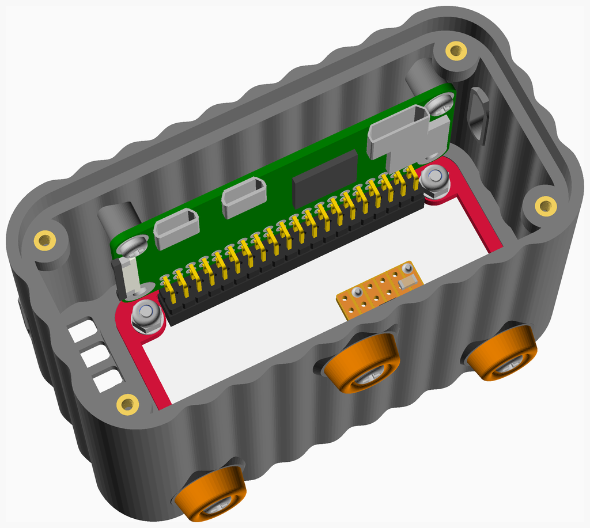

[Top](#TOP)

---

## Main Assembly
### Vitamins
|Qty|Description|
|---:|:----------|
|4| Screw M2 cap x  6mm|
|4| Washer  M2 x 5mm x 0.3mm|

### Sub-assemblies

| 1 x RPI_case_assembly | 1 x back_assembly |
|---|---|
| 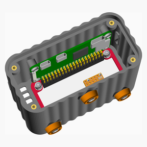 | 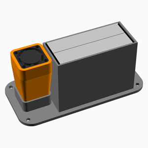 

### Assembly instructions
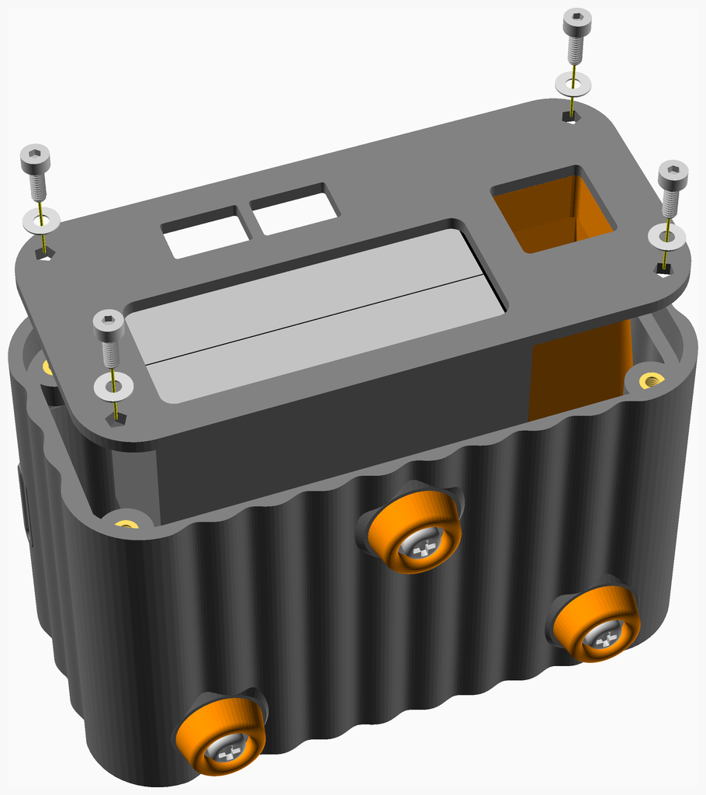

* Solder the fan wires to the veroboard assembly

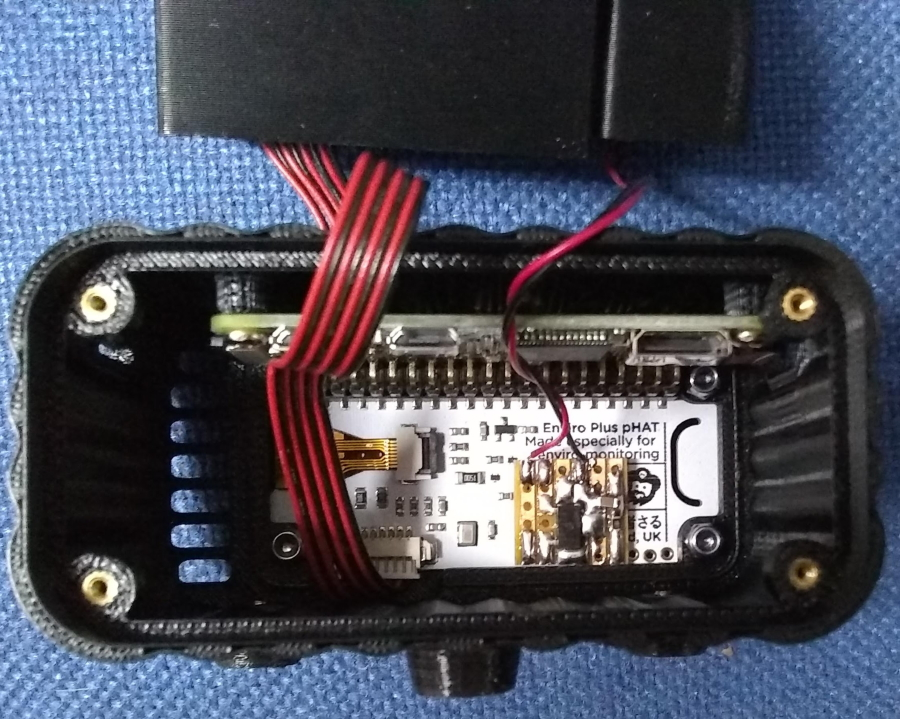

* Slide the back assembly into the case and secure with four M2 x 6mm cap screws and washers.

[Top](#TOP)
