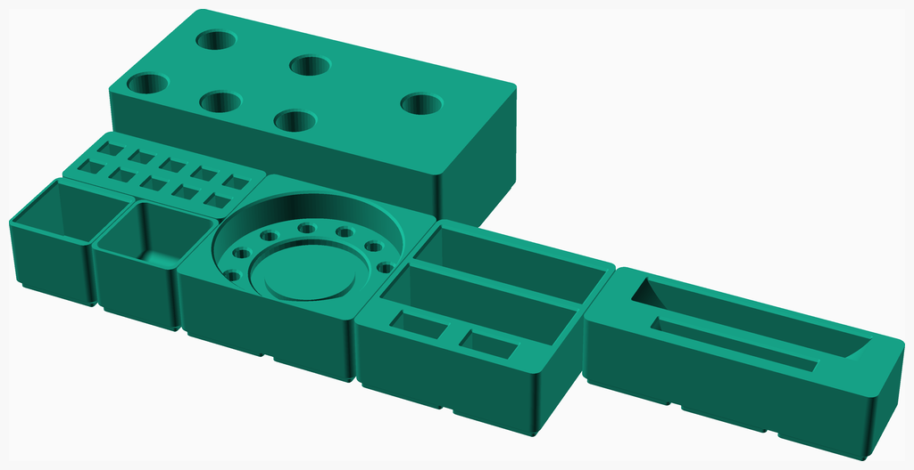
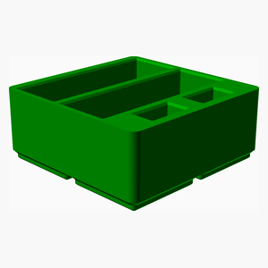
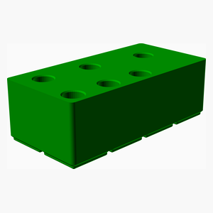
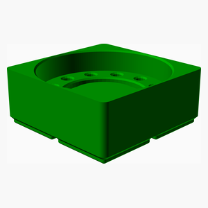
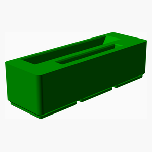
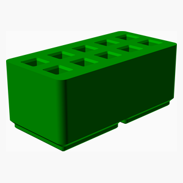

# Gridfinity
Gridfinity examples

---
## Table of Contents
1. [Parts list](#Parts_list)
1. [Main Assembly](#main_assembly)

[Top](#TOP)

---

## Parts list
| Main | TOTALS |  |
|---:|---:|:---|
|  | | **3D printed parts** |
| &nbsp;&nbsp;1&nbsp; |  &nbsp;&nbsp;1&nbsp; | &nbsp;&nbsp;123_block_stand.stl |
| &nbsp;&nbsp;1&nbsp; |  &nbsp;&nbsp;1&nbsp; | &nbsp;&nbsp;1x1_bin.stl |
| &nbsp;&nbsp;1&nbsp; |  &nbsp;&nbsp;1&nbsp; | &nbsp;&nbsp;MT2_stand.stl |
| &nbsp;&nbsp;1&nbsp; |  &nbsp;&nbsp;1&nbsp; | &nbsp;&nbsp;chuck_jaw_bin.stl |
| &nbsp;&nbsp;1&nbsp; |  &nbsp;&nbsp;1&nbsp; | &nbsp;&nbsp;chuck_stand.stl |
| &nbsp;&nbsp;1&nbsp; |  &nbsp;&nbsp;1&nbsp; | &nbsp;&nbsp;faceplate_stand.stl |
| &nbsp;&nbsp;1&nbsp; |  &nbsp;&nbsp;1&nbsp; | &nbsp;&nbsp;lathe_tool_stand.stl |
| &nbsp;&nbsp;7&nbsp; | &nbsp;&nbsp;7&nbsp; | &nbsp;&nbsp;Total 3D printed parts count |

[Top](#TOP)

---

## Main Assembly
### 3D Printed parts

| 1 x [123_block_stand.stl](stls/123_block_stand.stl) | 1 x [1x1_bin.stl](stls/1x1_bin.stl) | 1 x [MT2_stand.stl](stls/MT2_stand.stl) |
|---|---|---|
|  |  |  

| 1 x [chuck_jaw_bin.stl](stls/chuck_jaw_bin.stl) | 1 x [chuck_stand.stl](stls/chuck_stand.stl) | 1 x [faceplate_stand.stl](stls/faceplate_stand.stl) |
|---|---|---|
|  |  |  

| 1 x [lathe_tool_stand.stl](stls/lathe_tool_stand.stl) |
|---|
|  

### Assembly instructions

Show all the Gridfinity parts

[Top](#TOP)
