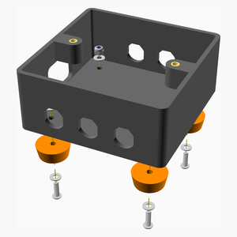
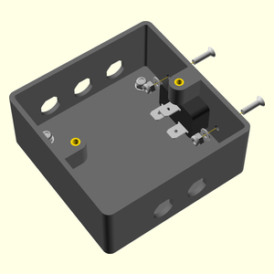
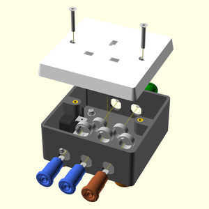
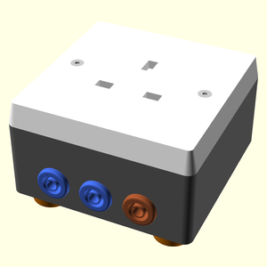

# MainsBreakOutBox
13A socket break out box with 4mm jacks to measure voltage and / or load current and earth leakage current.

---
## Table of Contents
[TOC]

[Top](#mainsbreakoutbox)

---
## Parts list
| Base | Feet | Mains&nbsp;In | Main | TOTALS |  |
|--:|--:|--:|--:|--:|:--|
| &nbsp;&nbsp;.&nbsp; | &nbsp;&nbsp;.&nbsp; | &nbsp;&nbsp;.&nbsp; | &nbsp;&nbsp;2&nbsp; |  &nbsp;&nbsp;2&nbsp; | &nbsp;&nbsp; 4mm shielded jack socket blue |
| &nbsp;&nbsp;.&nbsp; | &nbsp;&nbsp;.&nbsp; | &nbsp;&nbsp;.&nbsp; | &nbsp;&nbsp;1&nbsp; |  &nbsp;&nbsp;1&nbsp; | &nbsp;&nbsp; 4mm shielded jack socket brown |
| &nbsp;&nbsp;.&nbsp; | &nbsp;&nbsp;.&nbsp; | &nbsp;&nbsp;.&nbsp; | &nbsp;&nbsp;2&nbsp; |  &nbsp;&nbsp;2&nbsp; | &nbsp;&nbsp; 4mm shielded jack socket green |
| &nbsp;&nbsp;.&nbsp; | &nbsp;&nbsp;.&nbsp; | &nbsp;&nbsp;.&nbsp; | &nbsp;&nbsp;3&nbsp; |  &nbsp;&nbsp;3&nbsp; | &nbsp;&nbsp; Ferrule for 1.5mm^2 wire |
| &nbsp;&nbsp;2&nbsp; | &nbsp;&nbsp;.&nbsp; | &nbsp;&nbsp;.&nbsp; | &nbsp;&nbsp;.&nbsp; |  &nbsp;&nbsp;2&nbsp; | &nbsp;&nbsp; Heatfit insert M3 |
| &nbsp;&nbsp;.&nbsp; | &nbsp;&nbsp;.&nbsp; | &nbsp;&nbsp;3&nbsp; | &nbsp;&nbsp;5&nbsp; |  &nbsp;&nbsp;8&nbsp; | &nbsp;&nbsp; Heatshrink sleeving ID 3.2mm x 15mm - not shown |
| &nbsp;&nbsp;.&nbsp; | &nbsp;&nbsp;.&nbsp; | &nbsp;&nbsp;1&nbsp; | &nbsp;&nbsp;.&nbsp; |  &nbsp;&nbsp;1&nbsp; | &nbsp;&nbsp; IEC inlet for ATX |
| &nbsp;&nbsp;.&nbsp; | &nbsp;&nbsp;.&nbsp; | &nbsp;&nbsp;.&nbsp; | &nbsp;&nbsp;1&nbsp; |  &nbsp;&nbsp;1&nbsp; | &nbsp;&nbsp; Mains socket 13A |
| &nbsp;&nbsp;.&nbsp; | &nbsp;&nbsp;4&nbsp; | &nbsp;&nbsp;2&nbsp; | &nbsp;&nbsp;.&nbsp; |  &nbsp;&nbsp;6&nbsp; | &nbsp;&nbsp; Nut M3 nyloc |
| &nbsp;&nbsp;.&nbsp; | &nbsp;&nbsp;.&nbsp; | &nbsp;&nbsp;2&nbsp; | &nbsp;&nbsp;.&nbsp; |  &nbsp;&nbsp;2&nbsp; | &nbsp;&nbsp; Screw M3 cs cap x 12mm |
| &nbsp;&nbsp;.&nbsp; | &nbsp;&nbsp;.&nbsp; | &nbsp;&nbsp;.&nbsp; | &nbsp;&nbsp;2&nbsp; |  &nbsp;&nbsp;2&nbsp; | &nbsp;&nbsp; Screw M3 cs cap x 20mm |
| &nbsp;&nbsp;.&nbsp; | &nbsp;&nbsp;4&nbsp; | &nbsp;&nbsp;.&nbsp; | &nbsp;&nbsp;.&nbsp; |  &nbsp;&nbsp;4&nbsp; | &nbsp;&nbsp; Screw M3 dome x 10mm |
| &nbsp;&nbsp;.&nbsp; | &nbsp;&nbsp;8&nbsp; | &nbsp;&nbsp;2&nbsp; | &nbsp;&nbsp;.&nbsp; |  &nbsp;&nbsp;10&nbsp; | &nbsp;&nbsp; Washer  M3 x 7mm x 0.5mm |
| &nbsp;&nbsp;.&nbsp; | &nbsp;&nbsp;.&nbsp; | &nbsp;&nbsp;1&nbsp; | &nbsp;&nbsp;1&nbsp; |  &nbsp;&nbsp;2&nbsp; | &nbsp;&nbsp; Wire blue  30/0.25 length 150mm |
| &nbsp;&nbsp;.&nbsp; | &nbsp;&nbsp;.&nbsp; | &nbsp;&nbsp;1&nbsp; | &nbsp;&nbsp;.&nbsp; |  &nbsp;&nbsp;1&nbsp; | &nbsp;&nbsp; Wire brown  30/0.25 length 150mm |
| &nbsp;&nbsp;.&nbsp; | &nbsp;&nbsp;.&nbsp; | &nbsp;&nbsp;1&nbsp; | &nbsp;&nbsp;.&nbsp; |  &nbsp;&nbsp;1&nbsp; | &nbsp;&nbsp; Wire brown  7/0.2 length 150mm |
| &nbsp;&nbsp;.&nbsp; | &nbsp;&nbsp;.&nbsp; | &nbsp;&nbsp;1&nbsp; | &nbsp;&nbsp;1&nbsp; |  &nbsp;&nbsp;2&nbsp; | &nbsp;&nbsp; Wire green & yellow  30/0.25 length 150mm |
|  |  |  |  | | **3D Printed parts** |
| &nbsp;&nbsp;.&nbsp; | &nbsp;&nbsp;4&nbsp; | &nbsp;&nbsp;.&nbsp; | &nbsp;&nbsp;.&nbsp; | &nbsp;&nbsp;4&nbsp; | &nbsp;&nbsp;&nbsp;foot.stl |
| &nbsp;&nbsp;1&nbsp; | &nbsp;&nbsp;.&nbsp; | &nbsp;&nbsp;.&nbsp; | &nbsp;&nbsp;.&nbsp; | &nbsp;&nbsp;1&nbsp; | &nbsp;&nbsp;&nbsp;socket_box.stl |
[Top](#mainsbreakoutbox)

---
## Base Assembly
### Vitamins
|Qty|Description|
|--:|:----------|
|2| Heatfit insert M3|

### 3D Printed parts

| 1 x socket_box.stl |
|--|
|  

### Assembly instructions

1. Remove the support material from under the insert lugs.
2. Place the inserts into the holes in the lugs and press home with a soldering iron with a conical bit heated to 200&deg;C.

[Top](#mainsbreakoutbox)

---
## Feet Assembly
### Vitamins
|Qty|Description|
|--:|:----------|
|8| Washer  M3 x 7mm x 0.5mm|
|4| Screw M3 dome x 10mm|
|4| Nut M3 nyloc|

### 3D Printed parts

| 4 x foot.stl |
|--|
|  

### Sub-assemblies

| 1 x base_assembly |
|--|
|  

### Assembly instructions

* Attach the four feet using 10mm M3 dome screws, washers above and below and nyloc nuts

[Top](#mainsbreakoutbox)

---
## Mains In Assembly
### Vitamins
|Qty|Description|
|--:|:----------|
|1| Wire green & yellow  30/0.25 length 150mm|
|1| Wire blue  30/0.25 length 150mm|
|1| Wire brown  30/0.25 length 150mm|
|1| Wire brown  7/0.2 length 150mm|
|3| Heatshrink sleeving ID 3.2mm x 15mm - not shown|
|1| IEC inlet for ATX|
|2| Screw M3 cs cap x 12mm|
|2| Washer  M3 x 7mm x 0.5mm|
|2| Nut M3 nyloc|

### Sub-assemblies

| 1 x feet_assembly |
|--|
|  

### Assembly instructions

1. Solder wires to the IEC terminals and cover the joints with heatshrink sleeving.
    * Use wire rated for 13A, e.g. 1.5mm2, the easiest source is stripping 13A rated flex.
    * Attach one green & yellow to the earth, one blue to neutral and two brown to the live. The second brown one can be thinner because it is only for voltage measurement.
    * The earth, neutral and thin live wires should be long enough to protrude through the appropriate 4mm jack holes far enough to be able to strip and solder them to the jacks.
    * The thick brown needs to be long enough to reach the socket.
1. Attach the IEC inlet using two 12mm M3 countersunk cap screws, washers and nyloc nuts on the back.

[Top](#mainsbreakoutbox)

---
## Main Assembly
### Vitamins
|Qty|Description|
|--:|:----------|
|1| Wire green & yellow  30/0.25 length 150mm|
|1| Wire blue  30/0.25 length 150mm|
|5| Heatshrink sleeving ID 3.2mm x 15mm - not shown|
|3| Ferrule for 1.5mm^2 wire|
|1| Mains socket 13A|
|2| Screw M3 cs cap x 20mm|
|2| 4mm shielded jack socket blue|
|1| 4mm shielded jack socket brown|
|2| 4mm shielded jack socket green|

### Sub-assemblies

| 1 x mains_in_assembly |
|--|
|  

### Assembly instructions

1. Put the blue wire from the IEC inlet through the bottom left jack hole, strip it, add heatshrink sleeving and solder it to one of the blue jack sockets.
1. Put the green & yellow wire through the top left jack hole, add heatshrink sleeving and solder it to one of the green jack sockets.
1. Put the thin brown wire the bottom right jack hole, add heatshrink sleeving and solder it to the brown jack socket.
1. Shrink the heatshrink and screw in the three jack sockets.
1. Solder a 13A green & yellow wire to the remaining green jack socket, long enough to reach the 13A socket. Add heashrink and fit it to the top right jack hole.
1. Solder a 13A blue wire to the remaining blue jack socket, long enough to reach the 13A socket. Add heatshrink and fit to the bottom middle jack hole.
1. Crimp appropriate ferrules to the three wires and connect them to the 13A socket.
1. Screw the socket onto the top of the case using two 20mm M3 countersunk cap screws.

[Top](#mainsbreakoutbox)
