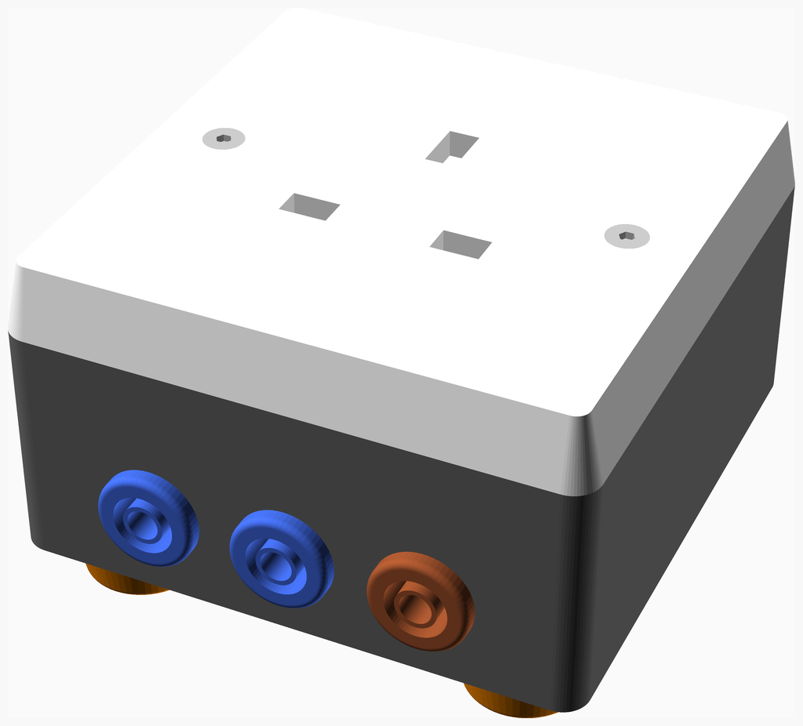
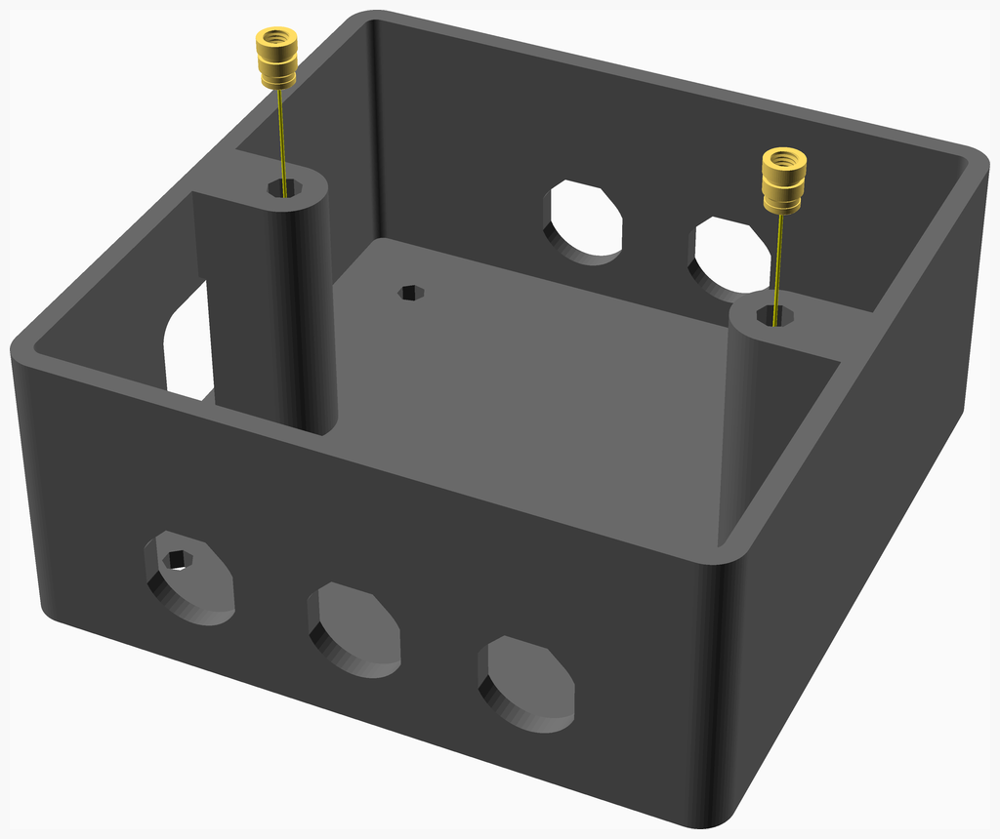
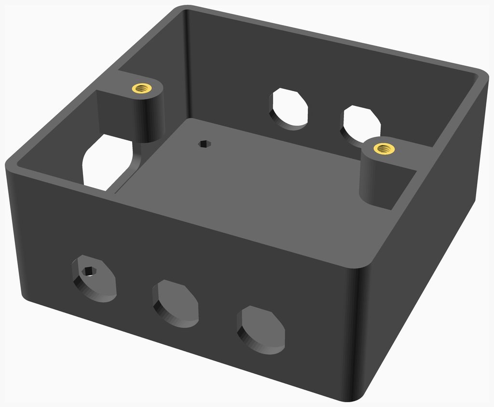
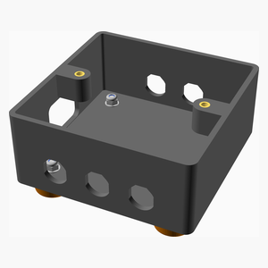
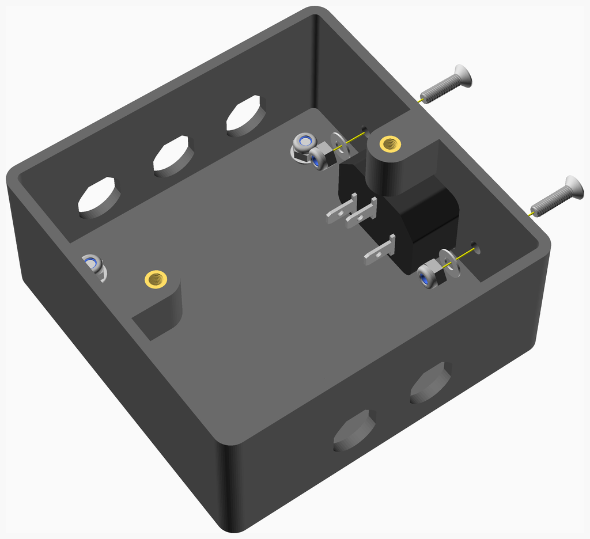

# MainsBreakOutBox
13A socket break out box with 4mm jacks to measure voltage and / or load current and earth leakage current.

Intended as a simple example of NopSCADlib use. Don't build it unless you understand the safety implications of working with mains electricity. In the words of
the great [Paul Carlson](https://www.youtube.com/channel/UCU9SoQxJewrWb_3GxeteQPA), "if you are following along, you are doing so at your own risk".

In normal use the neutral jack sockets are linked with a short lead and so are the two earth jacks. Current can be safely measured using a clamp ammeter around the neutral link.

Voltage and current waveforms can be measured simultaneously with a [Mooshimeter](https://moosh.im/) CAT III multimeter connected to the bottom three jacks.

Earth leakage current can be measured by connecting an AC milliampere meter between the two earth jacks. The DUT must be mounted on an insulated substrate and must not be touched
while its earth is disconnected. Don't be tempted to float the earth of an oscilloscope this way, use a mains isolation transformer to power the DUT instead.
Earth leakage can be measured Canadian CSA style by disconnected the neutral link from the left socket and linking the central neutral to the live.

---
## Table of Contents
1. [Parts list](#Parts_list)
1. [Base Assembly](#base_assembly)
1. [Feet Assembly](#feet_assembly)
1. [Mains In Assembly](#mains_in_assembly)
1. [Main Assembly](#main_assembly)

[Top](#TOP)

---

## Parts list
| Base | Feet | Mains&nbsp;In | Main | TOTALS |  |
|---:|---:|---:|---:|---:|:---|
|  |  |  |  | | **Vitamins** |
| &nbsp;&nbsp;.&nbsp; | &nbsp;&nbsp;.&nbsp; | &nbsp;&nbsp;.&nbsp; | &nbsp;&nbsp;2&nbsp; |  &nbsp;&nbsp;2&nbsp; | &nbsp;&nbsp; 4mm shielded jack socket blue |
| &nbsp;&nbsp;.&nbsp; | &nbsp;&nbsp;.&nbsp; | &nbsp;&nbsp;.&nbsp; | &nbsp;&nbsp;1&nbsp; |  &nbsp;&nbsp;1&nbsp; | &nbsp;&nbsp; 4mm shielded jack socket brown |
| &nbsp;&nbsp;.&nbsp; | &nbsp;&nbsp;.&nbsp; | &nbsp;&nbsp;.&nbsp; | &nbsp;&nbsp;2&nbsp; |  &nbsp;&nbsp;2&nbsp; | &nbsp;&nbsp; 4mm shielded jack socket green |
| &nbsp;&nbsp;.&nbsp; | &nbsp;&nbsp;.&nbsp; | &nbsp;&nbsp;.&nbsp; | &nbsp;&nbsp;3&nbsp; |  &nbsp;&nbsp;3&nbsp; | &nbsp;&nbsp; Ferrule for 1.5mm^2 wire - not shown |
| &nbsp;&nbsp;2&nbsp; | &nbsp;&nbsp;.&nbsp; | &nbsp;&nbsp;.&nbsp; | &nbsp;&nbsp;.&nbsp; |  &nbsp;&nbsp;2&nbsp; | &nbsp;&nbsp; Heatfit insert M3 x 5.8mm |
| &nbsp;&nbsp;.&nbsp; | &nbsp;&nbsp;.&nbsp; | &nbsp;&nbsp;3&nbsp; | &nbsp;&nbsp;5&nbsp; |  &nbsp;&nbsp;8&nbsp; | &nbsp;&nbsp; Heatshrink sleeving ID 3.2mm x 15mm - not shown |
| &nbsp;&nbsp;.&nbsp; | &nbsp;&nbsp;.&nbsp; | &nbsp;&nbsp;1&nbsp; | &nbsp;&nbsp;.&nbsp; |  &nbsp;&nbsp;1&nbsp; | &nbsp;&nbsp; IEC inlet for ATX |
| &nbsp;&nbsp;.&nbsp; | &nbsp;&nbsp;.&nbsp; | &nbsp;&nbsp;.&nbsp; | &nbsp;&nbsp;1&nbsp; |  &nbsp;&nbsp;1&nbsp; | &nbsp;&nbsp; Mains socket 13A |
| &nbsp;&nbsp;.&nbsp; | &nbsp;&nbsp;4&nbsp; | &nbsp;&nbsp;2&nbsp; | &nbsp;&nbsp;.&nbsp; |  &nbsp;&nbsp;6&nbsp; | &nbsp;&nbsp; Nut M3 x 2.4mm nyloc |
| &nbsp;&nbsp;.&nbsp; | &nbsp;&nbsp;.&nbsp; | &nbsp;&nbsp;2&nbsp; | &nbsp;&nbsp;.&nbsp; |  &nbsp;&nbsp;2&nbsp; | &nbsp;&nbsp; Screw M3 cs cap x 12mm |
| &nbsp;&nbsp;.&nbsp; | &nbsp;&nbsp;.&nbsp; | &nbsp;&nbsp;.&nbsp; | &nbsp;&nbsp;2&nbsp; |  &nbsp;&nbsp;2&nbsp; | &nbsp;&nbsp; Screw M3 cs cap x 20mm |
| &nbsp;&nbsp;.&nbsp; | &nbsp;&nbsp;4&nbsp; | &nbsp;&nbsp;.&nbsp; | &nbsp;&nbsp;.&nbsp; |  &nbsp;&nbsp;4&nbsp; | &nbsp;&nbsp; Screw M3 dome x 10mm |
| &nbsp;&nbsp;.&nbsp; | &nbsp;&nbsp;8&nbsp; | &nbsp;&nbsp;2&nbsp; | &nbsp;&nbsp;.&nbsp; |  &nbsp;&nbsp;10&nbsp; | &nbsp;&nbsp; Washer  M3 x 7mm x 0.5mm |
| &nbsp;&nbsp;.&nbsp; | &nbsp;&nbsp;.&nbsp; | &nbsp;&nbsp;1&nbsp; | &nbsp;&nbsp;1&nbsp; |  &nbsp;&nbsp;2&nbsp; | &nbsp;&nbsp; Wire blue 30/0.25mm strands, length 150mm - not shown |
| &nbsp;&nbsp;.&nbsp; | &nbsp;&nbsp;.&nbsp; | &nbsp;&nbsp;2&nbsp; | &nbsp;&nbsp;.&nbsp; |  &nbsp;&nbsp;2&nbsp; | &nbsp;&nbsp; Wire brown 30/0.25mm strands, length 150mm - not shown |
| &nbsp;&nbsp;.&nbsp; | &nbsp;&nbsp;.&nbsp; | &nbsp;&nbsp;1&nbsp; | &nbsp;&nbsp;1&nbsp; |  &nbsp;&nbsp;2&nbsp; | &nbsp;&nbsp; Wire green & yellow 30/0.25mm strands, length 150mm - not shown |
| &nbsp;&nbsp;2&nbsp; | &nbsp;&nbsp;16&nbsp; | &nbsp;&nbsp;14&nbsp; | &nbsp;&nbsp;18&nbsp; | &nbsp;&nbsp;50&nbsp; | &nbsp;&nbsp;Total vitamins count |
|  |  |  |  | | **3D printed parts** |
| &nbsp;&nbsp;.&nbsp; | &nbsp;&nbsp;4&nbsp; | &nbsp;&nbsp;.&nbsp; | &nbsp;&nbsp;.&nbsp; |  &nbsp;&nbsp;4&nbsp; | &nbsp;&nbsp;foot.stl |
| &nbsp;&nbsp;1&nbsp; | &nbsp;&nbsp;.&nbsp; | &nbsp;&nbsp;.&nbsp; | &nbsp;&nbsp;.&nbsp; |  &nbsp;&nbsp;1&nbsp; | &nbsp;&nbsp;socket_box.stl |
| &nbsp;&nbsp;1&nbsp; | &nbsp;&nbsp;4&nbsp; | &nbsp;&nbsp;.&nbsp; | &nbsp;&nbsp;.&nbsp; | &nbsp;&nbsp;5&nbsp; | &nbsp;&nbsp;Total 3D printed parts count |

[Top](#TOP)

---

## Base Assembly
### Vitamins
|Qty|Description|
|---:|:----------|
|2| Heatfit insert M3 x 5.8mm|

### 3D Printed parts

| 1 x [socket_box.stl](stls/socket_box.stl) |
|---|
|  

### Assembly instructions

1. Remove the support material from under the insert lugs.
2. Place the inserts into the holes in the lugs and press home with a soldering iron with a conical bit heated to 200&deg;C.

[Top](#TOP)

---

## Feet Assembly
### Vitamins
|Qty|Description|
|---:|:----------|
|4| Nut M3 x 2.4mm nyloc|
|4| Screw M3 dome x 10mm|
|8| Washer  M3 x 7mm x 0.5mm|

### 3D Printed parts

| 4 x [foot.stl](stls/foot.stl) |
|---|
|  

### Sub-assemblies

| 1 x base_assembly |
|---|
|  

### Assembly instructions

* Attach the four feet using 10mm M3 dome screws, washers above and below and nyloc nuts

[Top](#TOP)

---

## Mains In Assembly
### Vitamins
|Qty|Description|
|---:|:----------|
|3| Heatshrink sleeving ID 3.2mm x 15mm - not shown|
|1| IEC inlet for ATX|
|2| Nut M3 x 2.4mm nyloc|
|2| Screw M3 cs cap x 12mm|
|2| Washer  M3 x 7mm x 0.5mm|
|1| Wire blue 30/0.25mm strands, length 150mm - not shown|
|2| Wire brown 30/0.25mm strands, length 150mm - not shown|
|1| Wire green & yellow 30/0.25mm strands, length 150mm - not shown|

### Sub-assemblies

| 1 x feet_assembly |
|---|
|  

### Assembly instructions

1. Solder wires to the IEC terminals: -
    * Use wire rated for 13A, e.g. 1.5mm2, the easiest source is stripping 13A rated flex.
    * Attach one green & yellow to the earth, one blue to neutral and two brown to the live.
    * The earth, neutral and one of the live wires should be long enough to protrude through the appropriate 4mm jack holes far enough to be able to strip and solder them to the jacks.
    * The second brown needs to be long enough to reach the socket.
1. Cover the the joints with heatshrink sleeving and shrink it with a hot air gun.
1. Attach the IEC inlet using two 12mm M3 countersunk cap screws, washers and nyloc nuts on the back.

[Top](#TOP)

---

## Main Assembly
### Vitamins
|Qty|Description|
|---:|:----------|
|2| 4mm shielded jack socket blue|
|1| 4mm shielded jack socket brown|
|2| 4mm shielded jack socket green|
|3| Ferrule for 1.5mm^2 wire - not shown|
|5| Heatshrink sleeving ID 3.2mm x 15mm - not shown|
|1| Mains socket 13A|
|2| Screw M3 cs cap x 20mm|
|1| Wire blue 30/0.25mm strands, length 150mm - not shown|
|1| Wire green & yellow 30/0.25mm strands, length 150mm - not shown|

### Sub-assemblies

| 1 x mains_in_assembly |
|---|
|  

### Assembly instructions

1. Put the blue wire from the IEC inlet through the bottom left jack hole, strip it, add heatshrink sleeving and solder it to one of the blue jack sockets.
1. Put the green & yellow wire through the top left jack hole, add heatshrink sleeving and solder it to one of the green jack sockets.
1. Put the thin brown wire the bottom right jack hole, add heatshrink sleeving and solder it to the brown jack socket.
1. Shrink the heatshrink and screw in the three jack sockets.
1. Solder a 13A green & yellow wire to the remaining green jack socket, long enough to reach the 13A socket. Add heashrink and fit it to the top right jack hole.
1. Solder a 13A blue wire to the remaining blue jack socket, long enough to reach the 13A socket. Add heatshrink and fit to the bottom middle jack hole.
1. Crimp appropriate ferrules to the three wires and connect them to the 13A socket.
1. Screw the socket onto the top of the case using two 20mm M3 countersunk cap screws.

[Top](#TOP)
