# NopSCADlib
An ever expanding library of parts modelled in OpenSCAD useful for 3D printers and enclosures for electronics, etc.

It contains lots of vitamins (the RepRap term for non-printed parts), some general purpose printed parts and some utilities.
There are also Python scripts to generate Bills of Materials (BOMs),
STL files for all the printed parts, DXF files for CNC routed parts in a project and a manual containing assembly
instructions and exploded views by scraping markdown embedded in OpenSCAD comments, [see scripts](scripts/readme.md).

A simple example project can be found [here](examples/MainsBreakOutBox/readme.md).

For more examples of what it can make see the [gallery](gallery/readme.md).

The license is GNU General Public License v3.0, see [COPYING](COPYING).

See [usage](docs/usage.md) for requirements, installation instructions and a usage guide.

A list of changes classified as breaking, additions or fixes is maintained in [CHANGELOG.md](CHANGELOG.md).

## Table of Contents<a name="top"/>
<table><tr>
<th align="left"> Vitamins A-H </th><th align="left"> Vitamins I-Q </th><th align="left"> Vitamins R-Z </th><th align="left"> Printed </th><th align="left"> Utilities </th><th align="left"> Core Utilities </th></tr>
<tr><td> <a href = "#Axials">Axials</a> </td><td> <a href = "#IECs">IECs</a> </td><td> <a href = "#Rails">Rails</a> </td><td> <a href = "#Box">Box</a> </td><td> <a href = "#Annotation">Annotation</a> </td><td> <a href = "#BOM">BOM</a> </td></tr>
<tr><td> <a href = "#Ball_bearings">Ball_bearings</a> </td><td> <a href = "#Inserts">Inserts</a> </td><td> <a href = "#Ring_terminals">Ring_terminals</a> </td><td> <a href = "#Butt_box">Butt_box</a> </td><td> <a href = "#Bezier">Bezier</a> </td><td> <a href = "#Clip">Clip</a> </td></tr>
<tr><td> <a href = "#Batteries">Batteries</a> </td><td> <a href = "#Jack">Jack</a> </td><td> <a href = "#Rockers">Rockers</a> </td><td> <a href = "#Cable_grommets">Cable_grommets</a> </td><td> <a href = "#Catenary">Catenary</a> </td><td> <a href = "#Global">Global</a> </td></tr>
<tr><td> <a href = "#Bearing_blocks">Bearing_blocks</a> </td><td> <a href = "#LDRs">LDRs</a> </td><td> <a href = "#Rod">Rod</a> </td><td> <a href = "#Camera_housing">Camera_housing</a> </td><td> <a href = "#Core_xy">Core_xy</a> </td><td> <a href = "#Polyholes">Polyholes</a> </td></tr>
<tr><td> <a href = "#Belts">Belts</a> </td><td> <a href = "#LED_meters">LED_meters</a> </td><td> <a href = "#SK_brackets">SK_brackets</a> </td><td> <a href = "#Carriers">Carriers</a> </td><td> <a href = "#Dogbones">Dogbones</a> </td><td> <a href = "#Rounded_rectangle">Rounded_rectangle</a> </td></tr>
<tr><td> <a href = "#Blowers">Blowers</a> </td><td> <a href = "#LEDs">LEDs</a> </td><td> <a href = "#SMDs">SMDs</a> </td><td> <a href = "#Corner_block">Corner_block</a> </td><td> <a href = "#Fillet">Fillet</a> </td><td> <a href = "#Sphere">Sphere</a> </td></tr>
<tr><td> <a href = "#Box_sections">Box_sections</a> </td><td> <a href = "#Leadnuts">Leadnuts</a> </td><td> <a href = "#SSRs">SSRs</a> </td><td> <a href = "#Door_hinge">Door_hinge</a> </td><td> <a href = "#Gears">Gears</a> </td><td> <a href = "#Teardrops">Teardrops</a> </td></tr>
<tr><td> <a href = "#Bulldogs">Bulldogs</a> </td><td> <a href = "#Light_strips">Light_strips</a> </td><td> <a href = "#Screws">Screws</a> </td><td> <a href = "#Door_latch">Door_latch</a> </td><td> <a href = "#Hanging_hole">Hanging_hole</a> </td><td></td></tr>
<tr><td> <a href = "#Buttons">Buttons</a> </td><td> <a href = "#Linear_bearings">Linear_bearings</a> </td><td> <a href = "#Sealing_strip">Sealing_strip</a> </td><td> <a href = "#Drag_chain">Drag_chain</a> </td><td> <a href = "#Horiholes">Horiholes</a> </td><td></td></tr>
<tr><td> <a href = "#Cable_strips">Cable_strips</a> </td><td> <a href = "#Magnets">Magnets</a> </td><td> <a href = "#Shaft_couplings">Shaft_couplings</a> </td><td> <a href = "#Fan_guard">Fan_guard</a> </td><td> <a href = "#Layout">Layout</a> </td><td></td></tr>
<tr><td> <a href = "#Cameras">Cameras</a> </td><td> <a href = "#Mains_sockets">Mains_sockets</a> </td><td> <a href = "#Sheets">Sheets</a> </td><td> <a href = "#Fixing_block">Fixing_block</a> </td><td> <a href = "#Maths">Maths</a> </td><td></td></tr>
<tr><td> <a href = "#Circlips">Circlips</a> </td><td> <a href = "#Microswitches">Microswitches</a> </td><td> <a href = "#Spades">Spades</a> </td><td> <a href = "#Flat_hinge">Flat_hinge</a> </td><td> <a href = "#Offset">Offset</a> </td><td></td></tr>
<tr><td> <a href = "#Components">Components</a> </td><td> <a href = "#Microview">Microview</a> </td><td> <a href = "#Spools">Spools</a> </td><td> <a href = "#Foot">Foot</a> </td><td> <a href = "#Quadrant">Quadrant</a> </td><td></td></tr>
<tr><td> <a href = "#DIP">DIP</a> </td><td> <a href = "#Modules">Modules</a> </td><td> <a href = "#Springs">Springs</a> </td><td> <a href = "#Handle">Handle</a> </td><td> <a href = "#Round">Round</a> </td><td></td></tr>
<tr><td> <a href = "#D_connectors">D_connectors</a> </td><td> <a href = "#Nuts">Nuts</a> </td><td> <a href = "#Stepper_motors">Stepper_motors</a> </td><td> <a href = "#PCB_mount">PCB_mount</a> </td><td> <a href = "#Rounded_cylinder">Rounded_cylinder</a> </td><td></td></tr>
<tr><td> <a href = "#Displays">Displays</a> </td><td> <a href = "#O_ring">O_ring</a> </td><td> <a href = "#Swiss_clips">Swiss_clips</a> </td><td> <a href = "#PSU_shroud">PSU_shroud</a> </td><td> <a href = "#Rounded_polygon">Rounded_polygon</a> </td><td></td></tr>
<tr><td> <a href = "#Extrusion_brackets">Extrusion_brackets</a> </td><td> <a href = "#Opengrab">Opengrab</a> </td><td> <a href = "#Toggles">Toggles</a> </td><td> <a href = "#Pocket_handle">Pocket_handle</a> </td><td> <a href = "#Rounded_triangle">Rounded_triangle</a> </td><td></td></tr>
<tr><td> <a href = "#Extrusions">Extrusions</a> </td><td> <a href = "#PCB">PCB</a> </td><td> <a href = "#Transformers">Transformers</a> </td><td> <a href = "#Press_fit">Press_fit</a> </td><td> <a href = "#Sector">Sector</a> </td><td></td></tr>
<tr><td> <a href = "#Fans">Fans</a> </td><td> <a href = "#PCBs">PCBs</a> </td><td> <a href = "#Tubings">Tubings</a> </td><td> <a href = "#Printed_box">Printed_box</a> </td><td> <a href = "#Sweep">Sweep</a> </td><td></td></tr>
<tr><td> <a href = "#Fuseholder">Fuseholder</a> </td><td> <a href = "#PSUs">PSUs</a> </td><td> <a href = "#Variacs">Variacs</a> </td><td> <a href = "#Printed_pulleys">Printed_pulleys</a> </td><td> <a href = "#Thread">Thread</a> </td><td></td></tr>
<tr><td> <a href = "#Geared_steppers">Geared_steppers</a> </td><td> <a href = "#Panel_meters">Panel_meters</a> </td><td> <a href = "#Veroboard">Veroboard</a> </td><td> <a href = "#Ribbon_clamp">Ribbon_clamp</a> </td><td> <a href = "#Tube">Tube</a> </td><td></td></tr>
<tr><td> <a href = "#Green_terminals">Green_terminals</a> </td><td> <a href = "#Pillars">Pillars</a> </td><td> <a href = "#Washers">Washers</a> </td><td> <a href = "#SSR_shroud">SSR_shroud</a> </td><td></td><td></td></tr>
<tr><td> <a href = "#Hot_ends">Hot_ends</a> </td><td> <a href = "#Pillow_blocks">Pillow_blocks</a> </td><td> <a href = "#Wire">Wire</a> </td><td> <a href = "#Screw_knob">Screw_knob</a> </td><td></td><td></td></tr>
<tr><td> <a href = "#Hygrometer">Hygrometer</a> </td><td> <a href = "#Pin_headers">Pin_headers</a> </td><td> <a href = "#Zipties">Zipties</a> </td><td> <a href = "#Socket_box">Socket_box</a> </td><td></td><td></td></tr>
<tr><td></td><td> <a href = "#Pulleys">Pulleys</a> </td><td></td><td> <a href = "#Strap_handle">Strap_handle</a> </td><td></td><td></td></tr>
</table>

---

## Axials
Axial components for PCBs.

[vitamins/axials.scad](vitamins/axials.scad) Object definitions.

[vitamins/axial.scad](vitamins/axial.scad) Implementation.

[tests/axials.scad](tests/axials.scad) Code for this example.

### Properties
| Function | Description |
|:--- |:--- |
| `ax_res_colour(type)` | Body colour |
| `ax_res_diameter(type)` | Body diameter |
| `ax_res_end_d(type)` | End cap diameter |
| `ax_res_end_l(type)` | End cap length |
| `ax_res_length(type)` | Body length |
| `ax_res_wattage(type)` | Power rating |
| `ax_res_wire(type)` | Wire diameter |

### Modules
| Module | Description |
|:--- |:--- |
| `ax_res(type, value, tol = 5, pitch = 0)` | Through hole axial resistor. If `pitch` is zero the minimum is used. If below the minimum the resistor is placed vertical. |
| `wire_link(d, l, h = 1, tail = 3)` | Draw a wire jumper link. |

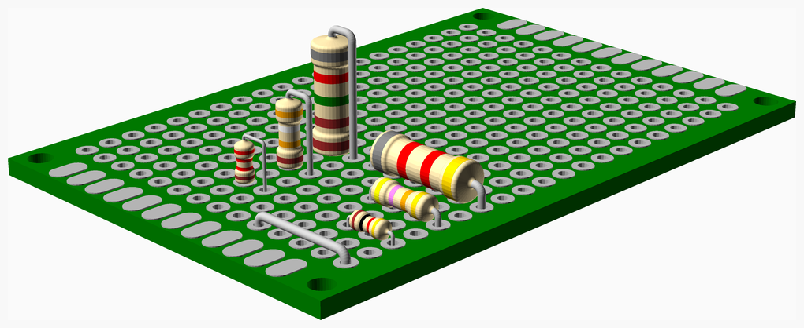

### Vitamins
| Qty | Module call | BOM entry |
| ---:|:--- |:---|
|   1 | `pcb(PERF60x40)` |  Perfboard 60 x 40mm |
|   1 | `ax_res(res1_8, 1000)` |  Resistor 1000 Ohms 5% 0.125W |
|   1 | `ax_res(res1_8, 2200, tol = 1)` |  Resistor 2200 Ohms 1% 0.125W |
|   1 | `ax_res(res1_4, 39000, tol = 1)` |  Resistor 39000 Ohms 1% 0.25W |
|   1 | `ax_res(res1_4, 47000)` |  Resistor 47000 Ohms 5% 0.25W |
|   1 | `ax_res(res1_2, 8200)` |  Resistor 8200 Ohms 5% 0.5W |
|   1 | `ax_res(res1_2, 8250, tol = 1)` |  Resistor 8250 Ohms 1% 0.5W |
|   1 | `wire_link(0.8, 10.16)` |  Wire link 0.8mm x 0.4" |

<a href="#top">Top</a>

---

## Ball_bearings
Simple model of ball bearings with seals, the colour of which can be specified. If silver they are assumed to be metal and the
part number gets a ZZ suffix. Any other colour is assumed to be rubber and the suffix is -2RS.

If a ball bearing has a child it is placed on its top surface, the same as nuts and washers, etc.

Also single bearing balls are modelled as just a silver sphere and a BOM entry.

[vitamins/ball_bearings.scad](vitamins/ball_bearings.scad) Object definitions.

[vitamins/ball_bearing.scad](vitamins/ball_bearing.scad) Implementation.

[tests/ball_bearings.scad](tests/ball_bearings.scad) Code for this example.

### Properties
| Function | Description |
|:--- |:--- |
| `bb_bore(type)` | Internal diameter |
| `bb_colour(type)` | Shield colour, "silver" for metal |
| `bb_diameter(type)` | External diameter |
| `bb_hub(type)` | Inner rim thickness guesstimate |
| `bb_name(type)` | Part code without shield type suffix |
| `bb_rim(type)` | Outer rim thickness guesstimate |
| `bb_width(type)` | Width |

### Modules
| Module | Description |
|:--- |:--- |
| `ball_bearing(type)` | Draw a ball bearing |
| `bearing_ball(dia)` | Draw a steel bearing ball |

### Vitamins
| Qty | Module call | BOM entry |
| ---:|:--- |:---|
|   1 | `ball_bearing(BB608)` |  Ball bearing 608-2RS 8mm x 22mm x 7mm |
|   1 | `ball_bearing(BB6200)` |  Ball bearing 6200-2RS 10mm x 30mm x 9mm |
|   1 | `ball_bearing(BB6201)` |  Ball bearing 6201-2RS 12mm x 32mm x 10mm |
|   1 | `ball_bearing(BB624)` |  Ball bearing 624-2RS 4mm x 13mm x 5mm |
|   1 | `ball_bearing(BB6808)` |  Ball bearing 6808-2RS 40mm x 52mm x 7mm |
|   1 | `ball_bearing(BBSMR95)` |  Ball bearing SMR95ZZ 5mm x 9mm x 2.5mm |
|   6 | ` bearing_ball(3)` |  Steel ball 3mm |

<a href="#top">Top</a>

---

## Batteries
Actually just single cells at the moment, shown here with mating contacts in place.

Note that the [Lumintop LM34](http://www.lumintop.com/lm34c-usb-rechargeable-18650-li-ion-battery.html) has a built in charger with a USB socket and two LEDs.

The battery length includes its contacts and the origin is the centre of that length. As well as drawing the battery and contacts there are functions
exposing enough information to make a battery box.

[vitamins/batteries.scad](vitamins/batteries.scad) Object definitions.

[vitamins/battery.scad](vitamins/battery.scad) Implementation.

[tests/batteries.scad](tests/batteries.scad) Code for this example.

### Properties
| Function | Description |
|:--- |:--- |
| `battery_colour(type)` | Casing colour |
| `battery_contact(type)` | Contact type |
| `battery_diameter(type)` | Casing diameter |
| `battery_led_positions(type)` | LED positions for Lumintop |
| `battery_length(type)` | Total length including terminals |
| `battery_neg_dia(type)` | Negative terminal diameter |
| `battery_pos_dia(type)` | Positive terminal diameter |
| `battery_pos_height(type)` | Positive terminal height above the casing |
| `battery_usb_offset(type)` | USB connector offset from the top |
| `contact_height(type)` | Height of the flat part |
| `contact_neg(type)` | Negative spring height above the plate when compressed and the spring type |
| `contact_pos(type)` | Positive contact dimple height and top and bottom internal diameter |
| `contact_tab_length(type)` | Length of the tab |
| `contact_tab_width(type)` | Width of the tab |
| `contact_thickness(type)` | Thickness of the metal |
| `contact_width(type)` | Width of the flat part |

### Modules
| Module | Description |
|:--- |:--- |
| `battery(type)` | Draw a battery |
| `battery_contact(type, pos = true)` | Draw a positive or negative battery contact for specified battery |
| `battery_led_positions(type)` | Position of the LEDs on a Lumintop |

### Vitamins
| Qty | Module call | BOM entry |
| ---:|:--- |:---|
|   6 | `battery_contact(bcontact, false)` |  Battery negative contact |
|   6 | `battery_contact(bcontact, true)` |  Battery positive contact |
|   1 | `battery(AACELL)` |  Cell AA |
|   1 | `battery(AAACELL)` |  Cell AAA |
|   1 | `battery(CCELL)` |  Cell C |
|   1 | `battery(DCELL)` |  Cell D |
|   1 | `battery(LUMINTOP)` |  Cell LUMINTOP 18650 LION with charger |
|   1 | `battery(S25R18650)` |  Cell Samsung 25R 18650 LION |

<a href="#top">Top</a>

---

## Bearing_blocks
SCSnUU and SCSnLUU bearing blocks

[vitamins/bearing_blocks.scad](vitamins/bearing_blocks.scad) Object definitions.

[vitamins/bearing_block.scad](vitamins/bearing_block.scad) Implementation.

[tests/bearing_blocks.scad](tests/bearing_blocks.scad) Code for this example.

### Properties
| Function | Description |
|:--- |:--- |
| `scs_bearing(type)` | Linear bearing used |
| `scs_block_center_height(type)` | Height of the center of the block |
| `scs_block_side_height(type)` | Height of the side of the block, this determines the minimum screw length |
| `scs_circlip(type)` | Circlip used |
| `scs_hole_offset(type)` | Offset of bearing hole from base of block |
| `scs_screw(type)` | Screw type |
| `scs_screw_separation_x(type)` | Screw separation in X direction |
| `scs_screw_separation_z(type)` | Screw separation in Z direction |
| `scs_spacer(type)` | Spacer used in long bearings |

### Functions
| Function | Description |
|:--- |:--- |
| `scs_size(type)` | Size of scs bracket bounding block |

### Modules
| Module | Description |
|:--- |:--- |
| `scs_bearing_block(type)` | Draw the specified SCS bearing block |
| `scs_bearing_block_assembly(type, part_thickness, screw_type, nut_type)` | Assembly with screws and nuts in place |
| `scs_bearing_block_hole_positions(type)` | Place children at hole positions |

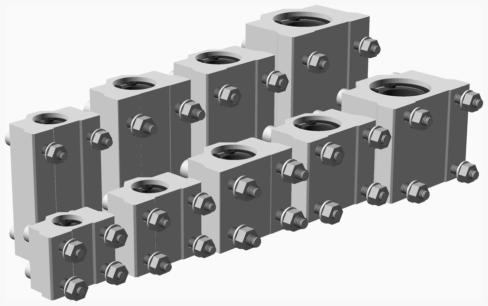

### Vitamins
| Qty | Module call | BOM entry |
| ---:|:--- |:---|
|  12 | `nut(M4_nut)` |  Nut M4 x 3.2mm  |
|  24 | `nut(M5_nut)` |  Nut M5 x 4mm  |
|   1 | `scs_bearing_block(SCS10LUU)` |  SCS10LUU bearing block |
|   1 | `scs_bearing_block(SCS10UU)` |  SCS10UU bearing block |
|   1 | `scs_bearing_block(SCS12LUU)` |  SCS12LUU bearing block |
|   1 | `scs_bearing_block(SCS12UU)` |  SCS12UU bearing block |
|   1 | `scs_bearing_block(SCS16LUU)` |  SCS16LUU bearing block |
|   1 | `scs_bearing_block(SCS16UU)` |  SCS16UU bearing block |
|   1 | `scs_bearing_block(SCS6UU)` |  SCS6UU bearing block |
|   1 | `scs_bearing_block(SCS8LUU)` |  SCS8LUU bearing block |
|   1 | `scs_bearing_block(SCS8UU)` |  SCS8UU bearing block |
|   4 | `screw(M4_cap_screw, 25)` |  Screw M4 cap x 25mm |
|   8 | `screw(M4_cap_screw, 30)` |  Screw M4 cap x 30mm |
|  16 | `screw(M5_cap_screw, 35)` |  Screw M5 cap x 35mm |
|   8 | `screw(M5_cap_screw, 45)` |  Screw M5 cap x 45mm |
|  12 | `washer(M4_washer)` |  Washer  M4 x 9mm x 0.8mm |
|  24 | `washer(M5_washer)` |  Washer  M5 x 10mm x 1mm |

<a href="#top">Top</a>

---

## Belts
Models timing belt running in a path over toothed or smooth pulleys and calculates an accurate length.
Only models 2D paths, belt may twist to support crossed belt core XY and other designes where the belt twists!

By default the path is a closed loop. An open loop can be specified by specifying `open=true`, and in that case the start and end points are not connected, leaving the loop open.

To get a 180 degree twist of the loop, you can use the `twist` argument. `Twist` can be a single number, and in that case the belt will twist after
the position with that number. Alternatively `twist` can be a list of boolean values with a boolean for each position; the belt will then twist after
the position that have a `true` value in the `twist` list. If the path is specified with pulley/idler types, then you can use `auto_twist=true`; in
that case the belt will automatically twist so the back of the belt always runs against idlers and the tooth side runs against pullies. If you use
`open=true` then you might also use `start_twist=true` to let the belt start the part with the back side out.

The path must be specified as a list of positions. Each position should be either a vector with `[x, y, pulley]` or `[x, y, r]`. A pully is a type from
`pulleys.scad`, and correct radius and angle will automatically be calculated. Alternatively a radius can be specified directly.

To make the back of the belt run against a smooth pulley on the outside of the loop specify a negative pitch radius.
Alternativley you can just specify smooth pulleys in the path, and it will then happen automatically.

Individual teeth are not drawn, instead they are represented by a lighter colour.

[vitamins/belts.scad](vitamins/belts.scad) Object definitions.

[vitamins/belt.scad](vitamins/belt.scad) Implementation.

[tests/belts.scad](tests/belts.scad) Code for this example.

### Properties
| Function | Description |
|:--- |:--- |
| `belt_pitch(type)` | Pitch in mm |
| `belt_pitch_height(type)` | Offset of the pitch radius from the tips of the teeth |
| `belt_thickness(type)` | Total thickness including teeth |
| `belt_tooth_height(type)` | Tooth height |
| `belt_width(type)` | Width in mm |

### Functions
| Function | Description |
|:--- |:--- |
| `_belt_points_info(type, points, open, twist, auto_twist, start_twist)` | Helper function that calculates [twist, istwisted, points, tangents, arcs] |
| `belt_length(type, points, open = false)` | Compute belt length given path |
| `belt_pitch_to_back(type)` | Offset of the back from the pitch radius |
| `belt_pulley_pr(type, pulley, twisted=false)` | Pitch radius. Default it expects the belt tooth to be against a toothed pulley an the backside to be against a smooth pulley (an idler). If `twisted` is true, the the belt is the other way around. |

### Modules
| Module | Description |
|:--- |:--- |
| `belt(type, points, belt_colour = grey(20)` | Draw a belt path given a set of points and pitch radii where the pulleys are. Closed loop unless open is specified |

### Vitamins
| Qty | Module call | BOM entry |
| ---:|:--- |:---|
|   1 | `belt(GT2x6, [ ... ])` |  Belt GT2 x 6mm x 128mm |
|   1 | `belt(GT2x6, [ ... ])` |  Belt GT2 x 6mm x 552mm |
|   2 | `belt(GT2x6, [ ... ])` |  Belt GT2 x 6mm x 556mm |
|   1 | `belt(T2p5x6, [ ... ])` |  Belt T2.5 x 6mm x 130mm |
|   1 | `belt(T5x10, [ ... ])` |  Belt T5 x 10mm x 130mm |
|   1 | `belt(T5x6, [ ... ])` |  Belt T5 x 6mm x 130mm |
|   2 | `insert(F1BM3)` |  Heatfit insert M3 |
|   2 | `pulley(GT2x16_toothed_idler)` |  Pulley GT2 idler 16 teeth |
|   4 | `pulley(GT2x20_toothed_idler)` |  Pulley GT2 idler 20 teeth |
|   6 | `pulley(GT2x16_plain_idler)` |  Pulley GT2 idler smooth 9.63mm |
|   3 | `pulley(GT2x20ob_pulley)` |  Pulley GT2OB 20 teeth |
|   2 | `screw(M3_cs_cap_screw, 20)` |  Screw M3 cs cap x 20mm |
|   6 | `screw(M3_grub_screw, 6)` |  Screw M3 grub x  6mm |

<a href="#top">Top</a>

---

## Blowers
Models of radial blowers.

[vitamins/blowers.scad](vitamins/blowers.scad) Object definitions.

[vitamins/blower.scad](vitamins/blower.scad) Implementation.

[tests/blowers.scad](tests/blowers.scad) Code for this example.

### Properties
| Function | Description |
|:--- |:--- |
| `blower_axis(type)` | XY coordinates of the axle |
| `blower_base(type)` | Thickness of the base |
| `blower_bore(type)` | The air intake hole diameter |
| `blower_depth(type)` | Height |
| `blower_exit(type)` | The width of the exit port |
| `blower_hub(type)` | Rotor hub diameter |
| `blower_hub_height(type)` | Height of the rotor |
| `blower_length(type)` | Length of enclosing rectangle |
| `blower_lug(type)` | Height of the lugs |
| `blower_screw(type)` | The type of screws needed |
| `blower_screw_hole(type)` | Screw hole diameter |
| `blower_screw_holes(type)` | List of XY coordinates of the screw holes |
| `blower_top(type)` | Thickness of the top |
| `blower_wall(type)` | Side wall thickness |
| `blower_wall_left(type)` | Left side wall thickness |
| `blower_wall_right(type)` | Right wall thickness (for square fans) |
| `blower_width(type)` | Width of enclosing rectangle |

### Functions
| Function | Description |
|:--- |:--- |
| `blower_casing_is_square(type)` | True for square radial fans, false for spiral shape radial blowers |
| `blower_exit_offset(type)` | Offset of exit's centre from the edge |
| `blower_size(type)` | Size |

### Modules
| Module | Description |
|:--- |:--- |
| `blower(type)` | Draw specified blower |
| `blower_hole_positions(type)` | Translate children to screw hole positions |
| `blower_square(type)` | Draw a square blower |

### Vitamins
| Qty | Module call | BOM entry |
| ---:|:--- |:---|
|   1 | `blower(PE4020)` |  Blower Pengda Technology 4020 |
|   1 | `blower(RB5015)` |  Blower Runda RB5015 |
|   4 | `screw(M2_cap_screw, 8)` |  Screw M2 cap x  8mm |
|   2 | `screw(M2_cap_screw, 10)` |  Screw M2 cap x 10mm |
|   3 | `screw(M3_cap_screw, 20)` |  Screw M3 cap x 20mm |
|   2 | `screw(M4_cap_screw, 25)` |  Screw M4 cap x 25mm |
|   1 | `blower(BL30x10)` |  Square radial fan 3010 |
|   1 | `blower(BL40x10)` |  Square radial fan 4010 |
|   6 | `washer(M2_washer)` |  Washer  M2 x 5mm x 0.3mm |
|   3 | `washer(M3_washer)` |  Washer  M3 x 7mm x 0.5mm |
|   2 | `washer(M4_washer)` |  Washer  M4 x 9mm x 0.8mm |

<a href="#top">Top</a>

---

## Box_sections
Box sections.

[vitamins/box_sections.scad](vitamins/box_sections.scad) Object definitions.

[vitamins/box_section.scad](vitamins/box_section.scad) Implementation.

[tests/box_sections.scad](tests/box_sections.scad) Code for this example.

### Properties
| Function | Description |
|:--- |:--- |
| `box_section_colour(type)` | Colour |
| `box_section_colour2(type)` | Colour2, for woven box section |
| `box_section_fillet(type)` | Fillet |
| `box_section_material(type)` | Material description |
| `box_section_size(type)` | Size |
| `box_section_thickness(type)` | Wall thickness |

### Functions
| Function | Description |
|:--- |:--- |
| `box_section_is_woven(type)` | Box section is woven, eg carbon fiber |

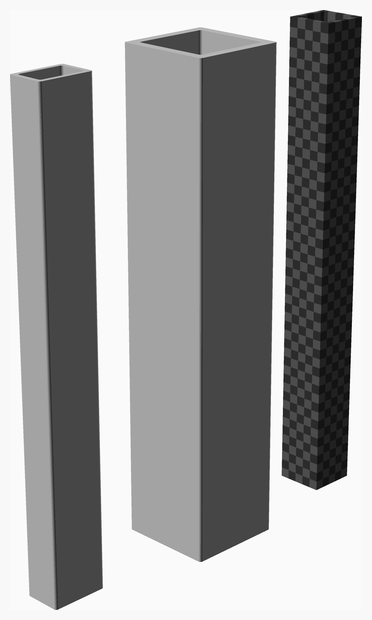

### Vitamins
| Qty | Module call | BOM entry |
| ---:|:--- |:---|
|   1 | `box_section(AL12x8x1, 100)` |  Aluminium rectangular box section 12mm x 8mm x 1mm, length 100mm |
|   1 | `box_section(AL20x20x2, 100)` |  Aluminium rectangular box section 20mm x 20mm x 2mm, length 100mm |
|   1 | `box_section(CF10x10x1, 100)` |  Carbon fiber rectangular box section 10mm x 10mm x 1mm, length 100mm |

<a href="#top">Top</a>

---

## Bulldogs
Crude representation of a bulldog clip. The handle is not currently drawn but its length can be
accessed to allow clearance. Used for holding glass on 3D printer beds but Swiss picture clips can be
better.

[vitamins/bulldogs.scad](vitamins/bulldogs.scad) Object definitions.

[vitamins/bulldog.scad](vitamins/bulldog.scad) Implementation.

[tests/bulldogs.scad](tests/bulldogs.scad) Code for this example.

### Properties
| Function | Description |
|:--- |:--- |
| `bulldog_depth(type)` | Depth from the back to the front of the tubes |
| `bulldog_handle_length(type)` | Length that the handle protrudes from the back |
| `bulldog_height(type)` | Height at the back |
| `bulldog_length(type)` | Length along the profile |
| `bulldog_radius(type)` | Outside radius of the back corners |
| `bulldog_thickness(type)` | Thickness of the metal |
| `bulldog_tube(type)` | Outside diameter of the tubes |

### Modules
| Module | Description |
|:--- |:--- |
| `bulldog(type, open = 4)` | Draw bulldog clip open by specified amount |

### Vitamins
| Qty | Module call | BOM entry |
| ---:|:--- |:---|
|   1 | `bulldog(small_bulldog)` |  Bulldog clip 19mm |
|   1 | `bulldog(large_bulldog)` |  Bulldog clip 25mm |

<a href="#top">Top</a>

---

## Buttons
PCB mounted buttons. Can optionally have a coloured cap

[vitamins/buttons.scad](vitamins/buttons.scad) Object definitions.

[vitamins/button.scad](vitamins/button.scad) Implementation.

[tests/buttons.scad](tests/buttons.scad) Code for this example.

### Properties
| Function | Description |
|:--- |:--- |
| `square_button_cap_d(type)` | Diameter of the body of the cap |
| `square_button_cap_flange_d(type)` | Diameter of the flange of the cap |
| `square_button_cap_flange_h(type)` | Height of the cap flange |
| `square_button_cap_h(type)` | Height of the cap including the stem |
| `square_button_cap_stem(type)` | Length of the cap stem |
| `square_button_d(type)` | Button diameter |
| `square_button_h(type)` | Height of the button above the PCB |
| `square_button_height(type)` | Height of the base |
| `square_button_rivit(type)` | Size of the corner rivets |
| `square_button_wall(type)` | Offset of the metal part |
| `square_button_width(type)` | Width and depth of the base |

### Modules
| Module | Description |
|:--- |:--- |
| `square_button(type, colour = "yellow")` | Draw square button with specified cap colour if it has a cap |

### Vitamins
| Qty | Module call | BOM entry |
| ---:|:--- |:---|
|   1 | `square_button(button_12mm, "yellow")` |  Square button 12mm with yellow cap |
|   1 | `square_button(button_4p5mm)` |  Square button 4.5mm |
|   1 | `square_button(button_6mm)` |  Square button 6mm |

<a href="#top">Top</a>

---

## Cable_strips
A strip of polypropylene used with ribbon cable to make a cable flexible in one direction only.

Modelled with a Bezier spline, which is not quite the same as a minimum energy curve but very close, epecially
near the extreme positions, where the model needs to be accurate.

When the sides are constrained then a circular model is more accurate.

[vitamins/cable_strip.scad](vitamins/cable_strip.scad) Implementation.

[tests/cable_strips.scad](tests/cable_strips.scad) Code for this example.

### Functions
| Function | Description |
|:--- |:--- |
| `bezier_cable_length(depth, min_z, pos)` | Calculate a length that will achieve the desired minimum z |
| `cable_strip_length(depth, travel, extra = 15)` | Calculate circular cable strip length |

### Modules
| Module | Description |
|:--- |:--- |
| `bezier_cable_strip(ways, depth, length, below, extra, pos = 0)` | Draw a cable strip using a Bezier curve |
| `cable_strip(ways, depth, travel, extra = 15, pos = 0)` | Draw a cable stripe with a semi circular fold |

### Vitamins
| Qty | Module call | BOM entry |
| ---:|:--- |:---|
|   3 | `bezier_cable_strip(20, 50, 150, 100, 10)` |  Polypropylene strip 170mm x 26mm x 0.8mm |
|   3 | `cable_strip(20, 25, 100, 30)` |  Polypropylene strip 189mm x 24mm x 0.8mm |

<a href="#top">Top</a>

---

## Cameras
PCB cameras.

[vitamins/cameras.scad](vitamins/cameras.scad) Object definitions.

[vitamins/camera.scad](vitamins/camera.scad) Implementation.

[tests/cameras.scad](tests/cameras.scad) Code for this example.

### Properties
| Function | Description |
|:--- |:--- |
| `camera_connector_pos(type)` | The flex connector block for the camera itself's position |
| `camera_connector_size(type)` | The flex connector block for the camera itself's size |
| `camera_lens(type)` | Stack of lens parts, can be round, rectanular or rounded rectangular, with optional tapered aperture |
| `camera_lens_offset(type)` | Offset of the lens center from the PCB centre |
| `camera_pcb(type)` | The PCB part of the camera |

### Modules
| Module | Description |
|:--- |:--- |
| `camera(type, show_lens = true)` | Draw specified PCB camera |
| `camera_lens(type, offset = 0, show_lens = true)` | Draw the lens stack, with optional offset for making a clearance hole |

### Vitamins
| Qty | Module call | BOM entry |
| ---:|:--- |:---|
|   1 | `camera(rpi_camera_v1)` |  Raspberry Pi camera V1 |
|   1 | `camera(rpi_camera_v2)` |  Raspberry Pi camera V2 |
|   1 | `camera(rpi_camera)` |  Raspberry Pi focusable camera |

<a href="#top">Top</a>

---

## Circlips
Circlips aka tapered retaining rings.

[vitamins/circlips.scad](vitamins/circlips.scad) Object definitions.

[vitamins/circlip.scad](vitamins/circlip.scad) Implementation.

[tests/circlips.scad](tests/circlips.scad) Code for this example.

### Properties
| Function | Description |
|:--- |:--- |
| `circlip_a(type)` | Size of the lugs |
| `circlip_b(type)` | Widest part of the taper |
| `circlip_d1(type)` | Nominal OD, i.e. diameter of tube |
| `circlip_d2(type)` | Groove diameter, i.e. OD when installed |
| `circlip_d3(type)` | Relaxed OD when not installed |
| `circlip_d5(type)` | Plier hole diameter |
| `circlip_thickness(type)` | Thickness |

### Modules
| Module | Description |
|:--- |:--- |
| `internal_circlip(type, open = 0)` | Draw specified internal circlip, open = 0, for nominal size installed, 1 for relaxed uninstalled, -1 for squeezed to install |

### Vitamins
| Qty | Module call | BOM entry |
| ---:|:--- |:---|
|   3 | `circlip(circlip_12i)` |  Circlip internal 12mm |
|   3 | `circlip(circlip_15i)` |  Circlip internal 15mm |
|   3 | `circlip(circlip_19i)` |  Circlip internal 19mm |
|   3 | `circlip(circlip_21i)` |  Circlip internal 21mm |
|   3 | `circlip(circlip_28i)` |  Circlip internal 28mm |

<a href="#top">Top</a>

---

## Components
Various electronic components used in hot ends and heated beds.

[vitamins/components.scad](vitamins/components.scad) Object definitions.

[vitamins/component.scad](vitamins/component.scad) Implementation.

[tests/components.scad](tests/components.scad) Code for this example.

### Properties
| Function | Description |
|:--- |:--- |
| `al_clad_clearance(type)` | Clearance from screw hole centre to the body |
| `al_clad_height(type)` | Body height |
| `al_clad_hole(type)` | Hole diameter |
| `al_clad_hpitch(type)` | Lengthways pitch between screw holes |
| `al_clad_length(type)` | Body length |
| `al_clad_tab(type)` | Tab width |
| `al_clad_thickness(type)` | Tab thickness |
| `al_clad_vpitch(type)` | Widthways pitch between screw holes |
| `al_clad_width(type)` | Width including tabs |
| `al_clad_wire_length(type)` | Total length including wires |
| `resistor_colour(type)` | Body colour |
| `resistor_diameter(type)` | Body diameter |
| `resistor_hole(type)` | Hole big enough to glue it into |
| `resistor_length(type)` | Body length |
| `resistor_radial(type)` | Radial gives bead thermistor style body |
| `resistor_sleeved(type)` | Are the leads sleeved |
| `resistor_wire_diameter(type)` | Wire diameter |
| `resistor_wire_length(type)` | Wire length from body |
| `tc_body_height(type)` | Plastic body height |
| `tc_body_inset(type)` | How far metal is inset into the plastic body |
| `tc_body_length(type)` | Plastic body length |
| `tc_body_width(type)` | Plastic body width |
| `tc_hole_dia(type)` | Screw hole diameter |
| `tc_hole_pitch(type)` | Screw hole pitch |
| `tc_length(type)` | Across the lugs |
| `tc_spade_height(type)` | Terminal spade height measured from base |
| `tc_spade_pitch(type)` | Terminal spade pitch |
| `tc_thickness(type)` | Metal thickness |
| `tc_width(type)` | Width of lugs |

### Functions
| Function | Description |
|:--- |:--- |
| `TO220_thickness()` | Thickness of the tab of a TO220 |
| `fack2spm_bezel_size()` | FACK2SPM Bezel dimensions |
| `fack2spm_screw()` | Screw type for FACK2SPM |

### Modules
| Module | Description |
|:--- |:--- |
| ` TO220(description, leads = 3, lead_length = 16)` | Draw a TO220 package, use `description` to describe what it is |
| `al_clad_resistor(type, value, leads = true)` | Draw an aluminium clad resistor |
| `al_clad_resistor_hole_positions(type)` | Position children at the screw holes of an aluminium clad resistor |
| `al_clad_resistor_holes(type, h = 100)` | Drill screw holes for an aluminium clad resistor |
| `fack2spm()` | Draw a FACK2SPM Cat5E RJ45 shielded panel mount coupler |
| `fack2spm_hole_positions()` | Place children at the FACK2SPM mounting hole positions |
| `fack2spm_holes(h = 0)` | Cut the holes for a FACK2SPM |
| `panel_USBA()` | Draw a panel mount USBA connector |
| `panel_USBA_hole_positions()` | Place children at hole positions |
| `panel_USBA_holes(h = 100)` | Make holes for USBA connector |
| `resistor(type)` | Draw specified type of resitor |
| `sleeved_resistor(type, sleeving, bare = 5, heatshrink = false)` | Draw a resistor with sleeved leads and option heatshrink |
| `thermal_cutout(type)` | Draw specified thermal cutout |
| `thermal_cutout_hole_positions(type)` | Place children at hole positions |

### Vitamins
| Qty | Module call | BOM entry |
| ---:|:--- |:---|
|   1 | `TO220("Generic TO220 package")` |  Generic TO220 package |
|   8 | `tubing(HSHRNK32)` |  Heatshrink sleeving ID 3.2mm x 15mm |
|   1 | `resistor(RWM04106R80J)` |  Resistor RWM04106R80J 6R8 3W vitreous enamel |
|   1 | `resistor(RIE1212UB5C5R6)` |  Resistor UB5C 5R6F 5R6 3W vitreous enamel |
|   1 | `al_clad_resistor(THS10, 4.7)` |  Resistor aluminium clad THS10 4.7 |
|   1 | `al_clad_resistor(THS15, 4.7)` |  Resistor aluminium clad THS15 4.7 |
|   1 | `al_clad_resistor(THS25, 4.7)` |  Resistor aluminium clad THS25 4.7 |
|   1 | `al_clad_resistor(THS50, 4.7)` |  Resistor aluminium clad THS50 4.7 |
|   4 | `screw(M2p5_pan_screw, 16)` |  Screw M2.5 pan x 16mm |
|   4 | `screw(M3_pan_screw, 16)` |  Screw M3 pan x 16mm |
|   1 | `panel_USBA()` |  Socket USB A panel mount |
|   1 | `tuk_fack2spm()` |  TUK FACK2SPM Cat5E RJ45 shielded panel mount coupler |
|   1 | `thermal_cutout(TC)` |  Thermal cutout TC |
|   1 | `resistor(Epcos)` |  Thermistor Epcos B57560G104F 100K 1% |
|   1 | `resistor(EpcosBlue)` |  Thermistor Epcos B57861S104F40 100K 1% |
|   1 | `resistor(Honewell)` |  Thermistor Honeywell 135-104LAC-J01 100K 1% |

<a href="#top">Top</a>

---

## D_connectors
D-connectors. Can be any number of ways, male or female, solder buckets, PCB mount or IDC, with or without pillars.

[vitamins/d_connectors.scad](vitamins/d_connectors.scad) Object definitions.

[vitamins/d_connector.scad](vitamins/d_connector.scad) Implementation.

[tests/d_connectors.scad](tests/d_connectors.scad) Code for this example.

### Properties
| Function | Description |
|:--- |:--- |
| ` d_flange_length(type)` | Length of the flange |
| ` d_flange_thickness(type)` | Thickness of the flange |
| ` d_flange_width(type)` | Width of the flange |
| ` d_front_height(type)` | From the back of the flange to the front |
| ` d_height(type)` | From the front to the back of the metal part |
| ` d_hole_pitch(type)` | Mounting hole pitch |
| ` d_lengths(type)` | Lengths of the D for plug and socket |
| ` d_ways(type)` | Number of ways |
| ` d_widths(type)` | Widths of the D for plug and socket |

### Functions
| Function | Description |
|:--- |:--- |
| ` d_mate_distance(type)` | Spacing when mated |
| ` d_pcb_offset(type)` | Height of the back of the flange above the PCB |
| ` d_slot_length(type)` | Slot to clear the back |

### Modules
| Module | Description |
|:--- |:--- |
| `d_connector_holes(type)` | Place children at the screw hole positions |
| `d_pillar()` | Draw a pillar for a D-connector |
| `d_plug(type, socket = false, pcb = false, idc = false)` | Draw specified D plug, which can be IDC, PCB or plain solder bucket |
| `d_socket(connector, pcb = false, idc = false)` | Draw specified D socket, which can be IDC, PCB or plain solder bucket |

### Vitamins
| Qty | Module call | BOM entry |
| ---:|:--- |:---|
|   1 | `d_plug(DCONN15, idc = true)` |  D-type 15 way IDC plug |
|   1 | `d_socket(DCONN15, idc = true)` |  D-type 15 way IDC socket |
|   1 | `d_plug(DCONN25, pcb = true)` |  D-type 25 way PCB mount plug |
|   1 | `d_socket(DCONN25, pcb = true)` |  D-type 25 way PCB mount socket |
|   1 | `d_plug(DCONN9)` |  D-type 9 way  plug |
|   1 | `d_socket(DCONN9)` |  D-type 9 way  socket |
|   6 | `d_pillar()` |  D-type connector pillar |

<a href="#top">Top</a>

---

## DIP
Dual inline IC packages and sockets

[vitamins/dip.scad](vitamins/dip.scad) Implementation.

[tests/DIP.scad](tests/DIP.scad) Code for this example.

### Properties
| Function | Description |
|:--- |:--- |
| `pdip_pin_W(type)` | Pin shoulder width |
| `pdip_pin_h(type)` | Pin height |
| `pdip_pin_n(type)` | Pin neck |
| `pdip_pin_s(type)` | Height above seating plane |
| `pdip_pin_t(type)` | Pin thickness |
| `pdip_pin_w(type)` | Pin width |

### Modules
| Module | Description |
|:--- |:--- |
| `dip(n, part, size, w, pitch, pin)` | Draw DIP package |
| `pdip(pins, part, socketed, w = inch(0.3)` | Draw standard 0.1" PDIP IC package |
| `pdip_pin(type, l, end)` | Draw a pin |

### Vitamins
| Qty | Module call | BOM entry |
| ---:|:--- |:---|
|   1 | `dil_socket(14, 7.62)` |  DIL socket 28 x 0.3" |
|   1 | `pdip(14, 74HC00)` |  IC 74HC00 PDIP14 |
|   1 | `pdip(20, 74HC245)` |  IC 74HC245 PDIP20 |
|   1 | `pdip(28, ATMEGA328)` |  IC ATMEGA328 PDIP28 |
|   1 | `pdip(8, NE555)` |  IC NE555 PDIP8 |
|   1 | `pdip(6, OPTO)` |  IC OPTO PDIP6 |
|   1 | `pdip(16, ULN2003)` |  IC ULN2003 PDIP16 |
|   1 | `pdip(18, ULN2803)` |  IC ULN2803 PDIP18 |

<a href="#top">Top</a>

---

## Displays
LCD dispays.

[vitamins/displays.scad](vitamins/displays.scad) Object definitions.

[vitamins/display.scad](vitamins/display.scad) Implementation.

[tests/displays.scad](tests/displays.scad) Code for this example.

### Properties
| Function | Description |
|:--- |:--- |
| `display_aperture(type)` | Size of the aperture including its depth |
| `display_height(type)` | Depth of the metal part |
| `display_pcb(type)` | PCB mounted on the back |
| `display_pcb_offset(type)` | 3D offset of the PCB centre |
| `display_ribbon(type)` | Keep out region for ribbon cable |
| `display_thickness(type)` | Height of the metal part |
| `display_threads(type)` | Length that studs protrude from the PCB holes |
| `display_touch_screen(type)` | Touch screen position and size |
| `display_width(type)` | Width of the metal part |

### Functions
| Function | Description |
|:--- |:--- |
| `display_depth(type)` | Total thickness including touch screen and PCB |
| `display_ts_thickness(type)` | Touch screen thickness or 0 |

### Modules
| Module | Description |
|:--- |:--- |
| `display(type)` | Draw specified display |
| `display_aperture(type, clearance, clear_pcb = false)` | Make aperture cutout |

### Vitamins
| Qty | Module call | BOM entry |
| ---:|:--- |:---|
|   1 | `display(BigTreeTech_TFT35v3_0)` |  BigTreeTech TFT35 v3.0 |
|   1 | `display(HDMI5)` |  HDMI display 5" |
|   1 | `display(LCD1602A)` |  LCD display 1602A |
|   1 | `display(LCDS7282B)` |  LCD display S-7282B |
|   1 | `display(SSD1963_4p3)` |  LCD display SSD1963 4.3" |

<a href="#top">Top</a>

---

## Extrusion_brackets
Brackets for joining extrusions at a corner.

[vitamins/extrusion_brackets.scad](vitamins/extrusion_brackets.scad) Object definitions.

[vitamins/extrusion_bracket.scad](vitamins/extrusion_bracket.scad) Implementation.

[tests/extrusion_brackets.scad](tests/extrusion_brackets.scad) Code for this example.

### Properties
| Function | Description |
|:--- |:--- |
| `extrusion_corner_bracket_base_thickness(type)` | Thickness of base of bracket |
| `extrusion_corner_bracket_hole_offset(type)` | Hole offset from corner |
| `extrusion_corner_bracket_side_thickness(type)` | Thickness of side of bracket |
| `extrusion_corner_bracket_size(type)` | Size of bracket |
| `extrusion_inner_corner_bracket_size(type)` | Size of inner bracket |

### Modules
| Module | Description |
|:--- |:--- |
| `extrusion_corner_bracket(type)` | Corner bracket for extrusion |
| `extrusion_corner_bracket_assembly(type, part_thickness = 2, screw_type = M4_cap_screw, nut_type = M4_sliding_t_nut, max_screw_depth = 6)` | Assembly with fasteners in place |
| `extrusion_corner_bracket_hole_positions(type)` | Place children at hole positions |
| `extrusion_inner_corner_bracket(type, grub_screws = true)` | Inner corner bracket for extrusion |

### Vitamins
| Qty | Module call | BOM entry |
| ---:|:--- |:---|
|   1 | `extrusion(E2020, 20)` |  Extrusion E2020 x 20mm |
|   1 | `extrusion(E2020, 30)` |  Extrusion E2020 x 30mm |
|   1 | `extrusion(E2020, 40)` |  Extrusion E2020 x 40mm |
|   1 | `extrusion(E2020, 50)` |  Extrusion E2020 x 50mm |
|   2 | `extrusion_corner_bracket(E20_corner_bracket)` |  Extrusion corner bracket 20 |
|   2 | `extrusion_inner_corner_bracket(E20_inner_corner_bracket, true)` |  Extrusion inner corner bracket 4.5 |
|   1 | `extrusion_inner_corner_bracket(E20_inner_corner_bracket, false)` |  Extrusion inner corner bracket 4.5 |
|   4 | `sliding_t_nut(M4_sliding_t_nut)` |  Nut M4 sliding T |
|   4 | `screw(M4_cap_screw, 8)` |  Screw M4 cap x  8mm |
|   4 | `washer(M4_washer)` |  Washer  M4 x 9mm x 0.8mm |

<a href="#top">Top</a>

---

## Extrusions
Aluminium  extrusion.

[vitamins/extrusions.scad](vitamins/extrusions.scad) Object definitions.

[vitamins/extrusion.scad](vitamins/extrusion.scad) Implementation.

[tests/extrusions.scad](tests/extrusions.scad) Code for this example.

### Properties
| Function | Description |
|:--- |:--- |
| `extrusion_center_hole(type)` | Diameter of center hole |
| `extrusion_center_square(type)` | Size of center square |
| `extrusion_channel_width(type)` | Channel width |
| `extrusion_channel_width_internal(type)` | Internal channel width |
| `extrusion_corner_hole(type)` | Diameter of corner hole |
| `extrusion_fillet(type)` | Radius of corner fillet |
| `extrusion_height(type)` | Height of extrusion |
| `extrusion_spar_thickness(type)` | Spar thickness |
| `extrusion_tab_thickness(type)` | Tab thickness |
| `extrusion_width(type)` | Width of extrusion |

### Modules
| Module | Description |
|:--- |:--- |
| `extrusion(type, length, center = true, cornerHole = false)` | Draw the specified extrusion |

### Vitamins
| Qty | Module call | BOM entry |
| ---:|:--- |:---|
|   1 | `extrusion(E1515, 80)` |  Extrusion E1515 x 80mm |
|   1 | `extrusion(E2020, 80)` |  Extrusion E2020 x 80mm |
|   1 | `extrusion(E2040, 80)` |  Extrusion E2040 x 80mm |
|   1 | `extrusion(E2060, 80)` |  Extrusion E2060 x 80mm |
|   1 | `extrusion(E2080, 80)` |  Extrusion E2080 x 80mm |
|   1 | `extrusion(E3030, 80, cornerHole = true)` |  Extrusion E3030 x 80mm |
|   1 | `extrusion(E3060, 80, cornerHole = true)` |  Extrusion E3060 x 80mm |
|   1 | `extrusion(E4040, 80, cornerHole = true)` |  Extrusion E4040 x 80mm |
|   1 | `extrusion(E4080, 80, cornerHole = true)` |  Extrusion E4080 x 80mm |

<a href="#top">Top</a>

---

## Fans
Axial fans.

Can draw three styles: solid, open frame and open frame with screw bosses.

[vitamins/fans.scad](vitamins/fans.scad) Object definitions.

[vitamins/fan.scad](vitamins/fan.scad) Implementation.

[tests/fans.scad](tests/fans.scad) Code for this example.

### Properties
| Function | Description |
|:--- |:--- |
| `fan_aperture(type)` | Optional diameter for the aperture, which can be bigger than the bore it has flared corners. |
| `fan_blades(type)` | The number of blades |
| `fan_bore(type)` | Diameter of the hole for the blades |
| `fan_boss_d(type)` | Diameter of the screw bosses |
| `fan_depth(type)` | Depth of fan |
| `fan_hole_pitch(type)` | Screw hole pitch |
| `fan_hub(type)` | Diameter of the hub |
| `fan_outer_diameter(type)` | Outside diameter of the frame |
| `fan_screw(type)` | Screw type |
| `fan_thickness(type)` | Thickness of the frame |
| `fan_width(type)` | Width of square |

### Modules
| Module | Description |
|:--- |:--- |
| `fan(type)` | Draw specified fan, origin in the centre |
| `fan_assembly(type, thickness, include_fan = true, screw = false, full_depth = false)` | Fan with its fasteners |
| `fan_hole_positions(type, z = undef)` | Position children at the screw hole positions |
| `fan_holes(type, poly = false, screws = true, h = 100)` | Make all the holes for the fan, or just the aperture if `screws` is false. Set `poly` true for poly_holes. |

### Vitamins
| Qty | Module call | BOM entry |
| ---:|:--- |:---|
|   1 | `fan(fan120x25)` |  Fan 120mm x 25mm |
|   1 | `fan(fan17x8)` |  Fan 17mm x 8mm |
|   1 | `fan(fan25.4x10)` |  Fan 25.4mm x 10mm |
|   1 | `fan(fan30x10)` |  Fan 30mm x 10mm |
|   1 | `fan(fan40x11)` |  Fan 40mm x 11mm |
|   1 | `fan(fan50x15)` |  Fan 50mm x 15mm |
|   1 | `fan(fan60x15)` |  Fan 60mm x 15mm |
|   1 | `fan(fan60x25)` |  Fan 60mm x 25mm |
|   1 | `fan(fan70x15)` |  Fan 70mm x 15mm |
|   1 | `fan(fan80x25)` |  Fan 80mm x 25mm |
|   1 | `fan(fan80x38)` |  Fan 80mm x 38mm |
|   4 | `nut(M2_nut, nyloc = true)` |  Nut M2 x 1.6mm nyloc |
|   4 | `nut(M2p5_nut, nyloc = true)` |  Nut M2.5 x 2.2mm nyloc |
|   8 | `nut(M3_nut, nyloc = true)` |  Nut M3 x 2.4mm nyloc |
|  28 | `nut(M4_nut, nyloc = true)` |  Nut M4 x 3.2mm nyloc |
|   4 | `screw(M2_cap_screw, 16)` |  Screw M2 cap x 16mm |
|   4 | `screw(M2p5_pan_screw, 20)` |  Screw M2.5 pan x 20mm |
|   8 | `screw(M3_dome_screw, 20)` |  Screw M3 dome x 20mm |
|  20 | `screw(M4_dome_screw, 16)` |  Screw M4 dome x 16mm |
|   4 | `screw(M4_dome_screw, 25)` |  Screw M4 dome x 25mm |
|   4 | `screw(M4_dome_screw, 30)` |  Screw M4 dome x 30mm |
|   8 | `washer(M2_washer)` |  Washer  M2 x 5mm x 0.3mm |
|   8 | `washer(M2p5_washer)` |  Washer  M2.5 x 5.9mm x 0.5mm |
|  12 | `washer(M3_washer)` |  Washer  M3 x 7mm x 0.5mm |
|  32 | `washer(M4_washer)` |  Washer  M4 x 9mm x 0.8mm |

<a href="#top">Top</a>

---

## Fuseholder
20mm panel mount fuse holder.

[vitamins/fuseholder.scad](vitamins/fuseholder.scad) Implementation.

[tests/fuseholder.scad](tests/fuseholder.scad) Code for this example.

### Functions
| Function | Description |
|:--- |:--- |
| `fuseholder_diameter()` | Outside diameter of flange |

### Modules
| Module | Description |
|:--- |:--- |
| `fuseholder(thickness)` | Fuseholder with nut in place for specified panel thickness |
| `fuseholder_hole(h = 100)` | Hole with flats for fuseholder |

### Vitamins
| Qty | Module call | BOM entry |
| ---:|:--- |:---|
|   1 | `fuseholder(6)` |  Fuse holder 20mm |

<a href="#top">Top</a>

---

## Geared_steppers
Geared tin can steppers

[vitamins/geared_steppers.scad](vitamins/geared_steppers.scad) Object definitions.

[vitamins/geared_stepper.scad](vitamins/geared_stepper.scad) Implementation.

[tests/geared_steppers.scad](tests/geared_steppers.scad) Code for this example.

### Properties
| Function | Description |
|:--- |:--- |
| `gs_boss_d(type)` | Boss around the shaft diameter |
| `gs_boss_h(type)` | Boss around the shaft height |
| `gs_bulge(type)` | Plastic bulge width, depth, height, z offset |
| `gs_bulge2(type)` | Plastic rear bulge width, depth, height |
| `gs_diameter(type)` | Can diameter |
| `gs_flat_length(type)` | Shaft flat length |
| `gs_height(type)` | Can height |
| `gs_hole_d(type)` | Screw hole diameter |
| `gs_lug_t(type)` | Screw lug thickness |
| `gs_lug_w(type)` | Screw lug width |
| `gs_motor(type)` | Motor diameter and height if separate from gearbox |
| `gs_offset(type)` | Offset of the shaft from the centre of the can |
| `gs_pitch(type)` | Screw pitch |
| `gs_radius(type)` | Top - or bottom + corner radius |
| `gs_shaft_d(type)` | Shaft diameter |
| `gs_shaft_flat(type)` | Shaft width across the flats |
| `gs_shaft_length(type)` | Shaft length |
| `gs_wire_d(type)` | Wire diameter |
| `gs_wires(type)` | Wire colours and grouping |

### Modules
| Module | Description |
|:--- |:--- |
| `geared_stepper(type)` | Draw the specified geared stepper |
| `geared_stepper_screw_positions(type)` | Place children at the screw positions |

### Vitamins
| Qty | Module call | BOM entry |
| ---:|:--- |:---|
|   1 | `geared_stepper(28BYJ_48)` |  Geared stepper - 28BYJ-48 5V |
|   1 | `geared_stepper(35BYGHJ75)` |  Geared stepper - 35BYGHJ75 0.4A |

<a href="#top">Top</a>

---

## Green_terminals
Parametric green terminal blocks

[vitamins/green_terminals.scad](vitamins/green_terminals.scad) Object definitions.

[vitamins/green_terminal.scad](vitamins/green_terminal.scad) Implementation.

[tests/green_terminals.scad](tests/green_terminals.scad) Code for this example.

### Properties
| Function | Description |
|:--- |:--- |
| `gt_back_depth(type)` | Back ledge depth |
| `gt_back_height(type)` | Height at the back |
| `gt_box_h(type)` | Height of the cable entry box |
| `gt_box_setback(type)` | How far the contact box is set back from the front |
| `gt_box_w(type)` | Width inside the cable entry box |
| `gt_depth(type)` | Total front to back depth |
| `gt_front_depth(type)` | Front ledge depth |
| `gt_front_height(type)` | Height at the front |
| `gt_front_t(type)` | Thickness of frame around the front aperture |
| `gt_height(type)` | Height of the flat top |
| `gt_pitch(type)` | Pitch between terminals |
| `gt_screw_r(type)` | Screw head radius |
| `gt_top(type)` | Depth at the top |
| `gt_tube_h(type)` | Height of optional tubes around the screws |
| `gt_y_offset(type)` | Offset of the pins from centre of the depth |
| `gt_y_offset2(type)` | Offset of the pins from the screws |

### Modules
| Module | Description |
|:--- |:--- |
| `green_terminal(type, ways, skip = [], colour = "lime")` | Draw green terminal blocks, skip can be used to remove pins. |

### Vitamins
| Qty | Module call | BOM entry |
| ---:|:--- |:---|
|   1 | `green_terminal(gt_5x17, 2)` |  Terminal block 2 way 5mm |
|   1 | `green_terminal(gt_5x11, 3)` |  Terminal block 3 way 5mm |
|   1 | `green_terminal(gt_6p35, 4)` |  Terminal block 4 way 0.25" |
|   1 | `green_terminal(gt_5p08, 5)` |  Terminal block 5 way 0.2" |
|   1 | `green_terminal(gt_3p5, 6)` |  Terminal block 6 way 3.5mm |
|   1 | `green_terminal(gt_2p54, 7)` |  Terminal block 7 way 0.1" |

<a href="#top">Top</a>

---

## Hot_ends
Hot end models. The E3D models were originally contributed to Mendel90 by Philippe LUC @philfifi

Needs updating as mostly obsolete versions.

[vitamins/hot_ends.scad](vitamins/hot_ends.scad) Object definitions.

[vitamins/hot_end.scad](vitamins/hot_end.scad) Implementation.

[tests/hot_ends.scad](tests/hot_ends.scad) Code for this example.

### Properties
| Function | Description |
|:--- |:--- |
| `hot_end_duct_height_fan(type)` | Duct height at fan end |
| `hot_end_duct_height_nozzle(type)` | Duct height at nozzle end |
| `hot_end_duct_offset(type)` | Offset of circular duct centre from the nozzle |
| `hot_end_duct_radius(type)` | Require radius to clear the heater block |
| `hot_end_groove(type)` | Groove length |
| `hot_end_groove_dia(type)` | Groove internal diameter |
| `hot_end_inset(type)` | The length that goes into the mounting |
| `hot_end_insulator_colour(type)` | Colour of the insulator |
| `hot_end_insulator_diameter(type)` | Outside diameter |
| `hot_end_insulator_length(type)` | Length of the insulator |
| `hot_end_part(type)` | Description |
| `hot_end_style(type)` | Basic type, jhead or e3d |
| `hot_end_total_length(type)` | Length from nozzle tip to the top |

### Functions
| Function | Description |
|:--- |:--- |
| `hot_end_length(type)` | The amount the hot end extends below its mounting |
| `hot_end_need_cooling(type)` | Has own fan so don't need cooling hole in the duct |

### Modules
| Module | Description |
|:--- |:--- |
| `hot_end(type, filament, naked = false, resistor_wire_rotate = [0,0,0], bowden = false)` | Draw specified hot end |

### Vitamins
| Qty | Module call | BOM entry |
| ---:|:--- |:---|
|   2 | `tubing(HSHRNK16)` |  Heatshrink sleeving ID 1.6mm x 15mm - not shown |
|   4 | `tubing(HSHRNK64, 60)` |  Heatshrink sleeving ID 6.4mm x 60mm |
|   1 | `e3d_hot_end(E3Dv5, 3)` |  Hot end E3D V5 direct 3mm |
|   1 | `e3d_hot_end(E3Dv6, 3)` |  Hot end E3D V6 direct 3mm |
|   1 | `e3d_hot_end(E3D_clone, 3)` |  Hot end E3D clone aliexpress 3mm |
|   1 | `jhead_hot_end(JHeadMk5, 3)` |  Hot end JHead MK5 3mm |
|   2 | `tubing(PTFE07, 62)` |  PTFE sleeving OD 1.2mm ID 0.71mm x 62mm - not shown |
|   2 | `tubing(PTFE20, 45)` |  PTFE sleeving OD 2.6mm ID 2mm x 45mm - not shown |
|   1 | `resistor(RIE1212UB5C5R6)` |  Resistor UB5C 5R6F 5R6 3W vitreous enamel - not shown |
|   1 |  |  Tape self amalgamating silicone 110mm x 25mm |
|   1 | `resistor(Epcos)` |  Thermistor Epcos B57560G104F 100K 1% - not shown |
|   2 |  |  Wire Red PTFE 16/0.2mm strands, length 170mm |
|   4 | `ziptie(small_ziptie, 8)` |  Ziptie 2.5mm x 100mm min length |

<a href="#top">Top</a>

---

## Hygrometer
Mini LCD Celsius Digital Thermometer Hygrometer Temperature Humidity Meter Gauge on eBay

[vitamins/hygrometer.scad](vitamins/hygrometer.scad) Implementation.

[tests/hygrometer.scad](tests/hygrometer.scad) Code for this example.

### Functions
| Function | Description |
|:--- |:--- |
| `hygrometer_or()` | The outside radius of a hygrometer |

### Modules
| Module | Description |
|:--- |:--- |
| `hygrometer()` | Draw a hygrometer |
| `hygrometer_hole(h = 0)` | Drill the hole for a hygrometer |

### Vitamins
| Qty | Module call | BOM entry |
| ---:|:--- |:---|
|   1 | `hygrometer()` |  Mini LCD Digital Thermometer / Hygrometer |

<a href="#top">Top</a>

---

## IECs
IEC mains inlets and outlet.

[vitamins/iecs.scad](vitamins/iecs.scad) Object definitions.

[vitamins/iec.scad](vitamins/iec.scad) Implementation.

[tests/IECs.scad](tests/IECs.scad) Code for this example.

### Properties
| Function | Description |
|:--- |:--- |
| `iec_bezel_h(type)` | Bezel height |
| `iec_bezel_r(type)` | Bezel corner radius |
| `iec_bezel_t(type)` | Bezel thickness |
| `iec_bezel_w(type)` | Bezel width |
| `iec_body_h(type)` | Body height |
| `iec_body_r(type)` | Body corner radius |
| `iec_body_w(type)` | Body width |
| `iec_body_w2(type)` | Body width at the narrow part |
| `iec_depth(type)` | Depth of the body below the flange |
| `iec_flange_h(type)` | Flange height |
| `iec_flange_r(type)` | Flange corner radius |
| `iec_flange_t(type)` | Flange thickness |
| `iec_flange_w(type)` | Flange width not including the lugs |
| `iec_male(type)` | True for an outlet |
| `iec_part(type)` | Description |
| `iec_pitch(type)` | Screw hole pitch |
| `iec_screw(type)` | Screw type |
| `iec_spades(type)` | Spade type |
| `iec_width(type)` | Widest part including the lugs |

### Functions
| Function | Description |
|:--- |:--- |
| `iec_insert_screw_length()` | Screw length used for inserts |

### Modules
| Module | Description |
|:--- |:--- |
| `iec(type)` | Draw specified IEC connector |
| `iec_assembly(type, thickness)` | Assembly with fasteners given panel thickness |
| `iec_holes(type, h = 100, poly = false, horizontal = false, insert = false)` | Drill the required panel holes |
| `iec_inserts(type)` | Place the inserts |
| `iec_screw_positions(type)` | Position children at the screw holes |

### Vitamins
| Qty | Module call | BOM entry |
| ---:|:--- |:---|
|   1 | `iec(IEC_fused_inlet)` |  IEC fused inlet JR-101-1F |
|   1 | `iec(IEC_fused_inlet2)` |  IEC fused inlet old |
|   1 | `iec(IEC_inlet)` |  IEC inlet |
|   1 | `iec(IEC_inlet_atx)` |  IEC inlet for ATX |
|   1 | `iec(IEC_outlet)` |  IEC outlet RS 811-7193 |
|   1 | `iec(IEC_switched_fused_inlet)` |  IEC320 C14 switched fused inlet module |
|  12 | `nut(M3_nut, nyloc = true)` |  Nut M3 x 2.4mm nyloc |
|   4 | `screw(M3_cs_cap_screw, 10)` |  Screw M3 cs cap x 10mm |
|   8 | `screw(M3_cs_cap_screw, 12)` |  Screw M3 cs cap x 12mm |
|  12 | `washer(M3_washer)` |  Washer  M3 x 7mm x 0.5mm |

<a href="#top">Top</a>

---

## Inserts
Heatfit threaded inserts. Can be pushed into thermoplastics using a soldering iron with a conical bit set to 200&deg;C.

[vitamins/inserts.scad](vitamins/inserts.scad) Object definitions.

[vitamins/insert.scad](vitamins/insert.scad) Implementation.

[tests/inserts.scad](tests/inserts.scad) Code for this example.

### Properties
| Function | Description |
|:--- |:--- |
| `insert_barrel_d(type)` | Diameter of the main barrel |
| `insert_hole_radius(type)` | Radius of the required hole in the plastic |
| `insert_length(type)` | Length |
| `insert_outer_d(type)` | Outer diameter at the top |
| `insert_ring1_h(type)` | Height of the top and middle rings |
| `insert_ring2_d(type)` | Diameter of the middle ring |
| `insert_ring3_d(type)` | Diameter of the bottom ring |
| `insert_screw_diameter(type)` | Screw size |

### Functions
| Function | Description |
|:--- |:--- |
| `insert_boss_radius(type, wall)` | Compute the outer radius of an insert boss |
| `insert_nose_length(type, d)` | The length before the second ring. |

### Modules
| Module | Description |
|:--- |:--- |
| `insert(type)` | Draw specified insert |
| `insert_boss(type, z, wall = 2 * extrusion_width)` | Make a boss to take an insert |
| `insert_hole(type, counterbore = 0, horizontal = false)` | Make a hole to take an insert, `counterbore` is the extra length for the screw |
| `insert_lug(insert, wall, counter_bore = 0, extension = 0, corner_r = 0, flying = true)` | Make a flying insert lug, see [ssr_shroud](#Ssr_shroud) |

### Vitamins
| Qty | Module call | BOM entry |
| ---:|:--- |:---|
|   1 | `insert(F1BM2)` |  Heatfit insert M2 |
|   1 | `insert(F1BM2p5)` |  Heatfit insert M2.5 |
|   1 | `insert(F1BM3)` |  Heatfit insert M3 |
|   1 | `insert(F1BM4)` |  Heatfit insert M4 |

<a href="#top">Top</a>

---

## Jack
4mm jack sockets and binding posts. Each has a colour for the BOM entry and an optional alternative colour for display.
E.g. a "brown" socket for mains live needs to be displayed as "sienna" to look realistic.

[vitamins/jack.scad](vitamins/jack.scad) Implementation.

[tests/jack.scad](tests/jack.scad) Code for this example.

### Functions
| Function | Description |
|:--- |:--- |
| `jack_4mm_hole_radius()` | Panel hole radius for 4mm jack |
| `jack_4mm_shielded_hole_radius()` | Panel hole radius for 4mm shielded jack |
| `post_4mm_diameter()` | Outer diameter of 4mm binding post |

### Modules
| Module | Description |
|:--- |:--- |
| `jack_4mm(colour, thickness, display_colour = false)` | Draw a 4mm jack socket with nut positioned for specified panel thickness |
| `jack_4mm_shielded(colour, thickness, display_colour = false)` | Draw a 4mm shielded jack |
| `post_4mm(colour, thickness, display_colour = false)` | Draw a 4mm binding post |
| `post_4mm_hole(h = 100, poly = false)` | Drill hole for 4mm binding post |

### Vitamins
| Qty | Module call | BOM entry |
| ---:|:--- |:---|
|   1 | `post_4mm("red", 3)` |  4mm jack binding post red |
|   1 | `jack_4mm("blue", 3, "royalblue")` |  4mm jack socket blue |
|   1 | `jack_4mm_shielded("brown", 3, "sienna")` |  4mm shielded jack socket brown |

<a href="#top">Top</a>

---

## LDRs
Light dependent resistors.

Larger ones seem to have both a higher dark resistance and a lower bright light resistance.

[vitamins/ldrs.scad](vitamins/ldrs.scad) Object definitions.

[vitamins/ldr.scad](vitamins/ldr.scad) Implementation.

[tests/LDRs.scad](tests/LDRs.scad) Code for this example.

### Properties
| Function | Description |
|:--- |:--- |
| `ldr_active(type)` | The active width |
| `ldr_description(type)` | Description |
| `ldr_diameter(type)` | The diameter of the round bit |
| `ldr_lead_d(type)` | The lead diameter |
| `ldr_pitch(type)` | Pitch between the leads |
| `ldr_thickness(type)` | Thickness |
| `ldr_width(type)` | Across the flats |

### Modules
| Module | Description |
|:--- |:--- |
| `LDR(type, lead_length = 3)` | Draw an LDR, can specify the lead length |

### Vitamins
| Qty | Module call | BOM entry |
| ---:|:--- |:---|
|   1 | `ldr(large_ldr)` |  Light dependent resistor - large |
|   1 | `ldr(small_ldr)` |  Light dependent resistor - small |

<a href="#top">Top</a>

---

## Leadnuts
Nuts for leadscrews.

[vitamins/leadnuts.scad](vitamins/leadnuts.scad) Object definitions.

[vitamins/leadnut.scad](vitamins/leadnut.scad) Implementation.

[tests/leadnuts.scad](tests/leadnuts.scad) Code for this example.

### Properties
| Function | Description |
|:--- |:--- |
| `leadnut_bore(type)` | Thread size |
| `leadnut_flange_dia(type)` | Flange diameter |
| `leadnut_flange_offset(type)` | Offset of the flange from the top |
| `leadnut_flange_t(type)` | Flange thickness |
| `leadnut_height(type)` | Total height |
| `leadnut_hole_dia(type)` | The diameter of the screw holes |
| `leadnut_hole_pitch(type)` | The radial pitch of the screw holes |
| `leadnut_holes(type)` | The number of screw holes |
| `leadnut_lead(type)` | Screw lead |
| `leadnut_od(type)` | Outer diameter of the shank |
| `leadnut_pitch(type)` | Screw pitch |
| `leadnut_screw(type)` | The type of the fixing screws |

### Functions
| Function | Description |
|:--- |:--- |
| `leadnut_shank(type)` | The length of the shank below the flange |

### Modules
| Module | Description |
|:--- |:--- |
| `leadnut(type)` | Draw specified leadnut |
| `leadnut_screw_positions(type)` | Position children at the screw holes |

### Vitamins
| Qty | Module call | BOM entry |
| ---:|:--- |:---|
|   1 | `leadnut(LSN8x2)` |  Leadscrew nut 8 x 2 |
|   1 | `leadnut(LSN8x8)` |  Leadscrew nut 8 x 8 RobotDigg |

<a href="#top">Top</a>

---

## LED_meters
LED voltmeter and ammeter modules available from China and a printed bezel that allows the voltmeter to be mounted into a
CNC cut panel. The meter is held in the bezel by melting the stakes with a soldering iron set to 200&deg;C. The
bezel is fixed in the panel with hot glue.

The 7 SEGMENT.TTF font from the [docs](docs) directory needs to be installed to get realistic digits.

[vitamins/led_meters.scad](vitamins/led_meters.scad) Object definitions.

[vitamins/led_meter.scad](vitamins/led_meter.scad) Implementation.

[tests/LED_meters.scad](tests/LED_meters.scad) Code for this example.

### Properties
| Function | Description |
|:--- |:--- |
| `meter_hole_pitch(type)` | Lug hole pitch |
| `meter_hole_radius(type)` | Lug hole radius |
| `meter_lug_offset(type)` | Lug position, 0 = center, +1 = top |
| `meter_lug_size(type)` | Lug length and width |
| `meter_offset(type)` | Display position, 0 = center, +1 = top |
| `meter_pcb_size(type)` | PCB size excluding lugs |
| `meter_shunt(type)` | Ammeter shunt wire |
| `meter_size(type)` | Size of display |

### Functions
| Function | Description |
|:--- |:--- |
| `meter_bezel_length(type)` | Printed bezel length |
| `meter_bezel_rad(type)` | Printed bezel corner radius |
| `meter_bezel_wall(type)` | Printed bezel wall thickness |
| `meter_bezel_width(type)` | Printed bezel width |
| `meter_shunt_y(type)` | Shunt y coordinate |

### Modules
| Module | Description |
|:--- |:--- |
| `meter(type, colour = "red", value = "888", display_colour = false)` | Draw a meter with optional colour and display value |
| `meter_assembly(type, colour = "red", value = "888", display_colour = false)` | Meter assembled into the bezel |
| `meter_bezel(type)` | Generate the STL for the meter bezel |
| `meter_bezel_hole(type, h = 100)` | Make a hole to fit the meter Bezel |
| `meter_hole_positions(type)` | Position children over the holes |

### Vitamins
| Qty | Module call | BOM entry |
| ---:|:--- |:---|
|   1 | `meter(led_ameter, colour = "blue")` |  LED ammeter blue |
|   1 | `meter(led_meter, colour = "blue")` |  LED voltmeter blue |
|   1 | `meter(led_meter)` |  LED voltmeter red |

### Printed
| Qty | Filename |
| ---:|:--- |
|   1 | meter_bezel.stl |

<a href="#top">Top</a>

---

## LEDs
Standard domed through hole LEDs. Can specify colour and lead length.

[vitamins/leds.scad](vitamins/leds.scad) Object definitions.

[vitamins/led.scad](vitamins/led.scad) Implementation.

[tests/LEDs.scad](tests/LEDs.scad) Code for this example.

### Properties
| Function | Description |
|:--- |:--- |
| `led_diameter(type)` | Body diameter |
| `led_height(type)` | Body height |
| `led_lead_t(type)` | Lead thickness |
| `led_pitch(type)` | Lead pitch |
| `led_rim_dia(type)` | Rim diameter |
| `led_rim_t(type)` | Rim height |

### Functions
| Function | Description |
|:--- |:--- |
| `led_hole_radius(type)` | Radius of panel hole to accept LED |

### Modules
| Module | Description |
|:--- |:--- |
| `led(type, colour = "red", lead = 5)` | Draw specified LED with desired colour and led length |

### Vitamins
| Qty | Module call | BOM entry |
| ---:|:--- |:---|
|   1 | `led(LED10mm)` |  LED 10 mm red |
|   1 | `led(LED3mm, "green")` |  LED 3 mm green |
|   1 | `led(LED5mm, "blue")` |  LED 5 mm blue |

<a href="#top">Top</a>

---

## Light_strips
LED strip lights that can be cut to size.

The definitions are for the full length but they can be cut to size by specifying how many segments,
which can by calcuated using `light_strip_segments(type, max_length)`.

The `light_strip_clip()` module makes a clip to go around the light that can be incorporated into a printed bracket to hold it.

[vitamins/light_strips.scad](vitamins/light_strips.scad) Object definitions.

[vitamins/light_strip.scad](vitamins/light_strip.scad) Implementation.

[tests/light_strips.scad](tests/light_strips.scad) Code for this example.

### Properties
| Function | Description |
|:--- |:--- |
| `light_strip_aperture(type)` | Inside width |
| `light_strip_depth(type)` | Outside depth |
| `light_strip_grouped(type)` | Number of LEDs in each group |
| `light_strip_leds(type)` | Total number of LEDs |
| `light_strip_length(type)` | Un-cut length |
| `light_strip_pcb_thickness(type)` | PCB thickness |
| `light_strip_thickness(type)` | Metal thickness |
| `light_strip_width(type)` | Outside width |

### Functions
| Function | Description |
|:--- |:--- |
| `light_strip_clip_depth(light)` | Depth of the clip |
| `light_strip_clip_length(light)` | Outside length of clip |
| `light_strip_clip_slot(light)` | Clip slot size |
| `light_strip_clip_wall()` | Clip wall thickness |
| `light_strip_clip_width(light)` | Outside width of clip |
| `light_strip_cut_length(type, segs)` | Calculate cut length given segments |
| `light_strip_segments(type, max_length)` | Calculate the maximum number of segments that fit in max_length |

### Modules
| Module | Description |
|:--- |:--- |
| `light_strip(type, segs = undef)` | Draw specified light strip, segs can be used to limit the length |
| `light_strip_clip(light)` | Make a clip to go over the strip to be incorporated into a bracket |

### Vitamins
| Qty | Module call | BOM entry |
| ---:|:--- |:---|
|   1 | `light_strip(Rigid5050, 6)` |  Light strip rigid SMD5050 low profile x 250mm (6 segments) |
|   1 | `light_strip(RIGID5050, 6)` |  Light strip rigid SMD5050 x 250mm (6 segments) |

<a href="#top">Top</a>

---

## Linear_bearings
LMnUU linear bearings.

[vitamins/linear_bearings.scad](vitamins/linear_bearings.scad) Object definitions.

[vitamins/linear_bearing.scad](vitamins/linear_bearing.scad) Implementation.

[tests/linear_bearings.scad](tests/linear_bearings.scad) Code for this example.

### Properties
| Function | Description |
|:--- |:--- |
| `bearing_dia(type)` | Outside diameter |
| `bearing_groove_dia(type)` | Groove diameter |
| `bearing_groove_length(type)` | Groove length |
| `bearing_groove_spacing(type)` | Spacing between grooves, outer to outer, ie includes the grooves themselves |
| `bearing_length(type)` | Total length |
| `bearing_rod_dia(type)` | Internal diameter |

### Functions
| Function | Description |
|:--- |:--- |
| `bearing_radius(type)` | Outside radius |

### Modules
| Module | Description |
|:--- |:--- |
| `linear_bearing(type)` | Draw specified linear bearing |

### Vitamins
| Qty | Module call | BOM entry |
| ---:|:--- |:---|
|   1 | `linear_bearing(LM10LUU)` |  Linear bearing LM10LUU |
|   1 | `linear_bearing(LM10UU)` |  Linear bearing LM10UU |
|   1 | `linear_bearing(LM12LUU)` |  Linear bearing LM12LUU |
|   1 | `linear_bearing(LM12UU)` |  Linear bearing LM12UU |
|   1 | `linear_bearing(LM16LUU)` |  Linear bearing LM16LUU |
|   1 | `linear_bearing(LM16UU)` |  Linear bearing LM16UU |
|   1 | `linear_bearing(LM3LUU)` |  Linear bearing LM3LUU |
|   1 | `linear_bearing(LM3UU)` |  Linear bearing LM3UU |
|   1 | `linear_bearing(LM4LUU)` |  Linear bearing LM4LUU |
|   1 | `linear_bearing(LM4UU)` |  Linear bearing LM4UU |
|   1 | `linear_bearing(LM5LUU)` |  Linear bearing LM5LUU |
|   1 | `linear_bearing(LM5UU)` |  Linear bearing LM5UU |
|   1 | `linear_bearing(LM6LUU)` |  Linear bearing LM6LUU |
|   1 | `linear_bearing(LM6UU)` |  Linear bearing LM6UU |
|   1 | `linear_bearing(LM8LUU)` |  Linear bearing LM8LUU |
|   1 | `linear_bearing(LM8UU)` |  Linear bearing LM8UU |

<a href="#top">Top</a>

---

## Magnets
Cylindrical and ring magnets.

[vitamins/magnets.scad](vitamins/magnets.scad) Object definitions.

[vitamins/magnet.scad](vitamins/magnet.scad) Implementation.

[tests/magnets.scad](tests/magnets.scad) Code for this example.

### Properties
| Function | Description |
|:--- |:--- |
| `magnet_h(type)` | Height |
| `magnet_id(type)` | Inside diameter if a ring |
| `magnet_od(type)` | Outer diameter |
| `magnet_r(type)` | Corner radius |

### Modules
| Module | Description |
|:--- |:--- |
| `magnet(type)` | Draw specified magnet |

### Vitamins
| Qty | Module call | BOM entry |
| ---:|:--- |:---|
|   1 | `magnet(MAG484)` |  Magnet 6.35mm diameter, 6.35mm high, 3.175mm bore |
|   1 | `magnet(MAG8x4x4p2)` |  Magnet 8mm diameter, 4mm high, 4.2mm bore |
|   1 | `magnet(MAG5x8)` |  Magnet 8mm diameter, 5mm high |

<a href="#top">Top</a>

---

## Mains_sockets
UK 13A sockets at the moment.

[vitamins/mains_sockets.scad](vitamins/mains_sockets.scad) Object definitions.

[vitamins/mains_socket.scad](vitamins/mains_socket.scad) Implementation.

[tests/mains_sockets.scad](tests/mains_sockets.scad) Code for this example.

### Properties
| Function | Description |
|:--- |:--- |
| `mains_socket_corner(type)` | Corner radius |
| `mains_socket_depth(type)` | Depth at the base |
| `mains_socket_height(type)` | Height |
| `mains_socket_offset(type)` | Offset of the socket from the centre |
| `mains_socket_pitch(type)` | Screw hole pitch |
| `mains_socket_t(type)` | Plastic thickness |
| `mains_socket_top_d(type)` | Depth at the top, might be tapered |
| `mains_socket_top_w(type)` | Width at the top, might be tapered |
| `mains_socket_width(type)` | Width at the base |

### Functions
| Function | Description |
|:--- |:--- |
| `mains_socket_screw(type)` | Screw type |

### Modules
| Module | Description |
|:--- |:--- |
| `mains_socket(type)` | Draw specified 13A socket |
| `mains_socket_earth_position(type)` | Position of earth terminal for DiBond panel |
| `mains_socket_hole_positions(type)` | Position children at the screw holes |
| `mains_socket_holes(type, h = 0)` | Panel cutout |

### Vitamins
| Qty | Module call | BOM entry |
| ---:|:--- |:---|
|   1 | `mains_socket(Contactum)` |  Mains socket 13A |
|   1 | `mains_socket(MKLOGIC)` |  Mains socket 13A, switched |

<a href="#top">Top</a>

---

## Microswitches
Used for limit switches. Currently only the button type is supported as the lever and roller types are less accurate.

The switch is drawn with the button at the nominal operation point. This can be plus or minus `microswitch_op_tol(type)`.

When the button is released it comes out by a maximum of `microswitch_fp_max(type)` from the nominal operating point.

[vitamins/microswitches.scad](vitamins/microswitches.scad) Object definitions.

[vitamins/microswitch.scad](vitamins/microswitch.scad) Implementation.

[tests/microswitches.scad](tests/microswitches.scad) Code for this example.

### Properties
| Function | Description |
|:--- |:--- |
| `microswitch_body_clr(type)` | Body colour |
| `microswitch_button_clr(type)` | Button colour |
| `microswitch_button_pos(type)` | Button position at operating point |
| `microswitch_button_t(type)` | Button thickness |
| `microswitch_button_w(type)` | Button width |
| `microswitch_fp_max(type)` | Free position maximum |
| `microswitch_hole_d(type)` | Screw hole diameter |
| `microswitch_holes(type)` | Hole positions |
| `microswitch_leg(type)` | Leg types |
| `microswitch_legs(type)` | Leg positions |
| `microswitch_length(type)` | Body length |
| `microswitch_op_tol(type)` | Operating position +/- tolerance |
| `microswitch_radius(type)` | Body corner radius |
| `microswitch_thickness(type)` | Body thickness |
| `microswitch_width(type)` | Body width |

### Functions
| Function | Description |
|:--- |:--- |
| `microswitch_lower_extent(type)` | How far legs extend downwards |
| `microswitch_right_extent(type)` | How far legs extend right |
| `microswitch_size(type)` | Body size |

### Modules
| Module | Description |
|:--- |:--- |
| `microswitch(type)` | Draw specified microswitch |
| `microswitch_hole_positions(type)` | Place children at the hole positions |
| `microswitch_wire_positions(type, skip = undef)` | Place children at the leg hole positions |

### Vitamins
| Qty | Module call | BOM entry |
| ---:|:--- |:---|
|   1 | `microswitch(small_microswitch)` |  Microswitch DM1-00P-110-3 |
|   1 | `microswitch(medium_microswitch)` |  Microswitch SS-01 or SS-5GL |
|   1 | `microswitch(large_microswitch)` |  Microswitch Saia G3 low force |

<a href="#top">Top</a>

---

## Microview
Microview OLED display with on board AVR by geekammo / Sparkfun.

`microview()` generates the model. `microview(true)` makes an object to cut out a panel aperture for it.

Uses STL files copyright geekammo and licenced with MIT license, see [microview/LICENSE.txt](vitamins/microview/LICENSE.txt).

[vitamins/microview.scad](vitamins/microview.scad) Implementation.

[tests/microview.scad](tests/microview.scad) Code for this example.

### Modules
| Module | Description |
|:--- |:--- |
| `microview(cutout = false)` | Draw microview or generate a panel cutout for it |

### Vitamins
| Qty | Module call | BOM entry |
| ---:|:--- |:---|
|   1 | `microview()` |  Microview OLED display |

<a href="#top">Top</a>

---

## Modules
Random screw down modules. Currently just DROK buck converters.

[vitamins/modules.scad](vitamins/modules.scad) Object definitions.

[vitamins/module.scad](vitamins/module.scad) Implementation.

[tests/modules.scad](tests/modules.scad) Code for this example.

### Properties
| Function | Description |
|:--- |:--- |
| `mod_height(type)` | Body height |
| `mod_hole_r(type)` | Screw hole radius |
| `mod_holes(type)` | Screw hole positions |
| `mod_length(type)` | Body length |
| `mod_part(type)` | Description |
| `mod_screw(type)` | Screw type |
| `mod_screw_z(type)` | Thickness of screw lug |
| `mod_width(type)` | Body width |

### Modules
| Module | Description |
|:--- |:--- |
| `mod(type)` | Draw specified module |
| `mod_screw_positions(type)` | Position children at the screw positions |
| `module_assembly(type, thickness)` | Module with its fasteners in place |

### Vitamins
| Qty | Module call | BOM entry |
| ---:|:--- |:---|
|   1 | `mod(drok_buck)` |  Drok buck converter |
|   2 | `nut(M4_nut, nyloc = true)` |  Nut M4 x 3.2mm nyloc |
|   2 | `screw(M4_dome_screw, 12)` |  Screw M4 dome x 12mm |
|   4 | `washer(M4_washer)` |  Washer  M4 x 9mm x 0.8mm |

<a href="#top">Top</a>

---

## Nuts
Default is steel but can be drawn as brass or nylon. A utility for making nut traps included.

If a nut is given a child then it gets placed on its top surface.

[vitamins/nuts.scad](vitamins/nuts.scad) Object definitions.

[vitamins/nut.scad](vitamins/nut.scad) Implementation.

[tests/nuts.scad](tests/nuts.scad) Code for this example.

### Properties
| Function | Description |
|:--- |:--- |
| `nut_pitch(type)` | Pitch if not standard metric course thread |
| `nut_radius(type)` | Radius across the corners |
| `nut_size(type)` | Diameter of the corresponding screw |
| `nut_square_size(type)` | Diameter of the corresponding screw |
| `nut_square_thickness(type)` | Thickness of the square nut |
| `nut_square_width(type)` | Width of the square nut |
| `nut_trap_depth(type)` | Depth of nut trap |
| `nut_washer(type)` | Corresponding washer |

### Functions
| Function | Description |
|:--- |:--- |
| `nut_flat_radius(type)` | Radius across the flats |
| `nut_thickness(type, nyloc = false)` | Thickness of plain or nyloc version |
| `nut_trap_flat_radius(nut, horizontal = false)` | Radius across the flats of a nut trap |
| `nut_trap_radius(nut, horizontal = false)` | Radius across the corners of a nut trap |

### Modules
| Module | Description |
|:--- |:--- |
| `nut(type, nyloc = false, brass = false, nylon = false)` | Draw specified nut |
| `nut_and_washer(type, nyloc)` | Draw nut with corresponding washer |
| `nut_square(type, brass = false, nylon = false)` | Draw specified square nut |
| `nut_trap(screw, nut, depth = 0, horizontal = false, supported = false, h = 200)` | Make a nut trap |
| `wingnut(type)` | Draw a wingnut |

### Vitamins
| Qty | Module call | BOM entry |
| ---:|:--- |:---|
|   1 | `nut(M2_nut)` |  Nut M2 x 1.6mm  |
|   1 | `nut(M2_nut, nyloc = true)` |  Nut M2 x 1.6mm nyloc |
|   1 | `nut(M2p5_nut)` |  Nut M2.5 x 2.2mm  |
|   1 | `nut(M2p5_nut, nyloc = true)` |  Nut M2.5 x 2.2mm nyloc |
|   1 | `nut(M2p5_nut, nylon = true)` |  Nut M2.5 x 2.2mm nylon |
|   1 | `sliding_t_nut(M3_hammer_nut)` |  Nut M3 hammer |
|   1 | `sliding_t_nut(M3_sliding_t_nut)` |  Nut M3 sliding T |
|   1 | `nut(M3_nut)` |  Nut M3 x 2.4mm  |
|   1 | `nut(M3_nut, brass = true)` |  Nut M3 x 2.4mm brass |
|   1 | `nut(M3_nut, nyloc = true)` |  Nut M3 x 2.4mm nyloc |
|   1 | `nut(M3nS_thin_nut)` |  Nut M3nS 5.5 x 1.8mm  |
|   1 | `sliding_t_nut(M4_hammer_nut)` |  Nut M4 hammer |
|   1 | `sliding_t_nut(M4_sliding_t_nut)` |  Nut M4 sliding T |
|   1 | `nut(M4_nut)` |  Nut M4 x 3.2mm  |
|   1 | `nut(M4_nut, nyloc = true)` |  Nut M4 x 3.2mm nyloc |
|   1 | `nut(M4nS_thin_nut)` |  Nut M4nS 7 x 2.2mm  |
|   1 | `sliding_t_nut(M5_sliding_t_nut)` |  Nut M5 sliding T |
|   1 | `nut(M5_nut)` |  Nut M5 x 4mm  |
|   1 | `nut(M5_nut, nyloc = true)` |  Nut M5 x 4mm nyloc |
|   1 | `nut(M5nS_thin_nut)` |  Nut M5nS 8 x 2.7mm  |
|   1 | `nut(M6_half_nut)` |  Nut M6 x 3mm  |
|   1 | `nut(M6_nut)` |  Nut M6 x 5mm  |
|   1 | `nut(M6_nut, nyloc = true)` |  Nut M6 x 5mm nyloc |
|   1 | `nut(M6nS_thin_nut)` |  Nut M6nS 10 x 3.2mm  |
|   1 | `nut(M8_nut)` |  Nut M8 x 6.5mm  |
|   1 | `nut(M8_nut, nyloc = true)` |  Nut M8 x 6.5mm nyloc |
|   1 | `nut(M8nS_thin_nut)` |  Nut M8nS 13 x 4mm  |
|   1 | `washer(M6_washer)` |  Washer  M6 x 12.5mm x 1.5mm |
|   1 | `wingnut(M4_wingnut)` |  Wingnut M4 |

<a href="#top">Top</a>

---

## O_ring
Nitrile rubber O-rings.

Just a black torus specified by internal diameter, `id` and `minor_d` plus a BOM entry.
Can be shown stretched by specifying the `actual_id`.

[vitamins/o_ring.scad](vitamins/o_ring.scad) Implementation.

[tests/o_ring.scad](tests/o_ring.scad) Code for this example.

### Modules
| Module | Description |
|:--- |:--- |
| `O_ring(id, minor_d, actual_id = 0)` | Draw O-ring with specified internal diameter and minor diameter. `actual_id` can be used to stretch it around something. |

### Vitamins
| Qty | Module call | BOM entry |
| ---:|:--- |:---|
|   1 | `O_ring(2.5, 1.6)` |  O-ring nitrile 2.5mm x 1.6mm |

<a href="#top">Top</a>

---

## Opengrab
Nicodrone OpenGrab V3 electro-permananet magnet, see <https://nicadrone.com/products/epm-v3>.

A permanent magnet that can be magnatized and de-magnatized electronically.

[vitamins/opengrab.scad](vitamins/opengrab.scad) Implementation.

[tests/opengrab.scad](tests/opengrab.scad) Code for this example.

### Functions
| Function | Description |
|:--- |:--- |
| `opengrab_depth()` | Module height |
| `opengrab_pcb()` | The PCB |
| `opengrab_pcb_z()` | PCB offset from the front |
| `opengrab_screw_depth()` | Max screw depth in pillars |
| `opengrab_target_thickness()` | Target sheet thickness |
| `opengrab_width()` | Module width |

### Modules
| Module | Description |
|:--- |:--- |
| `opengrab()` | Draw OpenGrab module |
| `opengrab_hole_positions()` | Position children at the screw positions |
| `opengrab_side_hole_positions()` | Position children at the two 4mm hole |
| `opengrab_target()` | Draw OpenGrab target |

### Vitamins
| Qty | Module call | BOM entry |
| ---:|:--- |:---|
|   1 | `opengrab()` |  OpenGrab V3 electro permanent magnet |
|   1 | `opengrab_target()` |  OpenGrab silicon steel target plate |

<a href="#top">Top</a>

---

## Panel_meters
Panel mounted digital meter modules

Notes on the DSN_VC288:

* The tabs aren't modelled because they can be fully retracted if the PCB is removed.
* The current connector isn't moddelled as it is awkwardly tall. I remove it and solder wires instead.

[vitamins/panel_meters.scad](vitamins/panel_meters.scad) Object definitions.

[vitamins/panel_meter.scad](vitamins/panel_meter.scad) Implementation.

[tests/panel_meters.scad](tests/panel_meters.scad) Code for this example.

### Properties
| Function | Description |
|:--- |:--- |
| `pmeter_aperture(type)` | Aperture length, width and bevel |
| `pmeter_bevel(type)` | Bezel bevel inset and start height or a radius |
| `pmeter_bezel(type)` | Bezel size |
| `pmeter_bezel_r(type)` | Bezel radius |
| `pmeter_button_colour(type)` | Button colour |
| `pmeter_button_pos(type)` | Button position |
| `pmeter_button_r(type)` | Button radius |
| `pmeter_button_size(type)` | Button size |
| `pmeter_buttons(type)` | List of buttons |
| `pmeter_inner_ap(type)` | Inner aperture |
| `pmeter_inner_ap_o(type)` | Inner aperture offset |
| `pmeter_pcb(type)` | Optional PCB for open types |
| `pmeter_pcb_h(type)` | Component height from the front |
| `pmeter_pcb_z(type)` | Distance of PCB from the back |
| `pmeter_size(type)` | Body size including bezel height |
| `pmeter_tab(type)` | Tab size |
| `pmeter_tab_z(type)` | Tab vertical position |
| `pmeter_thickness(type)` | Wall thickness if not closed |

### Functions
| Function | Description |
|:--- |:--- |
| `pmeter_depth(type)` | Depth below bezel |

### Modules
| Module | Description |
|:--- |:--- |
| `panel_meter(type)` | Draw panel mounted LCD meter module |
| `panel_meter_button(type)` | Draw panel meter button |
| `panel_meter_cutout(type, h = 0)` | Make panel cutout |

### Vitamins
| Qty | Module call | BOM entry |
| ---:|:--- |:---|
|   1 | `panel_meter(DSN_VC288)` |  DSN-VC288 DC 100V 10A Voltmeter ammeter |
|   1 | `panel_meter(PZEM001)` |  Peacefair PZEM-001 AC digital multi-function meter |
|   1 | `panel_meter(PZEM021)` |  Peacefair PZEM-021 AC digital multi-function meter |
|   1 | `panel_meter(DSP5005)` |  Ruideng DSP5005 Power supply module |

<a href="#top">Top</a>

---

## PCB
PCBs and perfboard with optional components. The shape can be a rectangle with optionally rounded corners or a polygon for odd shapes like Arduino.

[vitamins/pcb.scad](vitamins/pcb.scad) Implementation.

[tests/PCB.scad](tests/PCB.scad) Code for this example.

### Properties
| Function | Description |
|:--- |:--- |
| `ff_back(type)` | Flat flex back section size |
| `ff_latch(type)` | Flat flex latch size |
| `ff_mid(type)` | Flat flex middle section size |
| `ff_slot(type)` | Flat flex slot size |
| `hdmi_depth(type)` | Front to back depth |
| `hdmi_height(type)` | Outside height above the PCB |
| `hdmi_height1(type)` | Inside height at the sides |
| `hdmi_height2(type)` | Inside height in the middle |
| `hdmi_thickness(type)` | Wall thickness of the metal |
| `hdmi_width1(type)` | Inside width at the top |
| `hdmi_width2(type)` | Inside width at the bottom |
| `pcb_accessories(type)` | List of accessories to go on the BOM, SD cards, USB cables, etc. |
| `pcb_colour(type)` | Colour of the subtrate |
| `pcb_components(type)` | List of components |
| `pcb_grid(type)` | Grid if a perfboard |
| `pcb_hole_d(type)` | Mounting hole diameter |
| `pcb_holes(type)` | List of hole positions |
| `pcb_land_d(type)` | Pad around mounting hole |
| `pcb_length(type)` | Length |
| `pcb_name(type)` | Description |
| `pcb_parts_on_bom(type)` | True if the parts should be separate BOM items |
| `pcb_polygon(type)` | Optional outline polygon for odd shaped boards |
| `pcb_radius(type)` | Corner radius |
| `pcb_thickness(type)` | Thickness |
| `pcb_width(type)` | Width |

### Functions
| Function | Description |
|:--- |:--- |
| `pcb_component(type, name, index = 0)` | Return the component specified by name and index |
| `pcb_component_position(type, name, index = 0)` | Return x y position of specified component |
| `pcb_coord(type, p)` | Convert offsets from the edge to coordinates relative to the centre |
| `pcb_grid_pos(type, x, y, z = 0)` | Returns a pcb grid position |
| `pcb_screw(type, cap = hs_cap)` | Mounting screw type |
| `pcb_size(type)` | Length, width and thickness in a vector |

### Modules
| Module | Description |
|:--- |:--- |
| `barrel_jack(cutout = false)` | Draw barrel power jack |
| `block(size, colour, makes_cutout, cutouts)` | Draw a coloured cube to represent a random PCB component |
| `buzzer(height, diameter, colour)` | Draw PCB buzzer with specified height, diameter and colour |
| `chip(length, width, thickness, colour, cutout = false)` | Draw a coloured cube to represent a chip, or other rectangular component |
| `flat_flex(type, cutout = false)` | Draw flat flexistrip connector as used on RPI0 |
| `flex(cutout = false)` | Draw flexistrip connector |
| `hdmi(type, cutout = false)` | Draw HDMI socket |
| `jack(cutout = false)` | Draw 3.5mm jack |
| `molex_254(ways)` | Draw molex header |
| `molex_usb_Ax2(cutout)` | Draw Molex USB connector suitable for perf board |
| `pcb(type)` | Draw specified PCB |
| `pcb_assembly(type, height, thickness)` | Draw PCB assembly with spaces and fasteners in place |
| `pcb_base(type, height, thickness, wall = 2)` | Generate STL for a base with PCB spacers |
| `pcb_component(comp, cutouts = false, angle = undef)` | Draw pcb component from description |
| `pcb_component_position(type, name)` | Position child at the specified component position |
| `pcb_components(type, cutouts = false, angle = undef)` | Draw list of PCB components on the PCB |
| `pcb_cutouts(type, angle = undef)` | Make cut outs to clear components on a PCB |
| `pcb_grid(type, x, y, z = 0)` | Positions children at specified grid position |
| `pcb_screw_positions(type)` | Positions children at the mounting hole positions |
| `pcb_spacer(screw, height, wall = 1.8, taper = 0)` | Generate STL for PCB spacer |
| `rj45(cutout = false)` | Draw RJ45 Ethernet connector |
| `standoff(h, d, h2, d2)` | Draw a standoff |
| `terminal_35(ways, colour = "blue")` | Draw 3.5mm terminal block |
| `trimpot10(vertical, cutout = false)` | Draw a ten turn trimpot |
| `uSD(size, cutout = false)` | Draw uSD socket |
| `usb_Ax1(cutout = false)` | Draw USB type A single socket |
| `usb_Ax2(cutout = false)` | Draw USB type A dual socket |
| `usb_B(cutout = false)` | Draw USB B connector |
| `usb_C(cutout = false)` | Draw USB C connector |
| `usb_uA(cutout = false)` | Draw USB micro A connector |

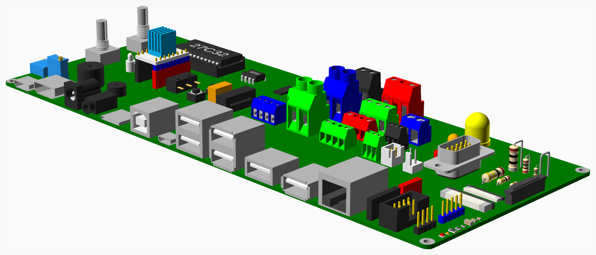

### Vitamins
| Qty | Module call | BOM entry |
| ---:|:--- |:---|
|   1 | `box_header(2p54header, 4, 2)` |  Box header 4 x 2 |
|   1 | `d_plug(DCONN9, pcb = true)` |  D-type 9 way PCB mount plug |
|   1 | `dil_socket(12, 15.24)` |  DIL socket 24 x 0.6" |
|   1 | `hdmi(hdmi_full)` |  HDMI socket |
|   1 | `pdip(24, 27C32, w = 15.24)` |  IC 27C32 PDIP24 |
|   1 | `pdip(8, NE555)` |  IC NE555 PDIP8 |
|   1 | `idc_transition(2p54header, 5)` |  IDC transition header 5 x 2 |
|   1 | `led(LED10mm, "yellow")` |  LED 10 mm yellow |
|   1 | `led(LED3mm)` |  LED 3 mm red |
|   1 | `led(LED5mm, "orange")` |  LED 5 mm orange |
|   1 | `microswitch(small_microswitch)` |  Microswitch DM1-00P-110-3 |
|   1 | `hdmi(hdmi_mini)` |  Mini HDMI socket |
|   1 | `molex_254(2)` |  Molex KK header 2 way |
|   1 | `pin_header(2p54header, 4, 1)` |  Pin header 4 x 1 |
|   1 | `pin_header(2p54header, 5, 1)` |  Pin header 5 x 1 |
|   1 | `pin_socket(2p54header, 4, 1)` |  Pin socket 4 x 1 |
|   1 | `pin_socket(2p54header, 6, 1)` |  Pin socket 6 x 1 |
|   2 | `pin_socket(2p54header, 8, 1)` |  Pin socket 8 x 1 |
|   1 | `ax_res(res1_2, 10, tol = 10)` |  Resistor 10 Ohms 10% 0.5W |
|   1 | `ax_res(res1_4, 100, tol = 2)` |  Resistor 100 Ohms 2% 0.25W |
|   1 | `ax_res(res1_8, 1000)` |  Resistor 1000 Ohms 5% 0.125W |
|   1 | `ax_res(res1_4, 10000)` |  Resistor 10000 Ohms 5% 0.25W |
|   1 | `ax_res(res1_2, 100000)` |  Resistor 100000 Ohms 5% 0.5W |
|   1 | `ax_res(res1_8, 1e+6, tol = 1)` |  Resistor 1e+6 Ohms 1% 0.125W |
|   1 | `smd_led(LED0603, orange)` |  SMD LED 0603 orange |
|   1 | `smd_led(LED0805, red)` |  SMD LED 0805 red |
|   1 | `smd_resistor(RES0603, 1K)` |  SMD resistor 0603 1K 0.1W |
|   1 | `smd_resistor(RES0805, 1K)` |  SMD resistor 0805 1K 0.125W |
|   1 | `smd_resistor(RES1206, 1K)` |  SMD resistor 1206 1K 0.25W |
|   1 | `square_button(button_4p5mm)` |  Square button 4.5mm |
|   1 | `square_button(button_6mm)` |  Square button 6mm |
|   1 | `pcb(TMC2130)` |  TMC2130 |
|   1 | `green_terminal(gt_5p08, 2)` |  Terminal block 2 way 0.2" |
|   2 | `green_terminal(gt_6p35, 2)` |  Terminal block 2 way 0.25" |
|   1 | `green_terminal(gt_5x17, 2)` |  Terminal block 2 way 5mm |
|   2 | `green_terminal(gt_2p54, 3)` |  Terminal block 3 way 0.1" |
|   1 | `terminal_35(3)` |  Terminal block 3 way 3.5mm |
|   1 | `green_terminal(gt_5x11, 3)` |  Terminal block 3 way 5mm |
|   1 | `green_terminal(gt_5x17, 3)` |  Terminal block 3 way 5mm |
|   2 | `green_terminal(gt_3p5, 4)` |  Terminal block 4 way 3.5mm |
|   1 | `terminal_35(4)` |  Terminal block 4 way 3.5mm |
|   1 | `pcb(TestPCB)` |  Test PCB |
|   1 | `wire_link(0.8, 5.08, h = 10.16)` |  Wire link 0.8mm x 0.2" |
|   1 | `wire_link(0.8, 10.16)` |  Wire link 0.8mm x 0.4" |

<a href="#top">Top</a>

---

## PCBs
PCBs and perfboard with optional components. The shape can be a rectangle with optionally rounded corners or a polygon for odd shapes like Arduino.

[vitamins/pcbs.scad](vitamins/pcbs.scad) Object definitions.

[vitamins/pcb.scad](vitamins/pcb.scad) Implementation.

[tests/PCBs.scad](tests/PCBs.scad) Code for this example.

### Properties
| Function | Description |
|:--- |:--- |
| `ff_back(type)` | Flat flex back section size |
| `ff_latch(type)` | Flat flex latch size |
| `ff_mid(type)` | Flat flex middle section size |
| `ff_slot(type)` | Flat flex slot size |
| `hdmi_depth(type)` | Front to back depth |
| `hdmi_height(type)` | Outside height above the PCB |
| `hdmi_height1(type)` | Inside height at the sides |
| `hdmi_height2(type)` | Inside height in the middle |
| `hdmi_thickness(type)` | Wall thickness of the metal |
| `hdmi_width1(type)` | Inside width at the top |
| `hdmi_width2(type)` | Inside width at the bottom |
| `pcb_accessories(type)` | List of accessories to go on the BOM, SD cards, USB cables, etc. |
| `pcb_colour(type)` | Colour of the subtrate |
| `pcb_components(type)` | List of components |
| `pcb_grid(type)` | Grid if a perfboard |
| `pcb_hole_d(type)` | Mounting hole diameter |
| `pcb_holes(type)` | List of hole positions |
| `pcb_land_d(type)` | Pad around mounting hole |
| `pcb_length(type)` | Length |
| `pcb_name(type)` | Description |
| `pcb_parts_on_bom(type)` | True if the parts should be separate BOM items |
| `pcb_polygon(type)` | Optional outline polygon for odd shaped boards |
| `pcb_radius(type)` | Corner radius |
| `pcb_thickness(type)` | Thickness |
| `pcb_width(type)` | Width |

### Functions
| Function | Description |
|:--- |:--- |
| `pcb_component(type, name, index = 0)` | Return the component specified by name and index |
| `pcb_component_position(type, name, index = 0)` | Return x y position of specified component |
| `pcb_coord(type, p)` | Convert offsets from the edge to coordinates relative to the centre |
| `pcb_grid_pos(type, x, y, z = 0)` | Returns a pcb grid position |
| `pcb_screw(type, cap = hs_cap)` | Mounting screw type |
| `pcb_size(type)` | Length, width and thickness in a vector |

### Modules
| Module | Description |
|:--- |:--- |
| `barrel_jack(cutout = false)` | Draw barrel power jack |
| `block(size, colour, makes_cutout, cutouts)` | Draw a coloured cube to represent a random PCB component |
| `buzzer(height, diameter, colour)` | Draw PCB buzzer with specified height, diameter and colour |
| `chip(length, width, thickness, colour, cutout = false)` | Draw a coloured cube to represent a chip, or other rectangular component |
| `flat_flex(type, cutout = false)` | Draw flat flexistrip connector as used on RPI0 |
| `flex(cutout = false)` | Draw flexistrip connector |
| `hdmi(type, cutout = false)` | Draw HDMI socket |
| `jack(cutout = false)` | Draw 3.5mm jack |
| `molex_254(ways)` | Draw molex header |
| `molex_usb_Ax2(cutout)` | Draw Molex USB connector suitable for perf board |
| `pcb(type)` | Draw specified PCB |
| `pcb_assembly(type, height, thickness)` | Draw PCB assembly with spaces and fasteners in place |
| `pcb_base(type, height, thickness, wall = 2)` | Generate STL for a base with PCB spacers |
| `pcb_component(comp, cutouts = false, angle = undef)` | Draw pcb component from description |
| `pcb_component_position(type, name)` | Position child at the specified component position |
| `pcb_components(type, cutouts = false, angle = undef)` | Draw list of PCB components on the PCB |
| `pcb_cutouts(type, angle = undef)` | Make cut outs to clear components on a PCB |
| `pcb_grid(type, x, y, z = 0)` | Positions children at specified grid position |
| `pcb_screw_positions(type)` | Positions children at the mounting hole positions |
| `pcb_spacer(screw, height, wall = 1.8, taper = 0)` | Generate STL for PCB spacer |
| `rj45(cutout = false)` | Draw RJ45 Ethernet connector |
| `standoff(h, d, h2, d2)` | Draw a standoff |
| `terminal_35(ways, colour = "blue")` | Draw 3.5mm terminal block |
| `trimpot10(vertical, cutout = false)` | Draw a ten turn trimpot |
| `uSD(size, cutout = false)` | Draw uSD socket |
| `usb_Ax1(cutout = false)` | Draw USB type A single socket |
| `usb_Ax2(cutout = false)` | Draw USB type A dual socket |
| `usb_B(cutout = false)` | Draw USB B connector |
| `usb_C(cutout = false)` | Draw USB C connector |
| `usb_uA(cutout = false)` | Draw USB micro A connector |

### Vitamins
| Qty | Module call | BOM entry |
| ---:|:--- |:---|
|   1 | `pcb(ArduinoLeonardo)` |  Arduino Leonardo |
|   1 | `pcb(ArduinoUno3)` |  Arduino Uno R3 |
|   1 | `pcb(BTT_SKR_E3_TURBO)` |  BigTreeTech SKR E3 Turbo |
|   1 | `pcb(BTT_SKR_MINI_E3_V2_0)` |  BigTreeTech SKR Mini E3 v2.0 |
|   1 | `pcb(BTT_SKR_V1_4_TURBO)` |  BigTreeTech SKR v1.4 Turbo |
|   1 |  |  Cat 5 patch cable 300mm |
|   1 | `d_plug(DCONN15, pcb = true)` |  D-type 15 way PCB mount plug |
|   1 | `pcb(DuetE)` |  Duet 2 Ethernet electronics |
|   1 | `pcb(Duex2)` |  Duex2 expansion board - not shown |
|   1 | `pcb(Duex5)` |  Duex5 expansion board |
|   1 | `pcb(ESP-01)` |  ESP-01 |
|   1 | `pcb(EnviroPlus)` |  Enviro+ |
|   1 | `pcb(ExtruderPCB)` |  Extruder connection PCB |
|   1 | `pcb(Keyes5p1)` |  Keyes5.1 Arduino Uno expansion board - not shown |
|   1 | `pcb(MP1584EN)` |  MP1584EN 3A buck converter |
|   1 | `pcb(MT3608)` |  MT3608 boost converter module |
|   1 | `pcb(Melzi)` |  Melzi electronics - not shown |
|   4 |  |  Micro SD card |
|   1 |  |  Micro SD card - not shown |
|   1 | `molex_254(2)` |  Molex KK header 2 way |
|   1 | `molex_254(3)` |  Molex KK header 3 way |
|  16 | `nut(M2_nut, nyloc = true)` |  Nut M2 x 1.6mm nyloc |
|  30 | `nut(M2p5_nut, nyloc = true)` |  Nut M2.5 x 2.2mm nyloc |
|  22 | `nut(M3_nut, nyloc = true)` |  Nut M3 x 2.4mm nyloc |
|   8 | `nut(M4_nut, nyloc = true)` |  Nut M4 x 3.2mm nyloc |
|   1 | `pcb(PI_IO)` |  PI_IO V2 |
|   1 | `pcb(PSU12V1A)` |  PSU 12V 1A - not shown |
|   1 | `pcb(PERF60x40)` |  Perfboard 60 x 40mm |
|   1 | `pcb(PERF70x30)` |  Perfboard 70 x 30mm |
|   1 | `pcb(PERF70x50)` |  Perfboard 70 x 50mm |
|   1 | `pcb(PERF74x51)` |  Perfboard 74 x 51mm |
|   1 | `pcb(PERF80x20)` |  Perfboard 80 x 20mm |
|   1 | `pin_socket(2p54header, 13, 2, right_angle = true)` |  Pin socket 13 x 2 right_angle |
|   1 | `pcb(RAMPSEndstop)` |  RAMPS Endstop Switch |
|   1 | `pcb(RPI3)` |  Raspberry Pi 3 |
|   1 | `pcb(RPI4)` |  Raspberry Pi 4 |
|   1 | `pcb(RPI0)` |  Raspberry Pi Zero |
|  12 | `screw(M2_cap_screw, 16)` |  Screw M2 cap x 16mm |
|   4 | `screw(M2_cap_screw, 20)` |  Screw M2 cap x 20mm |
|   2 | `screw(M2p5_cap_screw, 20)` |  Screw M2.5 cap x 20mm |
|   8 | `screw(M2p5_cap_screw, 25)` |  Screw M2.5 cap x 25mm |
|   8 | `screw(M2p5_cap_screw, 30)` |  Screw M2.5 cap x 30mm |
|  12 | `screw(M2p5_pan_screw, 25)` |  Screw M2.5 pan x 25mm |
|   4 | `screw(M3_cap_screw, 16)` |  Screw M3 cap x 16mm |
|   9 | `screw(M3_cap_screw, 30)` |  Screw M3 cap x 30mm |
|   9 | `screw(M3_cap_screw, 35)` |  Screw M3 cap x 35mm |
|   8 | `screw(M4_cap_screw, 35)` |  Screw M4 cap x 35mm |
|   1 | `pcb(TP4056)` |  TP4056 Li-lon Battery charger module |
|   3 | `terminal_35(2)` |  Terminal block 2 way 3.5mm |
|   2 | `green_terminal(gt_2p54, 4)` |  Terminal block 4 way 0.1" |
|   1 |  |  USB A to Mini B lead - not shown |
|   1 | `pcb(WD2002SJ)` |  WD2002SJ Buck Boost DC-DC converter |
|  16 | `washer(M2_washer)` |  Washer  M2 x 5mm x 0.3mm |
|  30 | `washer(M2p5_washer)` |  Washer  M2.5 x 5.9mm x 0.5mm |
|  22 | `washer(M3_washer)` |  Washer  M3 x 7mm x 0.5mm |
|   8 | `washer(M4_washer)` |  Washer  M4 x 9mm x 0.8mm |
|   1 | `pcb(ZC_A0591)` |  ZC-A0591 ULN2003 driver PCB |

### Printed
| Qty | Filename |
| ---:|:--- |
|   4 | pcb_spacer2060.stl |
|   4 | pcb_spacer2070.stl |
|   4 | pcb_spacer2080.stl |
|   4 | pcb_spacer2090.stl |
|   4 | pcb_spacer25120.stl |
|   4 | pcb_spacer25130.stl |
|   4 | pcb_spacer25140.stl |
|   4 | pcb_spacer25150_2.stl |
|   4 | pcb_spacer25160_2.stl |
|   4 | pcb_spacer25180.stl |
|   4 | pcb_spacer25190.stl |
|   2 | pcb_spacer2580.stl |
|   4 | pcb_spacer30170.stl |
|   5 | pcb_spacer30200.stl |
|   5 | pcb_spacer30210.stl |
|   4 | pcb_spacer30220.stl |
|   4 | pcb_spacer3050.stl |
|   4 | pcb_spacer40230.stl |
|   4 | pcb_spacer40240.stl |

<a href="#top">Top</a>

---

## Pillars
Threaded pillars. Each end can be male or female.

[vitamins/pillars.scad](vitamins/pillars.scad) Object definitions.

[vitamins/pillar.scad](vitamins/pillar.scad) Implementation.

[tests/pillars.scad](tests/pillars.scad) Code for this example.

### Properties
| Function | Description |
|:--- |:--- |
| `pillar_bot_thread(type)` | Bottom thread length, + for male, - for female |
| `pillar_height(type)` | Body height |
| `pillar_i_colour(type)` | Colour of the inner part |
| `pillar_id(type)` | Inner diameter of metal part |
| `pillar_ifn(type)` | Inner number of sides, 6 for hex, 0 for smooth cylinder |
| `pillar_name(type)` | Name of part |
| `pillar_o_colour(type)` | Colour of the outer part |
| `pillar_od(type)` | Outer diameter of body |
| `pillar_ofn(type)` | Outer number of sides, 6 for hex, 0 for smooth cylinder |
| `pillar_thread(type)` | Thread diameter |
| `pillar_top_thread(type)` | Top thread length, + for male, - for female |

### Modules
| Module | Description |
|:--- |:--- |
| `pillar(type)` | Draw specified pillar |

### Vitamins
| Qty | Module call | BOM entry |
| ---:|:--- |:---|
|   1 | `pillar(M3x13_hex_pillar)` |  Pillar hex M/F M3x13 |
|   1 | `pillar(M3x20_hex_pillar)` |  Pillar hex M/F M3x20 |
|   1 | `pillar(M3x10_nylon_hex_pillar)` |  Pillar hex nylon M/F M3x10 |
|   1 | `pillar(M3x20_nylon_hex_pillar)` |  Pillar hex nylon M/F M3x20 |
|   1 | `pillar(M2x16_brass_pillar)` |  Pillar nurled F/M M2x16 |
|   1 | `pillar(M3x20_nylon_pillar)` |  Pillar nylon M/F M3x20 |
|   1 | `pillar(M4x17_nylon_pillar)` |  Pillar nylon M/F M4x20 |

<a href="#top">Top</a>

---

## Pillow_blocks
KP pillow block bearings

[vitamins/pillow_blocks.scad](vitamins/pillow_blocks.scad) Object definitions.

[vitamins/pillow_block.scad](vitamins/pillow_block.scad) Implementation.

[tests/pillow_blocks.scad](tests/pillow_blocks.scad) Code for this example.

### Properties
| Function | Description |
|:--- |:--- |
| `kp_base_height(type)` | Height of base containing the bolts |
| `kp_diameter(type)` | Rod hole diameter |
| `kp_hole_offset(type)` | Rod hole offset |
| `kp_screw_separation(type)` | Separation of bolts in the base |

### Functions
| Function | Description |
|:--- |:--- |
| `kp_size(type)` | Size of bracket |

### Modules
| Module | Description |
|:--- |:--- |
| `kp_pillow_block(type)` | Draw the KP pillow block |
| `kp_pillow_block_assembly(type, part_thickness = 2, screw_type = M5_cap_screw, nut_type = undef)` | Assembly with fasteners in place |
| `kp_pillow_block_hole_positions(type)` | Place children at hole positions |

### Vitamins
| Qty | Module call | BOM entry |
| ---:|:--- |:---|
|   1 | `kp_pillow_block(KP000)` |  KP000 pillow block |
|   1 | `kp_pillow_block(KP001)` |  KP001 pillow block |
|   1 | `kp_pillow_block(KP08_15)` |  KP08_15 pillow block |
|   1 | `kp_pillow_block(KP08_18)` |  KP08_18 pillow block |
|   2 | `sliding_t_nut(M4_hammer_nut)` |  Nut M4 hammer |
|   2 | `sliding_t_nut(M4_sliding_t_nut)` |  Nut M4 sliding T |
|   2 | `sliding_t_nut(M5_sliding_t_nut)` |  Nut M5 sliding T |
|   2 | `nut(M5_nut, nyloc = undef)` |  Nut M5 x 4mm  |
|   4 | `screw(M4_cap_screw, 10)` |  Screw M4 cap x 10mm |
|   4 | `screw(M5_cap_screw, 12)` |  Screw M5 cap x 12mm |
|   4 | `washer(M4_washer)` |  Washer  M4 x 9mm x 0.8mm |
|   6 | `washer(M5_washer)` |  Washer  M5 x 10mm x 1mm |

<a href="#top">Top</a>

---

## Pin_headers
Pin headers and sockets, etc.

[vitamins/pin_headers.scad](vitamins/pin_headers.scad) Object definitions.

[vitamins/pin_header.scad](vitamins/pin_header.scad) Implementation.

[tests/pin_headers.scad](tests/pin_headers.scad) Code for this example.

### Properties
| Function | Description |
|:--- |:--- |
| `hdr_base_colour(type)` | Header insulator colour |
| `hdr_box_size(type)` | Box header outside dimensions |
| `hdr_box_wall(type)` | Box header wall thickness |
| `hdr_pin_below(type)` | Header pin length underneath |
| `hdr_pin_colour(type)` | Header pin colour |
| `hdr_pin_length(type)` | Header pin length |
| `hdr_pin_width(type)` | Header pin size |
| `hdr_pitch(type)` | Header pitch |
| `hdr_ra_box_offset(type)` | Offset between back of the box and the pins |
| `hdr_ra_height(type)` | Height of right angle connector |
| `hdr_socket_depth(type)` | Socket depth for female housing |
| `hdr_y_offset(type)` | Y offset of pins from center of the box |

### Modules
| Module | Description |
|:--- |:--- |
| `box_header(type, cols = 1, rows = 1, smt = false, cutout = false)` | Draw box header |
| `idc_transition(type, cols = 5, skip = [], cutout = false)` | Draw IDC transition header |
| `jst_xh_header(type, pin_count, right_angle = false, colour = false, pin_colour = false)` | Draw JST XH connector |
| `pin(type, length = undef)` | Draw a header pin |
| `pin_header(type, cols = 1, rows = 1, smt = false, right_angle = false, cutout = false, colour)` | Draw pin header |
| `pin_socket(type, cols = 1, rows = 1, right_angle = false, height = 0, smt = false, cutout = false, colour)` | Draw pin socket |

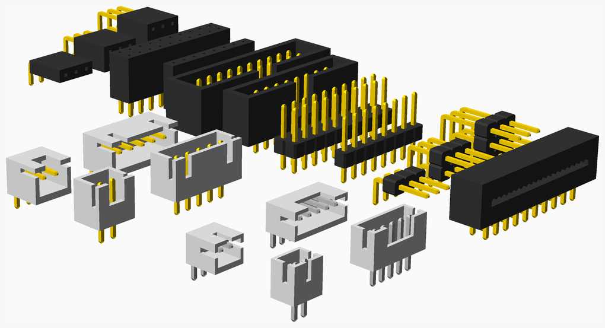

### Vitamins
| Qty | Module call | BOM entry |
| ---:|:--- |:---|
|   1 | `box_header(2p54header, 10, 2)` |  Box header 10 x 2 |
|   1 | `box_header(2p54header, 8, 1)` |  Box header 8 x 1 |
|   1 | `idc_transition(2p54header, 10)` |  IDC transition header 10 x 2 |
|   1 | `pin_header(2p54header, 10, 2)` |  Pin header 10 x 2 |
|   1 | `pin_header(2p54header, 3, 1, right_angle = true)` |  Pin header 3 x 1 right_angle |
|   1 | `pin_header(2p54header, 3, 2, right_angle = true)` |  Pin header 3 x 2 right_angle |
|   1 | `pin_header(2p54header, 3, 3, right_angle = true)` |  Pin header 3 x 3 right_angle |
|   1 | `pin_header(2p54header, 8, 1)` |  Pin header 8 x 1 |
|   1 | `pin_socket(2p54header, 10, 2)` |  Pin socket 10 x 2 |
|   1 | `pin_socket(2p54header, 3, 1, right_angle = true)` |  Pin socket 3 x 1 right_angle |
|   1 | `pin_socket(2p54header, 3, 2, right_angle = true)` |  Pin socket 3 x 2 right_angle |
|   1 | `pin_socket(2p54header, 3, 3, right_angle = true)` |  Pin socket 3 x 3 right_angle |
|   1 | `pin_socket(2p54header, 8, 1)` |  Pin socket 8 x 1 |

<a href="#top">Top</a>

---

## PSUs
Powersupplies. Can be a simple cube or can be defined by a list of six faces, each with thickness, holes, cutouts, etc.

Face order is bottom, top, left, right, front, back.

[vitamins/psus.scad](vitamins/psus.scad) Object definitions.

[vitamins/psu.scad](vitamins/psu.scad) Implementation.

[tests/PSUs.scad](tests/PSUs.scad) Code for this example.

### Properties
| Function | Description |
|:--- |:--- |
| `atx_psu(type)` | True if an ATX style PSU |
| `psu_accessories(type)` | Accessories to add to BOM, e.g. mains lead |
| `psu_face_cutouts(type)` | List of polygons to remove |
| `psu_face_fan(type)` | Fan x,y position and type |
| `psu_face_grill(type)` | Is this face a grill |
| `psu_face_holes(type)` | List of screw hole positions |
| `psu_face_iec(type)` | IEC connector x,y, rotation and type |
| `psu_face_switch(type)` | Rocker switch x,y, rotation and type |
| `psu_face_thickness(type)` | The thickness |
| `psu_face_vents(type)` | Vents array position x,y, rotation, size and corner radius |
| `psu_faces(type)` | List of face descriptions |
| `psu_height(type)` | Height |
| `psu_left_bay(type)` | Bay for terminals |
| `psu_length(type)` | Length |
| `psu_name(type)` | The part name |
| `psu_right_bay(type)` | Bay for heatsink |
| `psu_screw(type)` | Screw type |
| `psu_screw_hole_radius(type)` | Clearance hole for screw, bigger than normal on ATX |
| `psu_terminals(type)` | How many terminals and the y offset from the back |
| `psu_width(type)` | Width |
| `terminal_block_depth(type)` | Total depth |
| `terminal_block_depth2(type)` | Depth of contact well |
| `terminal_block_divider(type)` | Width of the dividers |
| `terminal_block_height(type)` | Height of the dividers |
| `terminal_block_height2(type)` | Height under the contacts |
| `terminal_block_pitch(type)` | Pitch between screws |

### Functions
| Function | Description |
|:--- |:--- |
| `psu_face_transform(type, face)` | Returns a transformation matrix to get to the specified face |
| `psu_size(type)` | Size |
| `terminal_block_length(type, ways)` | Total length of terminal block |

### Modules
| Module | Description |
|:--- |:--- |
| `atx_psu_cutout(type)` | Cut out for the rear of an ATX |
| `psu(type)` | Draw a power supply |
| `psu_screw_positions(type, face = undef)` | Position children at the screw positions on the preferred mounting face, which can be overridden. |
| `terminal_block(type, ways)` | Draw a power supply terminal block |

### Vitamins
| Qty | Module call | BOM entry |
| ---:|:--- |:---|
|   1 |  |  IEC mains lead |
|   1 | `psu(ATX500)` |  PSU ATX500 |
|   1 | `psu(KY240W)` |  PSU KY-240W-12-L |
|   1 | `psu(PD_150_12)` |  PSU PD-150-12 |
|   1 | `psu(S_250_48)` |  PSU S-250-48 |
|   1 | `psu(S_300_12)` |  PSU S-300-12 |
|   4 | `screw(No632_pan_screw, 8)` |  Screw 6-32 pan x  8mm |
|   4 | `screw(M3_cap_screw, 8)` |  Screw M3 cap x  8mm |
|   8 | `screw(M3_pan_screw, 8)` |  Screw M3 pan x  8mm |
|   4 | `screw(M4_cap_screw, 8)` |  Screw M4 cap x  8mm |
|  12 | `washer(M3_washer)` |  Washer  M3 x 7mm x 0.5mm |
|   8 | `washer(M4_washer)` |  Washer  M4 x 9mm x 0.8mm |

<a href="#top">Top</a>

---

## Pulleys
Timing belt pulleys, both toothed and plain with internal bearings for idlers.

[vitamins/pulleys.scad](vitamins/pulleys.scad) Object definitions.

[vitamins/pulley.scad](vitamins/pulley.scad) Implementation.

[tests/pulleys.scad](tests/pulleys.scad) Code for this example.

### Properties
| Function | Description |
|:--- |:--- |
| `pulley_belt(type)` | Belt type |
| `pulley_bore(type)` | Bore diameter for shaft |
| `pulley_flange_dia(type)` | Flange diameter |
| `pulley_flange_thickness(type)` | Flange thickness |
| `pulley_hub_dia(type)` | Hub diameter |
| `pulley_hub_length(type)` | Hub length |
| `pulley_od(type)` | Outer diameter |
| `pulley_screw(type)` | Grub screw type |
| `pulley_screw_length(type)` | Grup screw length |
| `pulley_screw_z(type)` | Grub screw position |
| `pulley_screws(type)` | Number of grub screws |
| `pulley_teeth(type)` | Number of teeth |
| `pulley_type(type)` | Part description |
| `pulley_width(type)` | Width of teeth / belt channel |

### Functions
| Function | Description |
|:--- |:--- |
| `pulley_extent(type)` | Largest diameter |
| `pulley_height(type)` | Total height of pulley |
| `pulley_ir(type)` | Inside radius of the teeth |
| `pulley_offset(type)` | Offset of the belt path centre |
| `pulley_pr(type, belt = undef)` | Pitch radius, `belt` only needed for non-standard belt over smooth pulleys |

### Modules
| Module | Description |
|:--- |:--- |
| `pulley(type, colour = silver)` | Draw a pulley, any children are placed above. |
| `pulley_assembly(type, colour = silver)` | Draw a pulley with its grub screws in place |

### Vitamins
| Qty | Module call | BOM entry |
| ---:|:--- |:---|
|   1 | `pulley(GT2x16_pulley)` |  Pulley GT2 16 teeth |
|   1 | `pulley(GT2x16_toothed_idler)` |  Pulley GT2 idler 16 teeth |
|   1 | `pulley(GT2x20_toothed_idler)` |  Pulley GT2 idler 20 teeth |
|   1 | `pulley(GT2x20_plain_idler)` |  Pulley GT2 idler smooth 12mm |
|   1 | `pulley(GT2x16_plain_idler)` |  Pulley GT2 idler smooth 9.63mm |
|   1 | `pulley(GT2x16x7_plain_idler)` |  Pulley GT2 idler smooth 9.63mm |
|   1 | `pulley(GT2x20ob_pulley)` |  Pulley GT2OB 20 teeth |
|   1 | `pulley(GT2x12_pulley)` |  Pulley GT2RD 12 teeth |
|   1 | `pulley(GT2x20um_pulley)` |  Pulley GT2UM 20 teeth |
|   1 | `pulley(T2p5x16_pulley)` |  Pulley T2.5 16 teeth |
|   1 | `pulley(T5x10_pulley)` |  Pulley T5 10 teeth |
|   1 | `screw(M3_grub_screw, 3)` |  Screw M3 grub x  3mm |
|   2 | `screw(M3_grub_screw, 4.5)` |  Screw M3 grub x  4.5mm |
|   2 | `screw(M3_grub_screw, 4)` |  Screw M3 grub x  4mm |
|   4 | `screw(M3_grub_screw, 6)` |  Screw M3 grub x  6mm |
|   1 | `screw(M4_grub_screw, 6)` |  Screw M4 grub x  6mm |

<a href="#top">Top</a>

---

## Rails
Linear rails with carriages.

[vitamins/rails.scad](vitamins/rails.scad) Object definitions.

[vitamins/rail.scad](vitamins/rail.scad) Implementation.

[tests/rails.scad](tests/rails.scad) Code for this example.

### Properties
| Function | Description |
|:--- |:--- |
| `carriage_block_length(type)` | Length of the metal part |
| `carriage_clearance(type)` | Gap under the carriage |
| `carriage_height(type)` | Height of carriage |
| `carriage_length(type)` | Overall length |
| `carriage_pitch_x(type)` | Screw hole x pitch |
| `carriage_pitch_y(type)` | Screw hole y pitch |
| `carriage_rail(type)` | Rail type |
| `carriage_screw(type)` | Carriage screw type |
| `carriage_width(type)` | Width of carriage |
| `rail_bore(type)` | Counter bore diameter for screw head |
| `rail_bore_depth(type)` | Counter bore depth |
| `rail_end(type)` | Minimum distance screw can be from the end |
| `rail_end_screw(type)` | Screw used for ends only (Countersink used for better location) |
| `rail_groove_offset(type)` | Offset of centre of groove from top of rail |
| `rail_groove_width(type)` | Groove width |
| `rail_height(type)` | Height of rail section |
| `rail_hole(type)` | Screw hole diameter |
| `rail_pitch(type)` | Distance between screws |
| `rail_screw(type)` | Screw type |
| `rail_width(type)` | Width of rail section |

### Functions
| Function | Description |
|:--- |:--- |
| `carriage_screw_depth(type)` | Carriage thread depth |
| `carriage_size(type)` | Size of carriage |
| `carriage_travel(type, rail_length)` | How far the carriage can travel on a given length rail |
| `rail_holes(type, length)` | Number of holes in a rail given its `length` |
| `rail_screw_height(type, screw)` | Position screw taking into account countersink into counterbored hole |

### Modules
| Module | Description |
|:--- |:--- |
| `carriage(type, end_colour = grey(20)` | Draw the specified carriage |
| `carriage_hole_positions(type)` | Position children over screw holes |
| `rail(type, length, colour = grey(90)` | Draw the specified rail |
| `rail_assembly(carriage, length, pos, carriage_end_colour = grey(20)` | Rail and carriage assembly |
| `rail_hole_positions(type, length, first = 0, screws = 100, both_ends = true)` | Position children over screw holes |
| `rail_screws(type, length, thickness, screws = 100, index_screws = undef)` | Place screws in the rail |

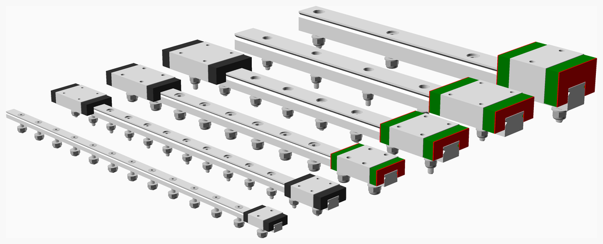

### Vitamins
| Qty | Module call | BOM entry |
| ---:|:--- |:---|
|   1 | `rail(MGN12, 200)` |  Linear rail MGN12 x 200mm |
|   1 | `rail(MGN15, 200)` |  Linear rail MGN15 x 200mm |
|   1 | `rail(MGN5, 200)` |  Linear rail MGN5 x 200mm |
|   1 | `rail(MGN7, 200)` |  Linear rail MGN7 x 200mm |
|   1 | `rail(MGN9, 200)` |  Linear rail MGN9 x 200mm |
|   1 | `rail(SSR15, 200)` |  Linear rail SSR15 x 200mm |
|   1 | `carriage(MGN12C_carriage)` |  Linear rail carriage MGN12C |
|   1 | `carriage(MGN12H_carriage)` |  Linear rail carriage MGN12H |
|   1 | `carriage(MGN15C_carriage)` |  Linear rail carriage MGN15C |
|   1 | `carriage(MGN5C_carriage)` |  Linear rail carriage MGN5C |
|   1 | `carriage(MGN7C_carriage)` |  Linear rail carriage MGN7C |
|   1 | `carriage(MGN7H_carriage)` |  Linear rail carriage MGN7H |
|   1 | `carriage(MGN9C_carriage)` |  Linear rail carriage MGN9C |
|   1 | `carriage(MGN9H_carriage)` |  Linear rail carriage MGN9H |
|   1 | `carriage(SSR15_carriage)` |  Linear rail carriage SSR15 |
|  26 | `nut(M2_nut, nyloc = true)` |  Nut M2 x 1.6mm nyloc |
|  23 | `nut(M3_nut, nyloc = true)` |  Nut M3 x 2.4mm nyloc |
|   4 | `nut(M4_nut, nyloc = true)` |  Nut M4 x 3.2mm nyloc |
|  11 | `screw(M2_cap_screw, 10)` |  Screw M2 cap x 10mm |
|  15 | `screw(M2_cs_cap_screw, 10)` |  Screw M2 cs cap x 10mm |
|   8 | `screw(M3_cap_screw, 10)` |  Screw M3 cap x 10mm |
|   6 | `screw(M3_cap_screw, 12)` |  Screw M3 cap x 12mm |
|   3 | `screw(M3_cap_screw, 16)` |  Screw M3 cap x 16mm |
|   2 | `screw(M3_cs_cap_screw, 12)` |  Screw M3 cs cap x 12mm |
|   4 | `screw(M3_cs_cap_screw, 16)` |  Screw M3 cs cap x 16mm |
|   2 | `screw(M4_cap_screw, 16)` |  Screw M4 cap x 16mm |
|   2 | `screw(M4_cs_cap_screw, 20)` |  Screw M4 cs cap x 20mm |
|  26 | `washer(M2_washer)` |  Washer  M2 x 5mm x 0.3mm |
|  23 | `washer(M3_washer)` |  Washer  M3 x 7mm x 0.5mm |
|   4 | `washer(M4_washer)` |  Washer  M4 x 9mm x 0.8mm |

<a href="#top">Top</a>

---

## Ring_terminals
Ring terminals and earth assemblies for DiBond panels.

[vitamins/ring_terminals.scad](vitamins/ring_terminals.scad) Object definitions.

[vitamins/ring_terminal.scad](vitamins/ring_terminal.scad) Implementation.

[tests/ring_terminals.scad](tests/ring_terminals.scad) Code for this example.

### Properties
| Function | Description |
|:--- |:--- |
| `ringterm_crimp_length(type)` | If non-zero the length of the crimp tube |
| `ringterm_hole(type)` | Wire hole diameter |
| `ringterm_id(type)` | Inside diameter |
| `ringterm_length(type)` | Length of the tail including the ring |
| `ringterm_od(type)` | Outside diameter |
| `ringterm_screw(type)` | Screw type |
| `ringterm_thickness(type)` | Metal thickness |
| `ringterm_width(type)` | Width of the tail |

### Functions
| Function | Description |
|:--- |:--- |
| `ringterm_extent(type)` | Space to leave |

### Modules
| Module | Description |
|:--- |:--- |
| `ring_terminal(type)` | Draw specifeid ring terminal |
| `ring_terminal_assembly(type, thickness, top = false)` | Earthing assembly for DiBond twin skins |
| `ring_terminal_hole(type, h = 0)` | Drill hole for the screw |

### Vitamins
| Qty | Module call | BOM entry |
| ---:|:--- |:---|
|   3 | `nut(M3_nut, nyloc = true)` |  Nut M3 x 2.4mm nyloc |
|   1 | `ring_terminal(M3_ringterm)` |  Ring terminal 3mm |
|   1 | `ring_terminal(M3_ringterm_cs)` |  Ring terminal 3mm |
|   1 | `ring_terminal(M3_ringterm_crimp)` |  Ring terminal crimp 3mm |
|   1 | `screw(M3_cap_screw, 10)` |  Screw M3 cap x 10mm |
|   2 | `screw(M3_dome_screw, 10)` |  Screw M3 dome x 10mm |
|   6 | `star_washer(M3_washer)` |  Washer star M3 x 0.5mm |

<a href="#top">Top</a>

---

## Rockers
Rocker switch. Also used for neon indicator in the same form factor.

[vitamins/rockers.scad](vitamins/rockers.scad) Object definitions.

[vitamins/rocker.scad](vitamins/rocker.scad) Implementation.

[tests/rockers.scad](tests/rockers.scad) Code for this example.

### Properties
| Function | Description |
|:--- |:--- |
| `rocker_bezel(type)` | Bezel width |
| `rocker_button(type)` | How far the button extends from the bezel |
| `rocker_depth(type)` | Body depth |
| `rocker_flange_h(type)` | Flange height |
| `rocker_flange_t(type)` | Flange thickness |
| `rocker_flange_w(type)` | Flange width |
| `rocker_height(type)` | Body height |
| `rocker_part(type)` | Part description |
| `rocker_pivot(type)` | Pivot distance from the back of the flange |
| `rocker_slot_h(type)` | Panel slot height |
| `rocker_slot_w(type)` | Panel slot width |
| `rocker_spades(type)` | Spade types and positions |
| `rocker_width(type)` | Body width |

### Functions
| Function | Description |
|:--- |:--- |
| `rocker_size(type)` | Width, height, and depth in a vector |
| `rocker_slot(type)` | Rocker slot in a vector |

### Modules
| Module | Description |
|:--- |:--- |
| `rocker(type, colour)` | Draw the specified rocker switch |
| `rocker_hole(type, h = 0, rounded = true)` | Make a hole to accept a rocker switch, by default 2D, set h for 3D |

### Vitamins
| Qty | Module call | BOM entry |
| ---:|:--- |:---|
|   2 | `rocker(neon_indicator)` |  Neon Indicator H8630FBNAL |
|   2 | `rocker(small_rocker)` |  Rocker Switch PRASA1-16F-BB0BW |

<a href="#top">Top</a>

---

## Rod
Steel rods and studding with chamfered ends.

These items are sysmtrical, so by default the origin is in the centre but it can be changed to the bottom.

[vitamins/rod.scad](vitamins/rod.scad) Implementation.

[tests/rod.scad](tests/rod.scad) Code for this example.

### Modules
| Module | Description |
|:--- |:--- |
| `leadscrew(d , l, lead, starts, center = true)` | Draw a leadscrew with specified diameter, length, lead and number of starts |
| `rod(d , l, center = true)` | Draw a smooth rod with specified diameter and length |
| `studding(d , l, center = true)` | Draw a threaded rod with specified diameter and length |

### Vitamins
| Qty | Module call | BOM entry |
| ---:|:--- |:---|
|   1 | `leadscrew(10, 80, 8, 4)` |  Leadscrew 10 x 80mm, 8mm lead, 4 starts |
|   1 | `leadscrew(12, 80, 12, 4)` |  Leadscrew 12 x 80mm, 12mm lead, 4 starts |
|   1 | `leadscrew(16, 80, 16, 4)` |  Leadscrew 16 x 80mm, 16mm lead, 4 starts |
|   1 | `leadscrew(6, 80, 2, 1)` |  Leadscrew 6 x 80mm, 2mm lead, 1 starts |
|   1 | `leadscrew(8, 80, 8, 4)` |  Leadscrew 8 x 80mm, 8mm lead, 4 starts |
|   1 | `rod(10, 80)` |  Smooth rod 10mm x 80mm |
|   1 | `rod(12, 80)` |  Smooth rod 12mm x 80mm |
|   1 | `rod(16, 80)` |  Smooth rod 16mm x 80mm |
|   1 | `rod(3, 80)` |  Smooth rod 3mm x 80mm |
|   1 | `rod(4, 80)` |  Smooth rod 4mm x 80mm |
|   1 | `rod(5, 80)` |  Smooth rod 5mm x 80mm |
|   1 | `rod(6, 80)` |  Smooth rod 6mm x 80mm |
|   1 | `rod(8, 80)` |  Smooth rod 8mm x 80mm |
|   1 | `studding(10, 80)` |  Threaded rod M10 x 80mm |
|   1 | `studding(12, 80)` |  Threaded rod M12 x 80mm |
|   1 | `studding(16, 80)` |  Threaded rod M16 x 80mm |
|   1 | `studding(3, 80)` |  Threaded rod M3 x 80mm |
|   1 | `studding(4, 80)` |  Threaded rod M4 x 80mm |
|   1 | `studding(5, 80)` |  Threaded rod M5 x 80mm |
|   1 | `studding(6, 80)` |  Threaded rod M6 x 80mm |
|   1 | `studding(8, 80)` |  Threaded rod M8 x 80mm |

<a href="#top">Top</a>

---

## Screws
Machine screws and wood screws with various head styles.

For an explanation of `screw_polysink()` see <https://hydraraptor.blogspot.com/2020/12/sinkholes.html>.

[vitamins/screws.scad](vitamins/screws.scad) Object definitions.

[vitamins/screw.scad](vitamins/screw.scad) Implementation.

[tests/screws.scad](tests/screws.scad) Code for this example.

### Properties
| Function | Description |
|:--- |:--- |
| `screw_clearance_radius(type)` | Clearance hole radius |
| `screw_head_height(type)` | Head height |
| `screw_head_radius(type)` | Head radius |
| `screw_head_type(type)` | Head style hs_cap, hs_pan, hs_cs, hs_hex, hs_grub, hs_cs_cap, hs_dome |
| `screw_max_thread(type)` | Maximum thread length |
| `screw_nut(type)` | Default nut |
| `screw_pilot_hole(type)` | Pilot hole radius for wood screws, tap radius for machine screws |
| `screw_radius(type)` | Nominal radius |
| `screw_socket_af(type)` | Socket across flats |
| `screw_socket_depth(type)` | Socket or slot depth |
| `screw_washer(type)` | Default washer |

### Functions
| Function | Description |
|:--- |:--- |
| `screw_boss_diameter(type)` | Boss big enough for nut trap and washer |
| `screw_head_depth(type, d = 0)` | How far a counter sink head will go into a straight hole diameter d |
| `screw_length(screw, thickness, washers, insert = false, nyloc = false, nut = false, longer = false)` | Returns the length of the longest or shortest screw that will got through `thickness` and `washers` and possibly an `insert`, `nut` or `nyloc` |
| `screw_longer_than(x)` | Returns the length of the shortest screw length longer or equal to x |
| `screw_nut_radius(type)` | Radius of matching nut |
| `screw_polysink_r(type, z)` | Countersink hole profile corrected for rounded staircase extrusions. |
| `screw_shorter_than(x)` | Returns the length of the longest screw shorter than or equal to x |

### Modules
| Module | Description |
|:--- |:--- |
| `screw(type, length, hob_point = 0, nylon = false)` | Draw specified screw, optionally hobbed or nylon |
| `screw_and_washer(type, length, star = false, penny = false)` | Screw with a washer which can be standard or penny and an optional star washer on top |
| `screw_countersink(type, drilled = true)` | Countersink shape |
| `screw_polysink(type, h = 100, alt = false, sink = 0)` | A countersink hole made from stacked polyholes for printed parts, default is flush, `sink` can be used to recess the head |

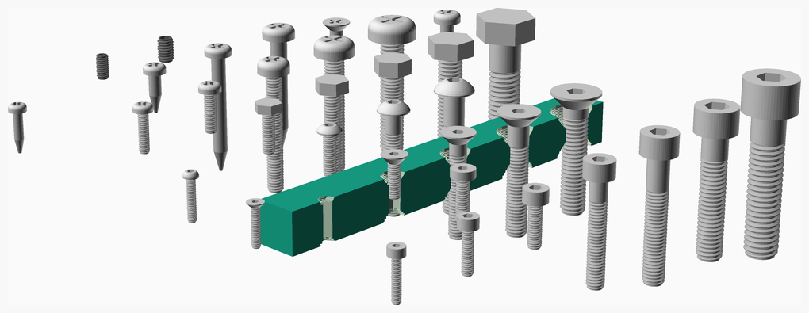

### Vitamins
| Qty | Module call | BOM entry |
| ---:|:--- |:---|
|   1 | `screw(No632_pan_screw, 30)` |  Screw 6-32 pan x 30mm |
|   1 | `screw(M2_cap_screw, 10)` |  Screw M2 cap x 10mm |
|   1 | `screw(M2_cs_cap_screw, 10)` |  Screw M2 cs cap x 10mm |
|   1 | `screw(M2_dome_screw, 10)` |  Screw M2 dome x 10mm |
|   1 | `screw(M2p5_cap_screw, 10)` |  Screw M2.5 cap x 10mm |
|   1 | `screw(M2p5_pan_screw, 10)` |  Screw M2.5 pan x 10mm |
|   1 | `screw(M3_cap_screw, 10)` |  Screw M3 cap x 10mm |
|   1 | `screw(M3_cs_cap_screw, 10)` |  Screw M3 cs cap x 10mm |
|   1 | `screw(M3_dome_screw, 10)` |  Screw M3 dome x 10mm |
|   1 | `screw(M3_grub_screw, 6)` |  Screw M3 grub x  6mm |
|   1 | `screw(M3_hex_screw, 10)` |  Screw M3 hex x 10mm |
|   1 | `screw(M3_low_cap_screw, 10)` |  Screw M3 low cap x 10mm |
|   1 | `screw(M3_pan_screw, 10)` |  Screw M3 pan x 10mm |
|   1 | `screw(M4_cap_screw, 25)` |  Screw M4 cap x 25mm |
|   1 | `screw(M4_cs_cap_screw, 25)` |  Screw M4 cs cap x 25mm |
|   1 | `screw(M4_dome_screw, 25)` |  Screw M4 dome x 25mm |
|   1 | `screw(M4_grub_screw, 6)` |  Screw M4 grub x  6mm |
|   1 | `screw(M4_hex_screw, 30)` |  Screw M4 hex x 30mm |
|   1 | `screw(M4_pan_screw, 30)` |  Screw M4 pan x 30mm |
|   1 | `screw(M5_cap_screw, 30)` |  Screw M5 cap x 30mm |
|   1 | `screw(M5_cs_cap_screw, 30)` |  Screw M5 cs cap x 30mm |
|   1 | `screw(M5_dome_screw, 30)` |  Screw M5 dome x 30mm |
|   1 | `screw(M5_hex_screw, 30)` |  Screw M5 hex x 30mm |
|   1 | `screw(M5_pan_screw, 30)` |  Screw M5 pan x 30mm |
|   1 | `screw(M6_cap_screw, 30)` |  Screw M6 cap x 30mm |
|   1 | `screw(M6_cs_cap_screw, 30)` |  Screw M6 cs cap x 30mm |
|   1 | `screw(M6_hex_screw, 30)` |  Screw M6 hex x 30mm |
|   1 | `screw(M6_pan_screw, 30)` |  Screw M6 pan x 30mm |
|   1 | `screw(M8_cap_screw, 35)` |  Screw M8 cap x 35mm |
|   1 | `screw(M8_hex_screw, 30)` |  Screw M8 hex x 30mm |
|   1 | `screw(No2_screw, 10)` |  Screw No2 pan wood x 10mm |
|   1 | `screw(No4_screw, 10)` |  Screw No4 pan wood x 10mm |
|   1 | `screw(No6_cs_screw, 30)` |  Screw No6 cs wood x 30mm |
|   1 | `screw(No6_screw, 30)` |  Screw No6 pan wood x 30mm |
|   1 | `screw(No8_screw, 30)` |  Screw No8 pan wood x 30mm |

### Printed
| Qty | Filename |
| ---:|:--- |
|   1 | polysink.stl |

<a href="#top">Top</a>

---

## Sealing_strip
Sealing strip from B&Q used to seal around the door of 3D printers.

[vitamins/sealing_strip.scad](vitamins/sealing_strip.scad) Implementation.

[tests/sealing_strip.scad](tests/sealing_strip.scad) Code for this example.

### Modules
| Module | Description |
|:--- |:--- |
| `sealing_strip(length)` | Draw specified length of sealing strip |

### Vitamins
| Qty | Module call | BOM entry |
| ---:|:--- |:---|
|   1 | `sealing_strip(100)` |  Sealing strip 10mm x 4mm x 100mm |

<a href="#top">Top</a>

---

## Shaft_couplings
Shaft couplings

[vitamins/shaft_couplings.scad](vitamins/shaft_couplings.scad) Object definitions.

[vitamins/shaft_coupling.scad](vitamins/shaft_coupling.scad) Implementation.

[tests/shaft_couplings.scad](tests/shaft_couplings.scad) Code for this example.

### Properties
| Function | Description |
|:--- |:--- |
| `sc_diameter(type)` | Coupling outer diameter |
| `sc_diameter1(type)` | Diameter of smaller shaft |
| `sc_diameter2(type)` | Diameter of larger shaft |
| `sc_length(type)` | Coupling length |

### Modules
| Module | Description |
|:--- |:--- |
| `shaft_coupling(type, colour = "silver")` | Draw the shaft coupling |

### Vitamins
| Qty | Module call | BOM entry |
| ---:|:--- |:---|
|   1 | `shaft_coupling(SC_5x8_rigid)` |  Shaft coupling SC_5x8_rigid |

<a href="#top">Top</a>

---

## Sheets
Sheet materials. Rectangular with optional rounded corners. Negative radii make a chamfer.

The "Soft" parameter can be used to determinesif the sheet material needs machine screws or wood screws, e.g.:

* If soft, wood screws will be used, with a pilot hole.
* If not soft, either tapped holes or a clearance hole and nuts will be used to retain screws.

The "Colour" parameter is a quad-array: [R, G, B, Alpha], or can be a named colour, see [OpenSCAD_User_Manual](https://en.wikibooks.org/wiki/OpenSCAD_User_Manual/The_OpenSCAD_Language#color).

For speed sheets should be modelled in 2D by subtracting holes from 2D templates made by `sheet_2D()` and then extruded to 3D with `render_2D_sheet()`.
Note that modules that drill holes will return a 2D object if `h` is set to 0 to facilitate this.

If 3D features are needed, for example countersinks, then sheets can be modelled in 3D using `sheet()` and then coloured with `render_sheet()`.

When woven sheets (e.g. carbon fibre) are rendered it is necessary to specify the dimensions again to `render_sheet()` or `render_2D_sheet()`.

[vitamins/sheets.scad](vitamins/sheets.scad) Object definitions.

[vitamins/sheet.scad](vitamins/sheet.scad) Implementation.

[tests/sheets.scad](tests/sheets.scad) Code for this example.

### Properties
| Function | Description |
|:--- |:--- |
| `sheet_colour(type)` | Colour |
| `sheet_colour2(type)` | Second colour for a woven sheet |
| `sheet_is_soft(type)` | Is soft enough for wood screws |
| `sheet_thickness(type)` | Thickness |
| `sheet_warp(type)` | Wovern sheet warp |
| `sheet_weft(type)` | Wovern sheet weft |

### Functions
| Function | Description |
|:--- |:--- |
| `sheet_is_woven(type)` | Is a woven sheet, eg carbon fiber |

### Modules
| Module | Description |
|:--- |:--- |
| `render_2D_sheet(type, colour = false, colour2 = false, w = undef, d = undef)` | Extrude a 2D sheet template and give it the correct colour |
| `render_sheet(type, colour = false, colour2 = false, w = undef, d = undef)` | Render a sheet in the correct colour after holes have been subtracted |
| `sheet(type, w, d, corners = [0, 0, 0, 0])` | Draw specified sheet |
| `sheet_2D(type, w, d, corners = [0, 0, 0, 0])` | 2D sheet template with specified size and optionally rounded corners |

### Vitamins
| Qty | Module call | BOM entry |
| ---:|:--- |:---|
|   1 | `sheet(FoilTape, 30, 30, 2)` |  Aluminium foil tape 30mm x 30mm x 0.05mm |
|   1 | `sheet(AL6, 30, 30, 2)` |  Aluminium tooling plate 30mm x 30mm x 6mm |
|   1 | `sheet(AL8, 30, 30, 2)` |  Aluminium tooling plate 30mm x 30mm x 8mm |
|   1 | `sheet(Spring05, 30, 30, 2)` |  Bi-metal saw blade 30mm x 30mm x 0.5mm |
|   1 | `sheet(Cardboard, 30, 30, 2)` |  Corrugated cardboard 30mm x 30mm x 5mm |
|   1 | `sheet(Foam20, 30, 30, 2)` |  Foam sponge 30mm x 30mm x 20mm |
|   1 | `sheet(DiBond, 30, 30, 2)` |  Sheet DiBond 30mm x 30mm x 3mm |
|   1 | `sheet(DiBond6, 30, 30, 2)` |  Sheet DiBond 30mm x 30mm x 6mm |
|   1 | `sheet(MDF10, 30, 30, 2)` |  Sheet MDF 30mm x 30mm x 10mm |
|   1 | `sheet(MDF12, 30, 30, 2)` |  Sheet MDF 30mm x 30mm x 12mm |
|   1 | `sheet(MDF19, 30, 30, 2)` |  Sheet MDF 30mm x 30mm x 19mm |
|   1 | `sheet(MDF6, 30, 30, 2)` |  Sheet MDF 30mm x 30mm x 6mm |
|   1 | `sheet(PMMA10, 30, 30, 2)` |  Sheet acrylic 30mm x 30mm x 10mm |
|   1 | `sheet(PMMA2, 30, 30, 2)` |  Sheet acrylic 30mm x 30mm x 2mm |
|   1 | `sheet(PMMA3, 30, 30, 2)` |  Sheet acrylic 30mm x 30mm x 3mm |
|   1 | `sheet(PMMA6, 30, 30, 2)` |  Sheet acrylic 30mm x 30mm x 6mm |
|   1 | `sheet(PMMA8, 30, 30, 2)` |  Sheet acrylic 30mm x 30mm x 8mm |
|   1 | `sheet(CF1, 30, 30, 2)` |  Sheet carbon fiber 30mm x 30mm x 1mm |
|   1 | `sheet(CF2, 30, 30, 2)` |  Sheet carbon fiber 30mm x 30mm x 2mm |
|   1 | `sheet(CF3, 30, 30, 2)` |  Sheet carbon fiber 30mm x 30mm x 3mm |
|   1 | `sheet(glass2, 30, 30, 2)` |  Sheet glass 30mm x 30mm x 2mm |
|   1 | `sheet(Steel06, 30, 30, 2)` |  Sheet mild steel 30mm x 30mm x 0.6mm |
|   1 | `sheet(Silicone3, 30, 30, 2)` |  Sheet silicone 30mm x 30mm x 3mm |

<a href="#top">Top</a>

---

## SK_brackets
SK shaft support brackets

[vitamins/sk_brackets.scad](vitamins/sk_brackets.scad) Object definitions.

[vitamins/sk_bracket.scad](vitamins/sk_bracket.scad) Implementation.

[tests/SK_brackets.scad](tests/SK_brackets.scad) Code for this example.

### Properties
| Function | Description |
|:--- |:--- |
| `sk_base_height(type)` | Height of base containing the screws |
| `sk_diameter(type)` | Rod hole diameter |
| `sk_hole_offset(type)` | Rod hole offset |
| `sk_screw_separation(type)` | Separation of screws in the base |

### Functions
| Function | Description |
|:--- |:--- |
| `sk_size(type)` | Size of bracket |

### Modules
| Module | Description |
|:--- |:--- |
| `sk_bracket(type)` | SK shaft support bracket |
| `sk_bracket_assembly(type, part_thickness = 2, screw_type = M5_cap_screw, nut_type = undef, max_screw_depth = 6)` | Assembly with fasteners in place |
| `sk_bracket_hole_positions(type)` | Place children at hole positions |

### Vitamins
| Qty | Module call | BOM entry |
| ---:|:--- |:---|
|   2 | `extrusion(E2020, 20)` |  Extrusion E2020 x 20mm |
|   2 | `extrusion(E3030, 20)` |  Extrusion E3030 x 20mm |
|   2 | `sliding_t_nut(M4_hammer_nut)` |  Nut M4 hammer |
|   2 | `sliding_t_nut(M4_sliding_t_nut)` |  Nut M4 sliding T |
|   2 | `sliding_t_nut(M5_sliding_t_nut)` |  Nut M5 sliding T |
|   2 | `nut(M5_nut, nyloc = undef)` |  Nut M5 x 4mm  |
|   1 | `sk_bracket(SK10)` |  SK10 shaft support bracket |
|   1 | `sk_bracket(SK12)` |  SK12 shaft support bracket |
|   1 | `sk_bracket(SK16)` |  SK16 shaft support bracket |
|   1 | `sk_bracket(SK8)` |  SK8 shaft support bracket |
|   2 | `screw(M4_cap_screw, 12)` |  Screw M4 cap x 12mm |
|   2 | `screw(M4_dome_screw, 12)` |  Screw M4 dome x 12mm |
|   4 | `screw(M5_cap_screw, 16)` |  Screw M5 cap x 16mm |
|   4 | `washer(M4_washer)` |  Washer  M4 x 9mm x 0.8mm |
|   6 | `washer(M5_washer)` |  Washer  M5 x 10mm x 1mm |

<a href="#top">Top</a>

---

## SMDs
Surface mount components for PCBs.

[vitamins/smds.scad](vitamins/smds.scad) Object definitions.

[vitamins/smd.scad](vitamins/smd.scad) Implementation.

[tests/SMDs.scad](tests/SMDs.scad) Code for this example.

### Properties
| Function | Description |
|:--- |:--- |
| `smd_led_lens(type)` | Lens length width and height |
| `smd_led_size(type)` | Body length, width and height |
| `smd_res_end_cap(type)` | End cap width |
| `smd_res_power(type)` | Power rating in Watts |
| `smd_res_size(type)` | Body length, width and height |

### Functions
| Function | Description |
|:--- |:--- |
| `smd_100th(x)` | Convert dimension to 1/100" notation |
| `smd_led_height(type)` | Total height |
| `smd_size(size)` | Convert size to 1/100" notation |

### Modules
| Module | Description |
|:--- |:--- |
| `smd_led(type, colour, cutout)` | Draw an SMD LED with specified `colour` |
| `smd_resistor(type, value)` | Draw an SMD resistor with specified value |

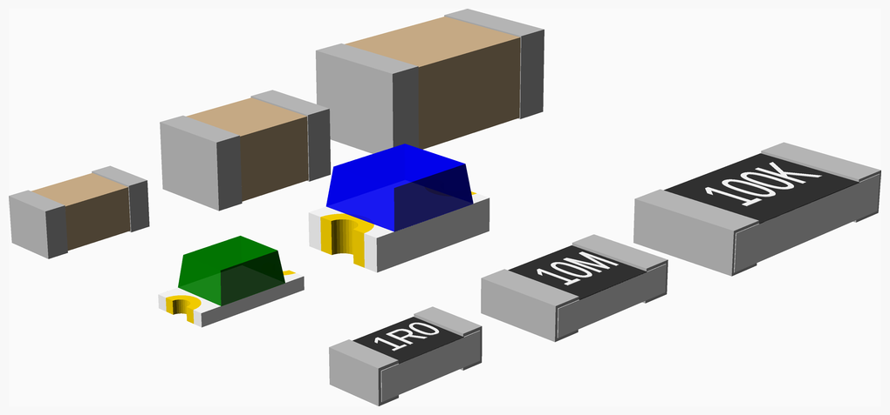

### Vitamins
| Qty | Module call | BOM entry |
| ---:|:--- |:---|
|   1 | `smd_led(LED0603, green)` |  SMD LED 0603 green |
|   1 | `smd_led(LED0805, blue)` |  SMD LED 0805 blue |
|   1 | `smd_resistor(RES0603, 1R0)` |  SMD resistor 0603 1R0 0.1W |
|   1 | `smd_resistor(RES0805, 10M)` |  SMD resistor 0805 10M 0.125W |
|   1 | `smd_resistor(RES1206, 100K)` |  SMD resistor 1206 100K 0.25W |

<a href="#top">Top</a>

---

## Spades
Spade terminals used as parts of electrical components.

[vitamins/spades.scad](vitamins/spades.scad) Object definitions.

[vitamins/spade.scad](vitamins/spade.scad) Implementation.

[tests/spades.scad](tests/spades.scad) Code for this example.

### Properties
| Function | Description |
|:--- |:--- |
| `spade_hole(type)` | Hole diameter |
| `spade_l(type)` | Length of the narrow part |
| `spade_shank(type)` | Shank width |
| `spade_t(type)` | Thickness |
| `spade_w(type)` | Width |

### Modules
| Module | Description |
|:--- |:--- |
| `spade(type, height = 14)` | Draw a spade of the specified type and total length. The shank length is adjusted to make the length. |

<a href="#top">Top</a>

---

## Spools
Filament spool models

[vitamins/spools.scad](vitamins/spools.scad) Object definitions.

[vitamins/spool.scad](vitamins/spool.scad) Implementation.

[tests/spools.scad](tests/spools.scad) Code for this example.

### Properties
| Function | Description |
|:--- |:--- |
| `spool_depth(type)` | Internal depth |
| `spool_diameter(type)` | Outside diameter |
| `spool_hub_bore(type)` | Bore through the hub |
| `spool_hub_diameter(type)` | Diameter of the thicker hub |
| `spool_hub_taper(type)` | Diameter at which it tapers down to rim thickness |
| `spool_hub_thickness(type)` | Thickness at the hub |
| `spool_rim_thickness(type)` | Thickness at the outside rim |
| `spool_width(type)` | Internal width |

### Functions
| Function | Description |
|:--- |:--- |
| `spool_height(type)` | Outside width |
| `spool_pitch(type)` | Spacing of the rims |

### Modules
| Module | Description |
|:--- |:--- |
| `spool(type, filament_depth = 0, filament_colour = "white", filament_d = 3)` | Draw specified spool with optional filament |

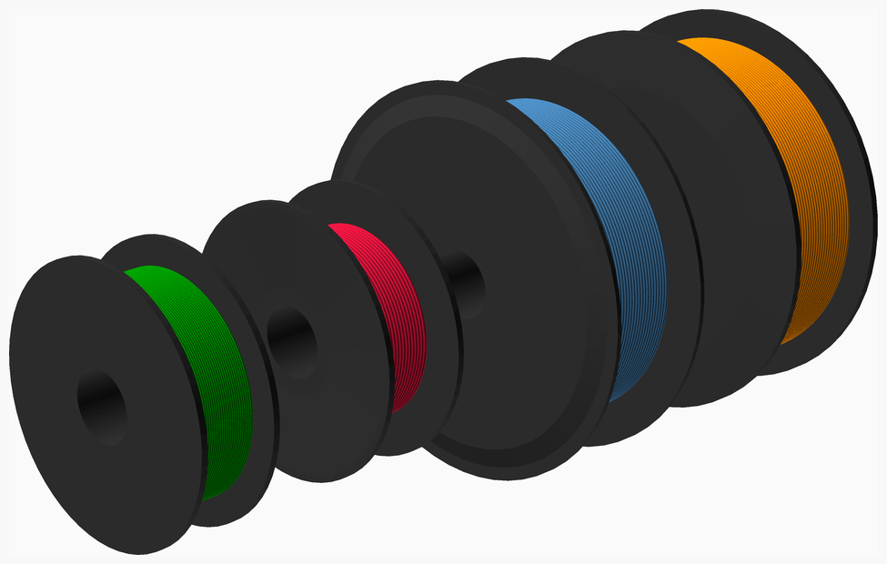

### Vitamins
| Qty | Module call | BOM entry |
| ---:|:--- |:---|
|   1 | `spool(spool_200x55)` |  Filament spool 200 x 55 |
|   1 | `spool(spool_200x60)` |  Filament spool 200 x 60 |
|   1 | `spool(spool_300x85)` |  Filament spool 300 x 85 |
|   1 | `spool(spool_300x88)` |  Filament spool 300 x 88 |

<a href="#top">Top</a>

---

## Springs
Compression springs. Can be tapered, have open, closed or ground ends. Ground ends will render a lot slower.

By default springs have their origin at the bottom but can be centered.

[vitamins/springs.scad](vitamins/springs.scad) Object definitions.

[vitamins/spring.scad](vitamins/spring.scad) Implementation.

[tests/springs.scad](tests/springs.scad) Code for this example.

### Properties
| Function | Description |
|:--- |:--- |
| `spring_closed(type)` | Are the ends closed |
| `spring_colour(type)` | The colour |
| `spring_gauge(type)` | Wire gauge |
| `spring_ground(type)` | Are the ends ground flat |
| `spring_length(type)` | Uncompressed length |
| `spring_mesh(type)` | Optional pre-computed mesh |
| `spring_od(type)` | Outside diameter |
| `spring_od2(type)` | Second diameter for spiral springs |
| `spring_turns(type)` | Number of turns |

### Functions
| Function | Description |
|:--- |:--- |
| `comp_spring(type, l = 0)` | Calculate the mesh for spring |

### Modules
| Module | Description |
|:--- |:--- |
| `comp_spring(type, l = 0, center = false)` | Draw specified spring, l can be set to specify the compressed length. |

### Vitamins
| Qty | Module call | BOM entry |
| ---:|:--- |:---|
|   1 | `comp_spring(batt_spring)` |  Spring 5 - 6mm spiral OD, 0.5mm gauge x 8mm long, closed end |
|   1 | `comp_spring(peg_spring)` |  Spring 6.4mm OD, 0.9mm gauge x 15.5mm long, closed end |

<a href="#top">Top</a>

---

## SSRs
Solid state relays.

[vitamins/ssrs.scad](vitamins/ssrs.scad) Object definitions.

[vitamins/ssr.scad](vitamins/ssr.scad) Implementation.

[tests/SSRs.scad](tests/SSRs.scad) Code for this example.

### Properties
| Function | Description |
|:--- |:--- |
| `ssr_base_t(type)` | Thickness of metal base |
| `ssr_height(type)` | Height |
| `ssr_hole_d(type)` | Screw hole diameter |
| `ssr_hole_pitch(type)` | Difference between screw centres |
| `ssr_length(type)` | Length |
| `ssr_part(type)` | Description |
| `ssr_slot_w(type)` | Width of the screw slot in the body |
| `ssr_width(type)` | Width |

### Modules
| Module | Description |
|:--- |:--- |
| `ssr(type)` | Draw specified SSR |
| `ssr_assembly(type, screw, thickness)` | Assembly with fasteners in place |
| `ssr_hole_positions(type)` | Place children at the screw positions |

### Vitamins
| Qty | Module call | BOM entry |
| ---:|:--- |:---|
|   4 | `nut(M4_nut, nyloc = true)` |  Nut M4 x 3.2mm nyloc |
|   4 | `screw(M4_cap_screw, 16)` |  Screw M4 cap x 16mm |
|   1 | `ssr(SSR25DA)` |  Solid state relay Fotek 25A |
|   1 | `ssr(SSR10DA)` |  Solid state relay Robodigg 10A |
|   8 | `washer(M4_washer)` |  Washer  M4 x 9mm x 0.8mm |

<a href="#top">Top</a>

---

## Stepper_motors
NEMA stepper motor model.

[vitamins/stepper_motors.scad](vitamins/stepper_motors.scad) Object definitions.

[vitamins/stepper_motor.scad](vitamins/stepper_motor.scad) Implementation.

[tests/stepper_motors.scad](tests/stepper_motors.scad) Code for this example.

### Properties
| Function | Description |
|:--- |:--- |
| `NEMA_body_radius(type)` | Body radius |
| `NEMA_boss_height(type)` | Boss height |
| `NEMA_boss_radius(type)` | Boss around the spindle radius |
| `NEMA_cap_heights(type)` | Height of the end cap at the corner and the side |
| `NEMA_hole_pitch(type)` | Screw hole pitch |
| `NEMA_length(type)` | Body length |
| `NEMA_radius(type)` | End cap radius |
| `NEMA_shaft_dia(type)` | Shaft diameter |
| `NEMA_shaft_length(type)` | Shaft length above the face, if a list then a leadscrew: length, lead, starts |
| `NEMA_width(type)` | Width of the square face |

### Functions
| Function | Description |
|:--- |:--- |
| `NEMA_big_hole(type)` | Clearance hole for the big boss |
| `NEMA_holes(type)` | Screw positions for for loop |

### Modules
| Module | Description |
|:--- |:--- |
| `NEMA(type, shaft_angle = 0, jst_connector = false)` | Draw specified NEMA stepper motor |
| `NEMA_outline(type)` | 2D outline |
| `NEMA_screw_positions(type, n = 4)` | Positions children at the screw holes |
| `NEMA_screws(type, screw, n = 4, screw_length = 8, earth = undef)` | Place screws and optional earth tag |

### Vitamins
| Qty | Module call | BOM entry |
| ---:|:--- |:---|
|   4 | `ring_terminal(M3_ringterm)` |  Ring terminal 3mm |
|  20 | `screw(M3_pan_screw, 8)` |  Screw M3 pan x  8mm |
|   1 | `NEMA(NEMA14)` |  Stepper motor NEMA14 x 36mm |
|   1 | `NEMA(NEMA16)` |  Stepper motor NEMA16 x 19.2mm |
|   1 | `NEMA(NEMA17P)` |  Stepper motor NEMA17 x 26.5mm |
|   1 | `NEMA(NEMA17S)` |  Stepper motor NEMA17 x 34mm |
|   1 | `NEMA(NEMA17M)` |  Stepper motor NEMA17 x 40mm |
|   1 | `NEMA(NEMA17)` |  Stepper motor NEMA17 x 47mm |
|   1 | `NEMA(NEMA23)` |  Stepper motor NEMA22 x 51.2mm |
|  16 | `washer(M3_washer)` |  Washer  M3 x 7mm x 0.5mm |
|  20 | `star_washer(M3_washer)` |  Washer star M3 x 0.5mm |

<a href="#top">Top</a>

---

## Swiss_clips
Swiss picture clip.
Used for holding glass on 3D printer beds.

The bending model is an approximation because in real life the arms bend.
Should be reasonably accurate if not close to fully open.

[vitamins/swiss_clips.scad](vitamins/swiss_clips.scad) Object definitions.

[vitamins/swiss_clip.scad](vitamins/swiss_clip.scad) Implementation.

[tests/Swiss_clips.scad](tests/Swiss_clips.scad) Code for this example.

### Properties
| Function | Description |
|:--- |:--- |
| `sclip_arm_length(type)` | Length of arms |
| `sclip_arm_width(type)` | Width of spring arms |
| `sclip_height(type)` | External height |
| `sclip_hinge_offset(type)` | Offset of hinge |
| `sclip_hook(type)` | hook, length, width |
| `sclip_length(type)` | Total external length |
| `sclip_max_gap(type)` | Maximum opening |
| `sclip_radius(type)` | Bend radius |
| `sclip_spigot(type)` | Spigot length, width, height |
| `sclip_thickness(type)` | Thickness of the metal |
| `sclip_width(type)` | Width |

### Modules
| Module | Description |
|:--- |:--- |
| `swiss_clip(type, open = 0.9)` | Draw a Swiss clip open by specified amount |
| `swiss_clip_hole(type, open, h = 0)` | Drill hole for spigot |

### Vitamins
| Qty | Module call | BOM entry |
| ---:|:--- |:---|
|   1 | `sheet(AL6, 40, 20, 1)` |  Aluminium tooling plate 40mm x 20mm x 6mm |
|   1 | `sheet(glass2, 40, 20, 1)` |  Sheet glass 40mm x 20mm x 2mm |
|   2 | `swiss_clip(UKPFS1008_10)` |  Swiss picture clip UKPFS1008_10 11mm |

<a href="#top">Top</a>

---

## Toggles
Toggle switches

[vitamins/toggles.scad](vitamins/toggles.scad) Object definitions.

[vitamins/toggle.scad](vitamins/toggle.scad) Implementation.

[tests/toggles.scad](tests/toggles.scad) Code for this example.

### Properties
| Function | Description |
|:--- |:--- |
| `toggle_angle(type)` | Angle of the paddle |
| `toggle_collar_d(type)` | Collar diameter |
| `toggle_collar_t(type)` | Collar thickness |
| `toggle_colour(type)` | Body colour |
| `toggle_depth(type)` | Body depth |
| `toggle_height(type)` | Body height |
| `toggle_id(type)` | Barrel inside diameter |
| `toggle_inset(type)` | How far the metal is inset into the body |
| `toggle_nut(type)` | Nut type |
| `toggle_od(type)` | Barrel outside diameter |
| `toggle_paddle_d1(type)` | Diameter at the top of the paddle |
| `toggle_paddle_l(type)` | Length of the paddle |
| `toggle_paddle_w(type)` | Width at the top for non-spherical end |
| `toggle_part(type)` | Part description |
| `toggle_pin_hp(type)` | Pin x pitch |
| `toggle_pin_l(type)` | Pin length |
| `toggle_pin_t(type)` | Pin thickness |
| `toggle_pin_vp(type)` | Pin y pitch |
| `toggle_pin_w(type)` | Pin width |
| `toggle_pins(type)` | Number of pins |
| `toggle_pivot(type)` | Z offset of the pivot point above the top of the body |
| `toggle_thickness(type)` | Metal thickness |
| `toggle_thread(type)` | Length of threaded barrel |
| `toggle_washer(type)` | Washer type |
| `toggle_width(type)` | Body width |

### Functions
| Function | Description |
|:--- |:--- |
| `toggle_hole_radius(type)` | Radius of the panel hole |

### Modules
| Module | Description |
|:--- |:--- |
| `toggle(type, thickness)` | Draw specified toggle switch with the nuts and washers positioned for the specified panel thickness |
| `toggle_hole(type, h = 100)` | Drill the hole in a panel |

### Vitamins
| Qty | Module call | BOM entry |
| ---:|:--- |:---|
|   1 | `toggle(AP5236, 3)` |  Toggle switch AP5236 |
|   1 | `toggle(CK7101, 3)` |  Toggle switch CK7101 |
|   1 | `toggle(CK7105, 3)` |  Toggle switch CK7105 |
|   1 | `toggle(MS332F, 3)` |  Toggle switch MS332F |

<a href="#top">Top</a>

---

## Transformers
Iron core transformers. The grey shaded area is the keep out region where the terminals are.

[vitamins/transformers.scad](vitamins/transformers.scad) Object definitions.

[vitamins/transformer.scad](vitamins/transformer.scad) Implementation.

[tests/transformers.scad](tests/transformers.scad) Code for this example.

### Properties
| Function | Description |
|:--- |:--- |
| `tx_bobbin_height(type)` | Bobbin height |
| `tx_bobbin_offset(type)` | Vertical offset of the bobbin from the centre of the laminations |
| `tx_bobbin_radius(type)` | Bobbin corner radius |
| `tx_bobbin_width(type)` | Bobbin width |
| `tx_depth(type)` | Bounding depth of the bobbin |
| `tx_foot_depth(type)` | Depth of the foot |
| `tx_foot_thickness(type)` | Thickness of the foot |
| `tx_foot_width(type)` | Width of the foot |
| `tx_height(type)` | Bounding height of the transformer |
| `tx_lamination_depth(type)` | Lamination depth |
| `tx_lamination_height(type)` | Lamination height |
| `tx_part(type)` | Part description |
| `tx_screw(type)` | Screw type |
| `tx_width(type)` | Bounding width of the core |
| `tx_x_pitch(type)` | Screw hole x pitch |
| `tx_y_pitch(type)` | Screw hole y pitch when four screws |

### Modules
| Module | Description |
|:--- |:--- |
| `transformer(type)` | Draw specified transformer |
| `transformer_hole_positions(type)` | Position children at the mounting hole positions |

### Vitamins
| Qty | Module call | BOM entry |
| ---:|:--- |:---|
|   1 | `transformer(CCM300)` |  Transformer Carroll & Meynell CCM300/230 isolation |
|   1 | `transformer(SMALLTX)` |  Transformer Small mains |

<a href="#top">Top</a>

---

## Tubings
Tubing and sleeving. The internal diameter can be forced to stretch it over something.

[vitamins/tubings.scad](vitamins/tubings.scad) Object definitions.

[vitamins/tubing.scad](vitamins/tubing.scad) Implementation.

[tests/tubings.scad](tests/tubings.scad) Code for this example.

### Properties
| Function | Description |
|:--- |:--- |
| `tubing_colour(type)` | Colour |
| `tubing_id(type)` | Inside diameter |
| `tubing_material(type)` | Material description |
| `tubing_od(type)` | Outside diameter |

### Functions
| Function | Description |
|:--- |:--- |
| `tubing_or(type)` | Outside radius |

### Modules
| Module | Description |
|:--- |:--- |
| `tubing(type, length = 15, forced_id = 0, center = true)` | Draw specified tubing with optional forced internal diameter |

### Vitamins
| Qty | Module call | BOM entry |
| ---:|:--- |:---|
|   1 | `tubing(CBNFIB10)` |  Carbon fiber OD 10mm ID 8mm x 15mm |
|   1 | `tubing(HSHRNK16)` |  Heatshrink sleeving ID 1.6mm x 15mm |
|   1 | `tubing(HSHRNK100)` |  Heatshrink sleeving ID 10mm x 15mm |
|   1 | `tubing(HSHRNK24)` |  Heatshrink sleeving ID 2.4mm x 15mm |
|   1 | `tubing(HSHRNK64)` |  Heatshrink sleeving ID 6.4mm x 15mm |
|   1 | `tubing(NEOP85)` |  Neoprene tubing OD 8mm ID 5mm x 15mm |
|   1 | `tubing(PTFE07)` |  PTFE sleeving OD 1.2mm ID 0.71mm x 15mm |
|   1 | `tubing(PTFE20)` |  PTFE sleeving OD 2.6mm ID 2mm x 15mm |
|   1 | `tubing(PTFE2_3)` |  PTFE tubing OD 3mm ID 2mm x 15mm |
|   1 | `tubing(PF7)` |  PTFE tubing OD 4.6mm ID 3.84mm x 15mm |
|   1 | `tubing(PTFE2_4)` |  PTFE tubing OD 4mm ID 2mm x 15mm |
|   1 | `tubing(PTFE4_6)` |  PTFE tubing OD 6mm ID 4mm x 15mm |
|   1 | `tubing(PVC64)` |  PVC aquarium tubing OD 6mm ID 4mm x 15mm |
|   1 | `tubing(PVC85)` |  PVC aquarium tubing OD 8mm ID 5mm x 15mm |

<a href="#top">Top</a>

---

## Variacs
Variable auto transformers.

[vitamins/variacs.scad](vitamins/variacs.scad) Object definitions.

[vitamins/variac.scad](vitamins/variac.scad) Implementation.

[tests/variacs.scad](tests/variacs.scad) Code for this example.

### Properties
| Function | Description |
|:--- |:--- |
| `variac_bulge_dia(type)` | Bulge to opposite edge |
| `variac_bulge_width(type)` | Width of the bulge |
| `variac_dial_big_hole(type)` | Central dial hole diameter |
| `variac_dial_dia(type)` | Dial diameter |
| `variac_dial_hole_pitch(type)` | Screw pitch for the dial |
| `variac_dial_hole_r(type)` | Dial screw hole radius |
| `variac_dial_thickness(type)` | Dial thickness |
| `variac_diameter(type)` | Body diameter |
| `variac_height(type)` | Body height |
| `variac_screw(type)` | Screw type |
| `variac_screw_pitch(type)` | Pitch of screws |
| `variac_screws(type)` | Number of screws |
| `variac_shaft_dia(type)` | Shaft diameter |
| `variac_shaft_length(type)` | Shaft length |

### Functions
| Function | Description |
|:--- |:--- |
| `variac_radius(type)` | Body radius |

### Modules
| Module | Description |
|:--- |:--- |
| `variac(type, thickness = 3, dial = true)` | Draw the specified variac with screws and possibly the dial when it is fixed and not rotating |
| `variac_dial(type)` | Draw the dial for the specified variac |
| `variac_hole_positions(type, pitch = undef)` | Position children at the screw positions |
| `variac_holes(type, h = 100)` | Drill panel holes for specified variac |

### Vitamins
| Qty | Module call | BOM entry |
| ---:|:--- |:---|
|   1 | `variac(DURATRAKV5HM, 3)` |  Variac DURATRAK V5HM |
|   1 | `variac(RAVISTAT1F1, 3)` |  Variac RAVISTAT 1F-1 |

<a href="#top">Top</a>

---

## Veroboard
Veroboard with mounting holes, track breaks, removed tracks, solder points and components.

[vitamins/veroboard.scad](vitamins/veroboard.scad) Implementation.

[tests/veroboard.scad](tests/veroboard.scad) Code for this example.

### Properties
| Function | Description |
|:--- |:--- |
| `vero_assembly(type)` | Name of the assembly |
| `vero_breaks(type)` | Breaks in the tracks |
| `vero_components(type)` | List of named components and their positions |
| `vero_fr4(type)` | True if FR4 rather than SRBP |
| `vero_holes(type)` | Number of holes in each strip |
| `vero_joints(type)` | List of solder joints |
| `vero_mounting_holes(type)` | Positions of the mounting holes |
| `vero_no_track(type)` | Missing tracks |
| `vero_pitch(type)` | Hole pitch |
| `vero_screw(type)` | Mounting screw type |
| `vero_strips(type)` | Number of strips |

### Functions
| Function | Description |
|:--- |:--- |
| `vero_length(type)` | Length of the board |
| `vero_size(type)` | Board size |
| `vero_thickness(type)` | Thickness of the substrate |
| `vero_track_thickness(type)` | Thickness of the tracks |
| `vero_track_width(type)` | The width of the tracks |
| `vero_width(type)` | Width of the board |

### Modules
| Module | Description |
|:--- |:--- |
| `vero_cutouts(type, angle = undef)` | Make cutouts to clear components |
| `vero_grid_pos(type, x, y)` | Convert grid position to offset from the centre |
| `vero_mounting_hole_positions(type)` | Positions children at the mounting holes |
| `vero_mounting_holes(type, h = 100)` | Drill mounting holes in a panel |
| `veroboard(type)` | Draw specified veroboard with missing tracks and track breaks |
| `veroboard_assembly(type, height, thickness, flip = false, ngb = false)` | Draw the assembly with components and fasteners in place |

### Vitamins
| Qty | Module call | BOM entry |
| ---:|:--- |:---|
|   2 | `idc_transition(2p54header, 10)` |  IDC transition header 10 x 2 |
|   4 | `nut(M3_nut, nyloc = true)` |  Nut M3 x 2.4mm nyloc |
|   4 | `screw(M3_dome_screw, 25)` |  Screw M3 dome x 25mm |
|   2 | `green_terminal(gt_2p54, 10)` |  Terminal block 10 way 0.1" |
|   2 | `veroboard(z_vb)` |  Veroboard 5 holes x 22strips |
|   8 | `washer(M3_washer)` |  Washer  M3 x 7mm x 0.5mm |

### Printed
| Qty | Filename |
| ---:|:--- |
|   4 | pcb_spacer30120.stl |

### Assemblies
| Qty | Name |
| ---:|:--- |
|   2 | z_bed_terminal_assembly |

<a href="#top">Top</a>

---

## Washers
Washers, star washers, penny washers and printed washers.

If a washer is given a child, usually a screw or a nut, then it is placed on its top surface.

[vitamins/washers.scad](vitamins/washers.scad) Object definitions.

[vitamins/washer.scad](vitamins/washer.scad) Implementation.

[tests/washers.scad](tests/washers.scad) Code for this example.

### Properties
| Function | Description |
|:--- |:--- |
| `penny_washer(type)` | Corresponding penny washer |
| `spring_washer_diameter(type)` | Spring washer size |
| `spring_washer_thickness(type)` | Spring washer thickness |
| `star_washer_diameter(type)` | Star version size |
| `washer_diameter(type)` | External diameter |
| `washer_size(type)` | Noiminal size |
| `washer_soft(type)` | True if rubber |
| `washer_thickness(type)` | Thickness |

### Functions
| Function | Description |
|:--- |:--- |
| `washer_colour(type)` | Washer colour |
| `washer_id(type)` | Inside diameter |
| `washer_radius(type)` | Outside radius |

### Modules
| Module | Description |
|:--- |:--- |
| `penny_washer(type)` | Draw penny version of specified plain washer |
| `printed_washer(type, name = false)` | Create printed washer |
| `spring_washer(type)` | Draw spring version of washer |
| `star_washer(type)` | Draw star version of washer |
| `washer(type)` | Draw specified washer |

### Vitamins
| Qty | Module call | BOM entry |
| ---:|:--- |:---|
|   1 | `washer(M2_washer)` |  Washer  M2 x 5mm x 0.3mm |
|   1 | `washer(M2p5_washer)` |  Washer  M2.5 x 5.9mm x 0.5mm |
|   1 | `washer(M3_washer)` |  Washer  M3 x 7mm x 0.5mm |
|   1 | `washer(M3p5_washer)` |  Washer  M3.5 x 8mm x 0.5mm |
|   1 | `washer(M4_washer)` |  Washer  M4 x 9mm x 0.8mm |
|   1 | `washer(M5_washer)` |  Washer  M5 x 10mm x 1mm |
|   1 | `washer(M6_washer)` |  Washer  M6 x 12.5mm x 1.5mm |
|   1 | `washer(M8_washer)` |  Washer  M8 x 17mm x 1.6mm |
|   1 | `washer(M3_penny_washer)` |  Washer penny  M3 x 12mm x 0.8mm |
|   1 | `washer(M4_penny_washer)` |  Washer penny  M4 x 14mm x 0.8mm |
|   1 | `washer(M5_penny_washer)` |  Washer penny  M5 x 20mm x 1.4mm |
|   1 | `washer(M6_penny_washer)` |  Washer penny  M6 x 26mm x 1.5mm |
|   1 | `washer(M8_penny_washer)` |  Washer penny  M8 x 30mm x 1.5mm |
|   1 | `washer(M3_rubber_washer)` |  Washer rubber M3 x 10mm x 1.5mm |
|   1 | `spring_washer(M2_washer)` |  Washer spring M2 x 0.5mm |
|   1 | `spring_washer(M2p5_washer)` |  Washer spring M2.5 x 0.6mm |
|   1 | `spring_washer(M3_washer)` |  Washer spring M3 x 1mm |
|   1 | `spring_washer(M3p5_washer)` |  Washer spring M3.5 x 1mm |
|   1 | `spring_washer(M4_washer)` |  Washer spring M4 x 1.2mm |
|   1 | `spring_washer(M5_washer)` |  Washer spring M5 x 1.6mm |
|   1 | `spring_washer(M6_washer)` |  Washer spring M6 x 1.6mm |
|   1 | `spring_washer(M8_washer)` |  Washer spring M8 x 2mm |
|   1 | `star_washer(M2_washer)` |  Washer star M2 x 0.3mm |
|   1 | `star_washer(M2p5_washer)` |  Washer star M2.5 x 0.5mm |
|   1 | `star_washer(M3_washer)` |  Washer star M3 x 0.5mm |
|   1 | `star_washer(M3_rubber_washer)` |  Washer star M3 x 1.5mm |
|   1 | `star_washer(M3p5_washer)` |  Washer star M3.5 x 0.5mm |
|   1 | `star_washer(M4_washer)` |  Washer star M4 x 0.8mm |
|   1 | `star_washer(M5_washer)` |  Washer star M5 x 1mm |
|   1 | `star_washer(M6_washer)` |  Washer star M6 x 1.5mm |
|   1 | `star_washer(M8_washer)` |  Washer star M8 x 1.6mm |

### Printed
| Qty | Filename |
| ---:|:--- |
|   1 | M20_washer.stl |
|   1 | M25_washer.stl |
|   2 | M30_washer.stl |
|   1 | M35_washer.stl |
|   1 | M40_washer.stl |
|   1 | M50_washer.stl |
|   1 | M60_washer.stl |
|   1 | M80_washer.stl |

<a href="#top">Top</a>

---

## Wire
Just a BOM entry at the moment and cable bundle size functions for holes, plus cable ties.

[vitamins/wire.scad](vitamins/wire.scad) Implementation.

[tests/wire.scad](tests/wire.scad) Code for this example.

### Functions
| Function | Description |
|:--- |:--- |
| `cable_bundle(cable)` | Arrangement of a bundle in a flat cable clip |
| `cable_height(cable)` | Height in flat clip |
| `cable_radius(cable)` | Radius of a bundle of wires, see <http://mathworld.wolfram.com/CirclePacking.html>. |
| `cable_width(cable)` | Width in flat clip |
| `cable_wire_size(cable)` | Size of each wire in a bundle |
| `cable_wires(cable)` | Number of wires in a bindle |
| `wire_hole_radius(cable)` | Radius of a hole to accept a bundle of wires |

### Modules
| Module | Description |
|:--- |:--- |
| `cable_tie(cable_r, thickness)` | A ziptie threaded around cable radius `cable_r` and through a panel with specified `thickness`. |
| `cable_tie_holes(cable_r, h = 100)` | Holes to thread a ziptie through a panel to make a cable tie. |
| `mouse_hole(cable, h = 100, teardrop = false)` | A mouse hole to allow a panel to go over a wire bundle. |
| `ribbon_cable(ways, length)` | Add ribbon cable to the BOM |
| `wire(colour, strands, length, strand = 0.2)` | Add stranded wire to the BOM |

### Vitamins
| Qty | Module call | BOM entry |
| ---:|:--- |:---|
|   1 |  |  Wire black 7/0.2mm strands, length 90mm |
|   1 |  |  Wire blue 7/0.2mm strands, length 90mm |
|   1 |  |  Wire brown 7/0.2mm strands, length 90mm |
|   1 |  |  Wire green 7/0.2mm strands, length 90mm |
|   1 |  |  Wire orange 7/0.2mm strands, length 90mm |
|   1 |  |  Wire red 7/0.2mm strands, length 90mm |
|   1 |  |  Wire yellow 7/0.2mm strands, length 90mm |
|   1 | `ziptie(small_ziptie, 2.1)` |  Ziptie 2.5mm x 100mm min length |

<a href="#top">Top</a>

---

## Zipties
Cable zipties.

[vitamins/zipties.scad](vitamins/zipties.scad) Object definitions.

[vitamins/ziptie.scad](vitamins/ziptie.scad) Implementation.

[tests/zipties.scad](tests/zipties.scad) Code for this example.

### Properties
| Function | Description |
|:--- |:--- |
| `ziptie_colour(type)` | Colour |
| `ziptie_latch(type)` | Latch dimensions |
| `ziptie_tail(type)` | The length without teeth |
| `ziptie_thickness(type)` | Thickness |
| `ziptie_width(type)` | Width |

### Modules
| Module | Description |
|:--- |:--- |
| `ziptie(type, r, t = 0)` | Draw specified ziptie wrapped around radius `r` and optionally through panel thickness `t` |

### Vitamins
| Qty | Module call | BOM entry |
| ---:|:--- |:---|
|   1 | `ziptie(small_ziptie, 5)` |  Ziptie 2.5mm x 100mm min length |
|   1 | `ziptie(ziptie_3p6mm, 5)` |  Ziptie 3.6mm x 100mm min length |
|   1 | `ziptie(ziptie_3mm, 5)` |  Ziptie 3mm x 100mm min length |

<a href="#top">Top</a>

---

## Box
A box made from routed or laser cut sheet sheets and printed profiles and bezels. It can be arbitrarily large
compared to the 3D printed parts because they can be cut into interlocking sections and solvent welded
together. The box panels can be customised to have holes and parts mounted on them by overriding the
definitions of `box_base()`, `box_front()`, etc.

`box.scad` should be `use`d and `box_assembly.scad` `include`d.

A box is defined with a list that specifies the inside dimensions, top, bottom and side sheet materials, the
screw type and printed part wall thickness. This diagram shows how the various dimensions are labelled:

Normally the side sheets are the same type but they can be overridden individually as long as the substitute has the same thickness.

[printed/box.scad](printed/box.scad) Implementation.

[tests/box.scad](tests/box.scad) Code for this example.

### Properties
| Function | Description |
|:--- |:--- |
| `box_base_sheet(type)` | Sheet type for the bottom |
| `box_depth(type)` | Internal depth |
| `box_feet(type)` | True to enable feet on the bottom bezel |
| `box_height(type)` | Internal height |
| `box_screw(type)` | Screw type to be used at the corners |
| `box_sheets(type)` | Sheet type used for the sides |
| `box_shelf_screw(type)` | Screw type to hold a shelf |
| `box_top_sheet(type)` | Sheet type for the top |
| `box_wall(type)` | Wall thickness of 3D parts |
| `box_width(type)` | Internal width |

### Functions
| Function | Description |
|:--- |:--- |
| `box(screw, wall, sheets, top_sheet, base_sheet, size, feet = false, shelf_screw = M3_dome_screw)` | Construct a property list for a box. |
| `box_bezel_height(type, bottom)` | Bezel height for top or bottom |
| `box_corner_gap(type)` | Gap between box_sheets at the corners to connect inside and outside profiles |
| `box_inset(type)` | How much the bezel intrudes on the specified width and length, away from the corners |
| `box_intrusion(type)` | Corner profile intrusion |
| `box_margin(type)` | How much the bezel intrudes on the specified height |
| `box_outset(type)` | How much the bezel expands the specified internal size |

### Modules
| Module | Description |
|:--- |:--- |
| `box_back(type)` | Default back, can be overridden to customise |
| `box_back_blank(type, sheet = false)` | Generates a 2D template for the back sheet, `sheet` can be set to override the type |
| `box_base(type)` | Default base, can be overridden to customise |
| `box_base_blank(type)` | Generates a 2D template for the base sheet |
| `box_bezel(type, bottom)` | Generates top and bottom bezel STLs |
| `box_bezel_section(type, bottom, rows, cols, x, y)` | Generates interlocking sections of the bezel to allow it to be bigger than the printer |
| `box_corner_profile(type)` | Generates the corner profile STL for 3D printing. |
| `box_corner_profile_2D(type)` | The 2D shape of the corner profile. |
| `box_corner_profile_section(type, section, sections)` | Generates interlocking sections of the corner profile to allow it to be taller than the printer |
| `box_corner_profile_sections(type, section, sections)` | Generate four copies of a corner profile section |
| `box_front(type)` | Default front, can be overridden to customise |
| `box_front_blank(type, sheet = false)` | Generates a 2D template for the front sheet, `sheet` can be set to override the type |
| `box_left(type)` | Default left side, can be overridden to customise |
| `box_left_blank(type, sheet = false)` | Generates a 2D template for the left sheet, `sheet` can be set to override the type |
| `box_right(type)` | Default right side, can be overridden to customise |
| `box_right_blank(type, sheet = false)` | Generates a 2D template for the right sheet, `sheet` can be set to override the type |
| `box_shelf_blank(type, sheet = false)` | Generates a 2D template for a shelf sheet |
| `box_shelf_bracket(type, screw_positions, wall = undef)` | Generates a shelf bracket, the first optional child is a 2D cutout and the second 3D cutouts |
| `box_shelf_bracket_section(type, rows, cols, x, y)` | Generates sections of the shelf bracket to allow it to be bigger than the printer |
| `box_shelf_screw_positions(type, screw_positions, thickness = 0, wall = undef)` | Place children at the shelf screw positions |
| `box_top(type)` | Default top, can be overridden to customise |
| `box_top_blank(type)` | Generates a 2D template for the top sheet |
| `grill(width, height, r = 1000, poly = false, h = 0)` | A staggered array of 5mm holes to make grills in sheets. Can be constrained to be circular. Set `poly` `true` for printing, `false` for milling. |

### Vitamins
| Qty | Module call | BOM entry |
| ---:|:--- |:---|
|   8 | `insert(F1BM3)` |  Heatfit insert M3 |
|   4 | `screw(M3_dome_screw, 16)` |  Screw M3 dome x 16mm |
|   4 | `screw(M3_dome_screw, 20)` |  Screw M3 dome x 20mm |
|   2 | `sheet(DiBond, 143, 63, 1)` |  Sheet DiBond 143mm x 63mm x 3mm |
|   1 | `sheet(DiBond6, 150, 100, 2.9)` |  Sheet DiBond 150mm x 100mm x 6mm |
|   2 | `sheet(DiBond, 93, 63, 1)` |  Sheet DiBond 93mm x 63mm x 3mm |
|   1 | `sheet(PMMA3, 150, 100, 2.9)` |  Sheet acrylic 150mm x 100mm x 3mm |
|   8 | `washer(M3_washer)` |  Washer  M3 x 7mm x 0.5mm |
|   8 | `star_washer(M3_washer)` |  Washer star M3 x 0.5mm |

### Printed
| Qty | Filename |
| ---:|:--- |
|  10 | bottom_bezel.stl |
|   4 | box_corner_profile.stl |
|   1 | top_bezel.stl |

### Routed
| Qty | Filename |
| ---:|:--- |
|   1 | box_back.dxf |
|   1 | box_base.dxf |
|   1 | box_front.dxf |
|   1 | box_left.dxf |
|   1 | box_right.dxf |
|   1 | box_top.dxf |

### Assemblies
| Qty | Name |
| ---:|:--- |
|   1 | box_assembly |

<a href="#top">Top</a>

---

## Butt_box
A box made from CNC cut panels butted together using printed fixing blocks. Useful for making large
boxes with minimal 3D printing.  More blocks are added as the box gets bigger.

Needs to be `include`d rather than `use`d to allow the panel definitions to be overridden to add holes
and mounted components.

A list specifies the internal dimensions, screw type, top, bottom and side sheet types and the block
maximum spacing.

 * An optional name can be specified to allow more then one box in a project.
 * An optional list of fixing blocks to be omitted can be given.
 * Star washers can be omitted by setting the 11th parameter to false.

Uses [fixing blocks](#fixing_block) and [corner blocks](#corner_block).

[printed/butt_box.scad](printed/butt_box.scad) Implementation.

[tests/butt_box.scad](tests/butt_box.scad) Code for this example.

### Properties
| Function | Description |
|:--- |:--- |
| `bbox_base_sheet(type)` | Sheet type for the base |
| `bbox_depth(type)` | Internal depth |
| `bbox_height(type)` | Internal height |
| `bbox_name(type)` | Optional name if there is more than one box in a project |
| `bbox_screw(type)` | Screw type for corner blocks |
| `bbox_sheets(type)` | Sheet type for the sides |
| `bbox_skip_blocks(type)` | List of fixing blocks to skip, used to allow a hinged panel for example |
| `bbox_span(type)` | Maximum span between fixing blocks |
| `bbox_top_sheet(type)` | Sheet type for the top |
| `bbox_width(type)` | Internal width |
| `star_washers(type)` | Set to false to remove star washers. |

### Functions
| Function | Description |
|:--- |:--- |
| `bbox(screw, sheets, base_sheet, top_sheet, span, size, name = "bbox", skip_blocks = [], star_washers = true)` | Construct the property list for a butt_box |
| `bbox_area(type)` | Internal surdface area in m^2 |
| `bbox_volume(type)` | Internal volume in litres |

### Modules
| Module | Description |
|:--- |:--- |
| `_bbox_assembly(type, top = true, base = true, left = true, right = true, back = true, front = true)` | The box assembly, wrap with a local copy without parameters |
| `bbox_back(type)` | Default back, can be overridden to customise |
| `bbox_back_blank(type, sheet = false)` | 2D template for the back |
| `bbox_base(type)` | Default base, can be overridden to customise |
| `bbox_base_blank(type)` | 2D template for the base |
| `bbox_front(type)` | Default front, can be overridden to customise |
| `bbox_front_blank(type, sheet = false, width = 0)` | 2D template for the front |
| `bbox_left(type)` | Default left side, can be overridden to customise |
| `bbox_left_blank(type, sheet = false)` | 2D template for the left side |
| `bbox_right(type)` | Default right side, can be overridden to customise |
| `bbox_right_blank(type, sheet = false)` | 2D template for the right side |
| `bbox_shelf_blank(type)` | 2D template for a shelf |
| `bbox_top(type)` | Default top, can be overridden to customise |
| `bbox_top_blank(type)` | 2D template for the top |

### Vitamins
| Qty | Module call | BOM entry |
| ---:|:--- |:---|
|  48 | `insert(F1BM3)` |  Heatfit insert M3 |
|  36 | `screw(M3_dome_screw, 10)` |  Screw M3 dome x 10mm |
|   4 | `screw(M3_dome_screw, 12)` |  Screw M3 dome x 12mm |
|   8 | `screw(M3_dome_screw, 16)` |  Screw M3 dome x 16mm |
|   2 | `sheet(DiBond, 303, 126)` |  Sheet DiBond 303mm x 126mm x 3mm |
|   1 | `sheet(DiBond, 400, 126)` |  Sheet DiBond 400mm x 126mm x 3mm |
|   1 | `sheet(DiBond6, 400, 300, 1)` |  Sheet DiBond 400mm x 300mm x 6mm |
|   1 | `sheet(DiBond, 406, 129)` |  Sheet DiBond 406mm x 129mm x 3mm |
|   1 | `sheet(PMMA3, 406, 303)` |  Sheet acrylic 406mm x 303mm x 3mm |
|  48 | `washer(M3_washer)` |  Washer  M3 x 7mm x 0.5mm |
|  48 | `star_washer(M3_washer)` |  Washer star M3 x 0.5mm |

### Printed
| Qty | Filename |
| ---:|:--- |
|   8 | corner_block_M30.stl |
|   8 | fixing_block_M30.stl |

### Routed
| Qty | Filename |
| ---:|:--- |
|   1 | bbox_back.dxf |
|   1 | bbox_base.dxf |
|   1 | bbox_front.dxf |
|   1 | bbox_left.dxf |
|   1 | bbox_right.dxf |
|   1 | bbox_top.dxf |

### Assemblies
| Qty | Name |
| ---:|:--- |
|   1 | bbox_assembly |
|   8 | corner_block_M30_assembly |
|   8 | fixing_block_M30_assembly |

<a href="#top">Top</a>

---

## Cable_grommets
Printed cable grommets for passing cables through panels avoiding sharp edges and in the case
of conductive panels, an extra layer of insulation.

[printed/cable_grommets.scad](printed/cable_grommets.scad) Implementation.

[tests/cable_grommets.scad](tests/cable_grommets.scad) Code for this example.

### Modules
| Module | Description |
|:--- |:--- |
| `mouse_grommet(r, thickness)` | Make the STL for a mouse grommet |
| `mouse_grommet_hole(r, h = 50, z = undef, expand = wall + clearance)` | Make a hole for a mouse grommet |
| `ribbon_grommet(ways, thickness)` | Generate the STL for a printed ribbon grommet |
| `ribbon_grommet_hole(ways, h = 50, expand = true)` | Generate a hole for a ribbon grommet |
| `round_grommet_bottom(diameter, od = undef)` | Generate the STL for a round grommet bottom half |
| `round_grommet_hole(diameter, h = 100)` | Make a hole for a round grommet |
| `round_grommet_top(diameter, thickness, od = undef)` | Generate the STL for a round grommet top half |

### Printed
| Qty | Filename |
| ---:|:--- |
|   1 | mouse_grommet_50_3.stl |
|   1 | ribbon_grommet_20_3.stl |
|   1 | round_grommet_bottom_60.stl |
|   1 | round_grommet_top_60_3.stl |

<a href="#top">Top</a>

---

## Camera_housing
Housings for PCB cameras.

[printed/camera_housing.scad](printed/camera_housing.scad) Implementation.

[tests/camera_housing.scad](tests/camera_housing.scad) Code for this example.

### Functions
| Function | Description |
|:--- |:--- |
| `cam_front_size(cam)` | Outside dimensions of the case |

### Modules
| Module | Description |
|:--- |:--- |
| `camera_assembly(cam, angle = 0)` | Camera case assembly |
| `camera_back(cam)` | Make the STL for a camera case back |
| `camera_bracket(cam)` | Make the STL for the camera bracket |
| `camera_bracket_position(cam)` | Position children at the bracket position |
| `camera_bracket_screw_positions(cam)` | Position children at the bracket screw positions |
| `camera_front(cam, hinge = 0)` | Make the STL for a camera case front |
| `rpi_camera_focus_ring_stl()` | Focus ring the glue onto RPI lens |

### Vitamins
| Qty | Module call | BOM entry |
| ---:|:--- |:---|
|   7 | `nut(M2_nut, nyloc = true)` |  Nut M2 x 1.6mm nyloc |
|  10 | `nut(M3_nut, nyloc = true)` |  Nut M3 x 2.4mm nyloc |
|   1 | `camera(rpi_camera_v1)` |  Raspberry Pi camera V1 |
|   1 | `camera(rpi_camera_v2)` |  Raspberry Pi camera V2 |
|   1 | `camera(rpi_camera)` |  Raspberry Pi focusable camera |
|   7 | `screw(M2_cap_screw, 10)` |  Screw M2 cap x 10mm |
|   4 | `screw(M3_cap_screw, 16)` |  Screw M3 cap x 16mm |
|   4 | `screw(M3_dome_screw, 10)` |  Screw M3 dome x 10mm |
|   2 | `screw(M3_dome_screw, 12)` |  Screw M3 dome x 12mm |
|   7 | `washer(M2_washer)` |  Washer  M2 x 5mm x 0.3mm |
|  16 | `washer(M3_washer)` |  Washer  M3 x 7mm x 0.5mm |

### Printed
| Qty | Filename |
| ---:|:--- |
|   1 | camera_back_rpi_camera.stl |
|   1 | camera_back_rpi_camera_v1.stl |
|   1 | camera_back_rpi_camera_v2.stl |
|   1 | camera_bracket_rpi_camera.stl |
|   1 | camera_bracket_rpi_camera_v1.stl |
|   1 | camera_bracket_rpi_camera_v2.stl |
|   1 | camera_front_rpi_camera.stl |
|   1 | camera_front_rpi_camera_v1.stl |
|   1 | camera_front_rpi_camera_v2.stl |

### Assemblies
| Qty | Name |
| ---:|:--- |
|   1 | camera_rpi_camera_assembly |
|   1 | camera_rpi_camera_v1_assembly |
|   1 | camera_rpi_camera_v2_assembly |

<a href="#top">Top</a>

---

## Carriers
Adapts ESP12 modules and various small PCBs to 0.1" grid. See <https://hydraraptor.blogspot.com/2018/04/esp-12-module-breakout-adaptor.html>.

[printed/carriers.scad](printed/carriers.scad) Implementation.

[tests/carriers.scad](tests/carriers.scad) Code for this example.

### Functions
| Function | Description |
|:--- |:--- |
| `carrier_height()` | Height of PCB carrier |

### Modules
| Module | Description |
|:--- |:--- |
| `ESP12F_carrier_stl()` | Generate the STL for an ESP12 carrier |
| `MT3608_carrier_stl()` | Generate the STL for an MT3608 carrier, two required |
| `TP4056_carrier_stl()` | Generate the STL for an TP4056 carrier, two required |

### Printed
| Qty | Filename |
| ---:|:--- |
|   1 | ESP12F_carrier.stl |
|   1 | MT3608_carrier.stl |
|   1 | TP4056_carrier.stl |

<a href="#top">Top</a>

---

## Corner_block
Corner brackets using threaded inserts for fastening three sheets together at right angles.
Defaults to M3 but other screws sizes can be specified provided they have inserts defined.

See [butt_box](#Butt_box) for an example of usage.

Note that the block with its inserts is defined as a sub assembly, but its fasteners get added to the parent assembly.

Specific fasteners can be omitted by setting a side's thickness to 0 and the block omitted by setting `show_block` to false.
This allows the block and one set of fasteners to be on one assembly and the other fasteners on the mating assemblies.

Star washers can be omitted by setting `star_washers` to false.

[printed/corner_block.scad](printed/corner_block.scad) Implementation.

[tests/corner_block.scad](tests/corner_block.scad) Code for this example.

### Functions
| Function | Description |
|:--- |:--- |
| `corner_block_h_holes(screw = def_screw)` | List of transforms to side holes |
| `corner_block_hole_offset(screw = def_screw)` | Hole offset from the edge |
| `corner_block_holes(screw)` | List of transforms to all holes |
| `corner_block_screw()` | Default screw type |
| `corner_block_v_hole(screw = def_screw)` | Transform to bottom hole |
| `corner_block_width(screw = def_screw)` | Block width, depth and height |

### Modules
| Module | Description |
|:--- |:--- |
| `corner_block(screw = def_screw, name = false)` | Generate the STL for a printed corner block |
| `corner_block_assembly(screw = def_screw, name = false)` | The printed block with inserts |
| `corner_block_h_holes(screw = def_screw, index = undef)` | Place children at the side screw holes |
| `corner_block_holes(screw = def_screw)` | Place children at all the holes |
| `corner_block_v_hole(screw = def_screw)` | Place children at the bottom screw hole |
| `fastened_corner_block_assembly(thickness, screw = def_screw, thickness_below = undef, thickness_side2 = undef, name = false, show_block = true, star_washers = true)` | Printed block with all fasteners |

### Vitamins
| Qty | Module call | BOM entry |
| ---:|:--- |:---|
|   3 | `insert(F1BM2)` |  Heatfit insert M2 |
|   3 | `insert(F1BM2p5)` |  Heatfit insert M2.5 |
|   3 | `insert(F1BM3)` |  Heatfit insert M3 |
|   3 | `insert(F1BM4)` |  Heatfit insert M4 |
|   3 | `screw(M2_cap_screw, 8)` |  Screw M2 cap x  8mm |
|   3 | `screw(M2p5_pan_screw, 10)` |  Screw M2.5 pan x 10mm |
|   3 | `screw(M3_dome_screw, 10)` |  Screw M3 dome x 10mm |
|   3 | `screw(M4_dome_screw, 12)` |  Screw M4 dome x 12mm |
|   3 | `washer(M2_washer)` |  Washer  M2 x 5mm x 0.3mm |
|   3 | `washer(M2p5_washer)` |  Washer  M2.5 x 5.9mm x 0.5mm |
|   3 | `washer(M3_washer)` |  Washer  M3 x 7mm x 0.5mm |
|   3 | `washer(M4_washer)` |  Washer  M4 x 9mm x 0.8mm |
|   3 | `star_washer(M2_washer)` |  Washer star M2 x 0.3mm |
|   3 | `star_washer(M2p5_washer)` |  Washer star M2.5 x 0.5mm |
|   3 | `star_washer(M3_washer)` |  Washer star M3 x 0.5mm |
|   3 | `star_washer(M4_washer)` |  Washer star M4 x 0.8mm |

### Printed
| Qty | Filename |
| ---:|:--- |
|   1 | corner_block_M20.stl |
|   1 | corner_block_M25.stl |
|   1 | corner_block_M30.stl |
|   1 | corner_block_M40.stl |

### Assemblies
| Qty | Name |
| ---:|:--- |
|   1 | corner_block_M20_assembly |
|   1 | corner_block_M25_assembly |
|   1 | corner_block_M30_assembly |
|   1 | corner_block_M40_assembly |

<a href="#top">Top</a>

---

## Door_hinge
Door hinges to hang an acrylic sheet door on a 3D printer, default 6mm thick.

The screws are tapped into the acrylic.
Rubber door [sealing strip](#sealing_strip) is used to make it airtight and a [door_latch](#door_latch) holds it closed.

[printed/door_hinge.scad](printed/door_hinge.scad) Implementation.

[tests/door_hinge.scad](tests/door_hinge.scad) Code for this example.

### Functions
| Function | Description |
|:--- |:--- |
| `door_hinge_pin_x()` | X offset of the hinge pin |
| `door_hinge_pin_y()` | Y offset of the hinge pin |
| `door_hinge_screw()` | Screw type used for hinge pin |
| `door_hinge_stat_length()` | Length of the stationary part |
| `door_hinge_stat_screw()` | Screw use to fasten the stationary part |
| `door_hinge_stat_width()` | Width of the stationary part |

### Modules
| Module | Description |
|:--- |:--- |
| `door_hinge(door_thickness)` | Generates STL for the moving part of the hinge |
| `door_hinge_assembly(top, door_thickness = 6)` | The moving assembly that goes on the door |
| `door_hinge_hole_positions(dir = 0)` | Position chidren at the door hole positions |
| `door_hinge_parts_stl()` | Generates the STL for both parts of the hinge |
| `door_hinge_stat_hole_positions(dir = 0)` | Position children over the screws holes of the stationary part |
| `door_hinge_stat_stl()` | Generates the STL for the stationary part |
| `door_hinge_static_assembly(top, sheet_thickness = 3)` | The stationary assembly |

### Vitamins
| Qty | Module call | BOM entry |
| ---:|:--- |:---|
|   4 | `nut(M4_nut, nyloc = true)` |  Nut M4 x 3.2mm nyloc |
|   2 | `screw(M3_cap_screw, 35)` |  Screw M3 cap x 35mm |
|   4 | `screw(M3_dome_screw, 10)` |  Screw M3 dome x 10mm |
|   4 | `screw(M4_dome_screw, 16)` |  Screw M4 dome x 16mm |
|   1 | `sheet(PMMA6, 50, 50, 3)` |  Sheet acrylic 50mm x 50mm x 6mm |
|   8 | `washer(M3_washer)` |  Washer  M3 x 7mm x 0.5mm |
|   8 | `washer(M4_washer)` |  Washer  M4 x 9mm x 0.8mm |

### Printed
| Qty | Filename |
| ---:|:--- |
|   2 | door_hinge_6.stl |
|   2 | door_hinge_stat.stl |

<a href="#top">Top</a>

---

## Door_latch
Door latch for 6mm acrylic door for 3D printer. See [door_hinge](#door_hinge).

[printed/door_latch.scad](printed/door_latch.scad) Implementation.

[tests/door_latch.scad](tests/door_latch.scad) Code for this example.

### Functions
| Function | Description |
|:--- |:--- |
| `door_latch_offset()` | Offset of the axle from the door edge |
| `door_latch_screw()` | The screw used for the axle |

### Modules
| Module | Description |
|:--- |:--- |
| `door_latch_assembly(sheet_thickness = 3)` | The assembly for a specified sheet thickess |
| `door_latch_stl()` | Generates the STL for the printed part |

### Vitamins
| Qty | Module call | BOM entry |
| ---:|:--- |:---|
|   1 | `nut(M4_nut, nyloc = true)` |  Nut M4 x 3.2mm nyloc |
|   1 | `screw(M4_hex_screw, 20)` |  Screw M4 hex x 20mm |
|   2 | `washer(M4_washer)` |  Washer  M4 x 9mm x 0.8mm |

### Printed
| Qty | Filename |
| ---:|:--- |
|   1 | door_latch.stl |

<a href="#top">Top</a>

---

## Drag_chain
Parametric cable drag chain to limit the bend radius of a cable run.

Each link has a maximum bend angle of 45&deg;, so the mininium radius is proportional to the link length.

The travel property is how far it can move in each direction, i.e. half the maximum travel if the chain is mounted in the middle of the travel.

The ends can have screw lugs with four screw positions to choose from, specified by a list of two arrays of four bools.
If none are enabled then a child object is expected to customise the end and this gets unioned with the blank end.
If both ends are customised then two children are expected.
Each child is called twice, once with `$fasteners` set to 0 to augment the STL and again with `$fasteners` set to 1 to add
to the assembly, for example to add inserts.

[printed/drag_chain.scad](printed/drag_chain.scad) Implementation.

[tests/drag_chain.scad](tests/drag_chain.scad) Code for this example.

### Properties
| Function | Description |
|:--- |:--- |
| `drag_chain_bwall(type)` | Bottom wall |
| `drag_chain_name(type)` | The name to allow more than one in a project |
| `drag_chain_screw(type)` | Mounting screw for the ends |
| `drag_chain_screw_lists(type)` | Two lists of four bools to say which screws positions are used |
| `drag_chain_size(type)` | The internal size and link length |
| `drag_chain_travel(type)` | X travel |
| `drag_chain_twall(type)` | Top wall |
| `drag_chain_wall(type)` | Side wall thickness |

### Functions
| Function | Description |
|:--- |:--- |
| `drag_chain(name, size, travel, wall = 1.6, bwall = 1.5, twall = 1.5, screw = M2_cap_screw, screw_lists = [[1,0,0,1],[1,0,0,1]])` | Constructor |
| `drag_chain_clearance()` | Clearance around joints. |
| `drag_chain_outer_size(type)` | Link outer dimensions |
| `drag_chain_radius(type)` | The bend radius at the pivot centres |
| `drag_chain_z(type)` | Outside dimension of a 180 bend |
| `screw_lug_radius(screw)` | Radius of a screw lug |

### Modules
| Module | Description |
|:--- |:--- |
| `drag_chain_assembly(type, pos = 0, render = false)` | Drag chain assembly |
| `drag_chain_link(type, start = false, end = false, check_kids = true)` | One link of the chain, special case for start and end |
| `drag_chain_screw_positions(type, end)` | Place children at the screw positions, end = 0 for the start, 1 for the end |
| `screw_lug(screw, h = 0)` | Create a D shaped lug for a screw |

### Printed
| Qty | Filename |
| ---:|:--- |
|  14 | x_drag_chain_link.stl |
|   1 | x_drag_chain_link_end.stl |
|   1 | x_drag_chain_link_start.stl |

### Assemblies
| Qty | Name |
| ---:|:--- |
|   1 | x_drag_chain_assembly |

<a href="#top">Top</a>

---

## Fan_guard
Pintable fan finger guard to match the specified fan. To be `include`d, not `use`d.

The ring spacing as well as the number of spokes can be specified, if zero a gasket is generated instead of a guard.

[printed/fan_guard.scad](printed/fan_guard.scad) Implementation.

[tests/fan_guard.scad](tests/fan_guard.scad) Code for this example.

### Functions
| Function | Description |
|:--- |:--- |
| `fan_guard_corner_r(type)` | Corner radius of the guard |
| `fan_guard_thickness()` | Default thickness |
| `fan_guard_width(type)` | Width of the guard |

### Modules
| Module | Description |
|:--- |:--- |
| `fan_guard(type, name = false, thickness = fan_guard_thickness()` | Generate the STL |

### Printed
| Qty | Filename |
| ---:|:--- |
|   1 | fan_guard_120.stl |
|   1 | fan_guard_17.stl |
|   1 | fan_guard_25.4.stl |
|   1 | fan_guard_30.stl |
|   1 | fan_guard_40.stl |
|   1 | fan_guard_50.stl |
|   2 | fan_guard_60.stl |
|   1 | fan_guard_70.stl |
|   2 | fan_guard_80.stl |

<a href="#top">Top</a>

---

## Fixing_block
Fixing block to mount two sheets at right angles using threaded inserts.
Defaults to M3 but other screw sizes can be specified provided they have inserts defined.

See [butt_box](#Butt_box) for an example of usage.

Note that the block with its inserts is defined as a sub assembly, but its fasteners get added to the parent assembly.

Specific fasteners can be omitted by setting a side's thickness to 0 and the block omitted by setting `show_block` to false.
This allows the block and one set of fasteners to be on one assembly and the other fasteners on the mating assemblies.

Star washers can be omitted by setting `star_washers` to false.

[printed/fixing_block.scad](printed/fixing_block.scad) Implementation.

[tests/fixing_block.scad](tests/fixing_block.scad) Code for this example.

### Functions
| Function | Description |
|:--- |:--- |
| `fixing_block_depth(screw = def_screw)` | Depth given screw size |
| `fixing_block_h_hole(screw = def_screw)` | Returns transform to position the horizontal screw |
| `fixing_block_height(screw = def_screw)` | Height given screw size, same as depth |
| `fixing_block_holes(screw)` | Returns a list of transforms to position all the screws |
| `fixing_block_screw()` | Default screw type |
| `fixing_block_v_holes(screw = def_screw)` | Returns a list of transforms to position the vertical screws |
| `fixing_block_width(screw = def_screw)` | Width given screw size |

### Modules
| Module | Description |
|:--- |:--- |
| `fastened_fixing_block_assembly(thickness, screw = def_screw, screw2 = undef, thickness2 = undef, show_block = true, star_washers = true)` | Assembly with fasteners in place |
| `fixing_block(screw = def_screw)` | Generate the STL |
| `fixing_block_assembly(screw = def_screw)` | Printed part with the inserts inserted |
| `fixing_block_h_hole(screw = def_screw)` | Position children on the horizontal hole |
| `fixing_block_h_hole_2D(screw = def_screw)` | Position 2D child on the horizontal hole |
| `fixing_block_holes(screw = def_screw)` | Position children on all the holes |
| `fixing_block_v_holes(screw = def_screw)` | Position children on the vertical holes |

### Vitamins
| Qty | Module call | BOM entry |
| ---:|:--- |:---|
|   3 | `insert(F1BM2)` |  Heatfit insert M2 |
|   3 | `insert(F1BM2p5)` |  Heatfit insert M2.5 |
|   3 | `insert(F1BM3)` |  Heatfit insert M3 |
|   3 | `insert(F1BM4)` |  Heatfit insert M4 |
|   3 | `screw(M2_cap_screw, 8)` |  Screw M2 cap x  8mm |
|   3 | `screw(M2p5_pan_screw, 10)` |  Screw M2.5 pan x 10mm |
|   3 | `screw(M3_dome_screw, 10)` |  Screw M3 dome x 10mm |
|   3 | `screw(M4_dome_screw, 16)` |  Screw M4 dome x 16mm |
|   3 | `washer(M2_washer)` |  Washer  M2 x 5mm x 0.3mm |
|   3 | `washer(M2p5_washer)` |  Washer  M2.5 x 5.9mm x 0.5mm |
|   3 | `washer(M3_washer)` |  Washer  M3 x 7mm x 0.5mm |
|   3 | `washer(M4_washer)` |  Washer  M4 x 9mm x 0.8mm |
|   3 | `star_washer(M2_washer)` |  Washer star M2 x 0.3mm |
|   3 | `star_washer(M2p5_washer)` |  Washer star M2.5 x 0.5mm |
|   3 | `star_washer(M3_washer)` |  Washer star M3 x 0.5mm |
|   3 | `star_washer(M4_washer)` |  Washer star M4 x 0.8mm |

### Printed
| Qty | Filename |
| ---:|:--- |
|   1 | fixing_block_M20.stl |
|   1 | fixing_block_M25.stl |
|   1 | fixing_block_M30.stl |
|   1 | fixing_block_M40.stl |

### Assemblies
| Qty | Name |
| ---:|:--- |
|   1 | fixing_block_M20_assembly |
|   1 | fixing_block_M25_assembly |
|   1 | fixing_block_M30_assembly |
|   1 | fixing_block_M40_assembly |

<a href="#top">Top</a>

---

## Flat_hinge
A parametric flat hinge. A piece of filament can be used for the hinge pin.

The width, depth, thickness, number and type of screws, number of knuckles, knuckle diameter, pin diameter and clearance can all be varied.
A margin between the screws and the knuckle edge can be enforced to allow the hinge to bend all the way back to 270&deg; from closed.

Opening the test in OpenSCAD with its customiser enabled allows these parameters to be played with.

Note setting `thickness1` or `thickness2` to zero in the `hinge_fastened_assembly()` removes the screws from one side or the other and
setting `show_hinge` to false removes the hinge.
This allows the hinges and one set of screws to belong to one assembly and the other set of screws to another assembly.

[printed/flat_hinge.scad](printed/flat_hinge.scad) Implementation.

[tests/flat_hinge.scad](tests/flat_hinge.scad) Code for this example.

### Properties
| Function | Description |
|:--- |:--- |
| `hinge_clearance(type)` | Clearance between knuckles |
| `hinge_depth(type)` | Depth of each leaf |
| `hinge_knuckle_dia(type)` | The knuckle diameter |
| `hinge_knuckles(type)` | How many knuckles |
| `hinge_margin(type)` | How far to keep the screws from the knuckes |
| `hinge_pin_dia(type)` | The pin diameter |
| `hinge_screw(type)` | Screw type to mount it |
| `hinge_screws(type)` | How many screws |
| `hinge_thickness(type)` | Thickness of the leaves |
| `hinge_width(type)` | Width |

### Functions
| Function | Description |
|:--- |:--- |
| `flat_hinge(name, size, pin_d, knuckle_d, knuckles, screw, screws, clearance, margin)` | Construct the property list for a flat hinge. |

### Modules
| Module | Description |
|:--- |:--- |
| `hinge_both(type)` | Both parts together for printing |
| `hinge_fastened_assembly(type, thickness1, thickness2, angle, show_hinge = true)` | Assembled hinge with its fasteners |
| `hinge_male(type, female = false)` | The half with the stationary pin |
| `hinge_screw_positions(type)` | Place children at the screw positions |

### Vitamins
| Qty | Module call | BOM entry |
| ---:|:--- |:---|
|   1 |  |  Hinge pin 20 x 2.85mm |
|   1 |  |  Hinge pin 50 x 4mm |
|  14 | `nut(M3_nut, nyloc = true)` |  Nut M3 x 2.4mm nyloc |
|   4 | `screw(M3_dome_screw, 10)` |  Screw M3 dome x 10mm |
|  10 | `screw(M3_dome_screw, 12)` |  Screw M3 dome x 12mm |
|  28 | `washer(M3_washer)` |  Washer  M3 x 7mm x 0.5mm |

### Printed
| Qty | Filename |
| ---:|:--- |
|   1 | hinge_female_big.stl |
|   1 | hinge_female_small.stl |
|   1 | hinge_male_big.stl |
|   1 | hinge_male_small.stl |

### Assemblies
| Qty | Name |
| ---:|:--- |
|   1 | hinge_big_assembly |
|   1 | hinge_small_assembly |

<a href="#top">Top</a>

---

## Foot
Customisable printed rubber feet for equipment cases. The insert variant is better for solid feet because
inserts don't grip well in rubber.

[printed/foot.scad](printed/foot.scad) Implementation.

[tests/foot.scad](tests/foot.scad) Code for this example.

### Properties
| Function | Description |
|:--- |:--- |
| `foot_diameter(type = foot)` | Outside maximum diameter |
| `foot_height(type = foot)` | Total height |
| `foot_rad(type = foot)` | Rounded corner radius |
| `foot_screw(type = foot)` | Screw type |
| `foot_slant(type = foot)` | Taper angle |
| `foot_thickness(type = foot)` | Thickness under the screw |

### Functions
| Function | Description |
|:--- |:--- |
| `Foot(d, h, t, r, screw, slant = 10)` | Construct a foot property list |
| `insert_foot()` | Default foot with insert |

### Modules
| Module | Description |
|:--- |:--- |
| `fastened_insert_foot_assembly(t = 3, type = insert_foot)` | Assembly with fasteners in place for specified sheet thickness |
| `foot(type = foot)` | Generate STL |
| `foot_assembly(t = 0, type = foot, flip = false)` | Assembly with fasteners in place for specified sheet thickness |
| `insert_foot(type = insert_foot)` | Generate STL for foot with insert |
| `insert_foot_assembly(type = insert_foot)` | Printed part with insert in place |

### Vitamins
| Qty | Module call | BOM entry |
| ---:|:--- |:---|
|   1 | `insert(F1BM3)` |  Heatfit insert M3 |
|   1 | `nut(M4_nut, nyloc = true)` |  Nut M4 x 3.2mm nyloc |
|   1 | `screw(M3_cap_screw, 8)` |  Screw M3 cap x  8mm |
|   1 | `screw(M4_cap_screw, 16)` |  Screw M4 cap x 16mm |
|   1 | `washer(M3_washer)` |  Washer  M3 x 7mm x 0.5mm |
|   2 | `washer(M4_washer)` |  Washer  M4 x 9mm x 0.8mm |
|   1 | `star_washer(M3_washer)` |  Washer star M3 x 0.5mm |

### Printed
| Qty | Filename |
| ---:|:--- |
|   1 | foot.stl |
|   1 | insert_foot.stl |

### Assemblies
| Qty | Name |
| ---:|:--- |
|   1 | insert_foot_assembly |

<a href="#top">Top</a>

---

## Handle
Printed handle that can be printed without needing support material due to its truncated teardrop profile.

[printed/handle.scad](printed/handle.scad) Implementation.

[tests/handle.scad](tests/handle.scad) Code for this example.

### Functions
| Function | Description |
|:--- |:--- |
| `handle_height()` | Total height |
| `handle_length()` | Outside length |
| `handle_screw()` | The screw type |
| `handle_width()` | The width, i.e. diameter |

### Modules
| Module | Description |
|:--- |:--- |
| `handle_assembly()` | Printed part with inserts in place |
| `handle_fastened_assembly(thickness)` | Assembly with fasteners in place |
| `handle_holes(h = 100)` | Drills holes for the screws |
| `handle_screw_positions()` | Position children at the screw positions |
| `handle_stl()` | generate the STL |

### Vitamins
| Qty | Module call | BOM entry |
| ---:|:--- |:---|
|   2 | `insert(F1BM4)` |  Heatfit insert M4 |
|   2 | `screw(M4_cap_screw, 16)` |  Screw M4 cap x 16mm |
|   2 | `washer(M4_washer)` |  Washer  M4 x 9mm x 0.8mm |
|   2 | `star_washer(M4_washer)` |  Washer star M4 x 0.8mm |

### Printed
| Qty | Filename |
| ---:|:--- |
|   1 | handle.stl |

### Assemblies
| Qty | Name |
| ---:|:--- |
|   1 | handle_assembly |

<a href="#top">Top</a>

---

## PCB_mount
A frame to mount a PCB by its corners when it has no mounting holes.
The stl must be given a parameterless wrapper in the project that uses it.

[printed/pcb_mount.scad](printed/pcb_mount.scad) Implementation.

[tests/PCB_mount.scad](tests/PCB_mount.scad) Code for this example.

### Functions
| Function | Description |
|:--- |:--- |
| `pcb_mount_length(pcb)` | Outside length of the mount |
| `pcb_mount_width(pcb)` | Outside width of the mount |
| `pillar_x_pitch(pcb)` | x pitch of screw pillars |
| `pillar_y_pitch(pcb)` | y pitch of screw pillars |

### Modules
| Module | Description |
|:--- |:--- |
| `pcb_mount(pcb, height = 5, washers = true)` | Make the STL of a pcb mount for the specified PCB. |
| `pcb_mount_assembly(pcb, thickness, height = 5)` | A PCB mount assembly with fasteners |
| `pcb_mount_holes(pcb, h = 0)` | Drill holes for PCB mount |
| `pcb_mount_screw_positions(pcb)` | Positions of the screws and pillars |
| `pcb_mount_washer_stl()` | A plastic washer to clamp a PCB |

### Vitamins
| Qty | Module call | BOM entry |
| ---:|:--- |:---|
|   4 | `nut(M3_nut, nyloc = true)` |  Nut M3 x 2.4mm nyloc |
|   1 | `pcb(PI_IO)` |  PI_IO V2 |
|   1 | `pin_socket(2p54header, 13, 2)` |  Pin socket 13 x 2 |
|   4 | `screw(M3_cap_screw, 16)` |  Screw M3 cap x 16mm |
|   3 | `terminal_35(2)` |  Terminal block 2 way 3.5mm |
|   4 | `washer(M3_washer)` |  Washer  M3 x 7mm x 0.5mm |

### Printed
| Qty | Filename |
| ---:|:--- |
|   1 | pcb_mount_PI_IO_5.stl |

<a href="#top">Top</a>

---

## Pocket_handle
Customisable pocket handle

[printed/pocket_handle.scad](printed/pocket_handle.scad) Implementation.

[tests/pocket_handle.scad](tests/pocket_handle.scad) Code for this example.

### Properties
| Function | Description |
|:--- |:--- |
| `pocket_handle_hand_size(type)` | Size of the hole for the fingers |
| `pocket_handle_panel_t(type)` | Thickness of the panel it is mounted in |
| `pocket_handle_rad(type)` | Min corner rad |
| `pocket_handle_screw(type)` | Screw type, can be countersunk or not |
| `pocket_handle_slant(type)` | Upward slant of the hand hole |
| `pocket_handle_wall(type)` | Wall thickness |

### Functions
| Function | Description |
|:--- |:--- |
| `pocket_handle(hand_size = [90, 40, 40], slant = 35, screw = M3_cs_cap_screw, panel_t = 3, wall = 4, rad = 4)` | Construct a pocket_handle property list |
| `pocket_handle_flange(type)` | Size of the flange |

### Modules
| Module | Description |
|:--- |:--- |
| `pocket_handle(type)` | Generate STL for pocket_handle |
| `pocket_handle_assembly(type)` | Assembly with fasteners in place |
| `pocket_handle_hole_positions(type)` | Place children at screw hole positions |
| `pocket_handle_holes(type, h = 0)` | Panel cutout and screw holes |

### Vitamins
| Qty | Module call | BOM entry |
| ---:|:--- |:---|
|   4 | `nut(M3_nut, nyloc = true)` |  Nut M3 x 2.4mm nyloc |
|   4 | `screw(M3_cs_cap_screw, 12)` |  Screw M3 cs cap x 12mm |
|   4 | `washer(M3_washer)` |  Washer  M3 x 7mm x 0.5mm |

### Printed
| Qty | Filename |
| ---:|:--- |
|   1 | pocket_handle.stl |

<a href="#top">Top</a>

---

## Press_fit
Utility for making printed press fit connectors to join printed parts.

Add solvent or glue to make a permanent fixture.

[printed/press_fit.scad](printed/press_fit.scad) Implementation.

[tests/press_fit.scad](tests/press_fit.scad) Code for this example.

### Modules
| Module | Description |
|:--- |:--- |
| `press_fit_peg(h, w = 5, horizontal = false)` | Make a rounded chamfered peg for easy insertion |
| `press_fit_socket(w = 5, h = 50, horizontal = false)` | Make a square hole to accept a peg |

<a href="#top">Top</a>

---

## Printed_box
A fully parametric 3D printed case that can be customised with cutouts and additions specified by children.

The walls can be made wavy, which possibly reduces warping when printing and looks nice, however if holes need to be made
in the sides you can't print a wavy bridge. Any holes need to be surrounded by a 45&deg; chamfer to make the bridges straight.
See the mounting points for the feet in the first example.

It can also have printed feet on the base with the screws doubling up to hold the base on.

[printed/printed_box.scad](printed/printed_box.scad) Implementation.

[tests/printed_box.scad](tests/printed_box.scad) Code for this example.

### Properties
| Function | Description |
|:--- |:--- |
| `pbox_base(type)` | Base thickness, can be zero for no base |
| `pbox_base_screw(type)` | Screw type if no feet |
| `pbox_depth(type)` | Internal depth |
| `pbox_foot(type)` | Printed foot, can be false to suppress feet |
| `pbox_height(type)` | Internal height |
| `pbox_name(type)` | Name to allow more than one box in a project |
| `pbox_radius(type)` | Internal corner radius |
| `pbox_ridges(type)` | Ridge wavelength and amplitude |
| `pbox_top(type)` | Top thickness |
| `pbox_wall(type)` | Wall thickness |
| `pbox_width(type)` | Internal width |

### Functions
| Function | Description |
|:--- |:--- |
| `pbox(name, wall, top_t, base_t, radius, size, foot = false, screw = false, ridges = [0, 0])` | Construct a printed box property list |
| `pbox_inclusion(type)` | How far the ledge for the base extends inwards |
| `pbox_insert(type)` | The insert for the base screws |
| `pbox_screw(type)` | Foot screw if got feet else base_screw |
| `pbox_screw_inset(type)` | How far the base screws are inset |
| `pbox_screw_length(type, panel_thickness = 0)` | Length of the base screw |
| `pbox_total_height(type)` | Total height including base overlap |
| `pbox_washer(type)` | The washer for the base screws |

### Modules
| Module | Description |
|:--- |:--- |
| `pbox(type)` | Generate the STL for the main case |
| `pbox_base(type)` | Generate the STL for the base |
| `pbox_base_screws(type, thickness = 0)` | Place the screws and feet |
| `pbox_inserts(type)` | Place the inserts for the base screws |
| `pbox_outer_shape(type)` | 2D outer shape of the box |
| `pbox_screw_positions(type)` | Place children at base screw positions |

### Vitamins
| Qty | Module call | BOM entry |
| ---:|:--- |:---|
|   4 | `insert(F1BM2)` |  Heatfit insert M2 |
|   4 | `insert(F1BM3)` |  Heatfit insert M3 |
|   4 | `screw(M2_cap_screw, 6)` |  Screw M2 cap x  6mm |
|   3 | `screw(M3_pan_screw, 6)` |  Screw M3 pan x  6mm |
|   4 | `screw(M3_pan_screw, 10)` |  Screw M3 pan x 10mm |
|   4 | `washer(M2_washer)` |  Washer  M2 x 5mm x 0.3mm |
|   7 | `washer(M3_washer)` |  Washer  M3 x 7mm x 0.5mm |

### Printed
| Qty | Filename |
| ---:|:--- |
|   1 | box1.stl |
|   1 | box1_base.stl |
|   7 | foot.stl |
|   1 | smooth_box.stl |
|   1 | smooth_box_base.stl |

### Assemblies
| Qty | Name |
| ---:|:--- |
|   1 | box1_assembly |
|   1 | box2_assembly |

<a href="#top">Top</a>

---

## Printed_pulleys
Printed pulleys are a remix of droftarts's (see <https://www.thingiverse.com/droftarts/designs>) Parametric Pulleys
on Thingiverse (see <https://www.thingiverse.com/thing:16627>) and are licensed under the
Creative Commons - Attribution - Share Alike license (see <https://creativecommons.org/licenses/by-sa/3.0/>)

[printed/printed_pulleys.scad](printed/printed_pulleys.scad) Implementation.

[tests/printed_pulleys.scad](tests/printed_pulleys.scad) Code for this example.

### Functions
| Function | Description |
|:--- |:--- |
| `printed_pulley_inverted(type)` | Need to print upside down to prevent overhang |

### Modules
| Module | Description |
|:--- |:--- |
| `printed_pulley(type)` | Draw a printable pulley |
| `printed_pulley_assembly(type, colour = pp1_colour)` | Draw a printed pulley with its grub screws in place |
| `printed_pulley_teeth(type)` | Draw the pulley's teeth |

### Vitamins
| Qty | Module call | BOM entry |
| ---:|:--- |:---|
|   1 | `screw(M3_grub_screw, 3)` |  Screw M3 grub x  3mm |
|   2 | `screw(M3_grub_screw, 4.5)` |  Screw M3 grub x  4.5mm |
|   2 | `screw(M3_grub_screw, 4)` |  Screw M3 grub x  4mm |
|   4 | `screw(M3_grub_screw, 6)` |  Screw M3 grub x  6mm |
|   1 | `screw(M4_grub_screw, 6)` |  Screw M4 grub x  6mm |

### Printed
| Qty | Filename |
| ---:|:--- |
|   1 | printed_pulley_GT2x12_pulley.stl |
|   1 | printed_pulley_GT2x16_plain_idler.stl |
|   1 | printed_pulley_GT2x16_pulley.stl |
|   1 | printed_pulley_GT2x16_toothed_idler.stl |
|   1 | printed_pulley_GT2x16x7_plain_idler.stl |
|   1 | printed_pulley_GT2x20_plain_idler.stl |
|   1 | printed_pulley_GT2x20_toothed_idler.stl |
|   1 | printed_pulley_GT2x20ob_pulley.stl |
|   1 | printed_pulley_GT2x20um_pulley.stl |
|   1 | printed_pulley_T2p5x16_pulley.stl |
|   1 | printed_pulley_T5x10_pulley.stl |

### Assemblies
| Qty | Name |
| ---:|:--- |
|   1 | printed_pulley_GT2x12_pulley_assembly |
|   1 | printed_pulley_GT2x16_plain_idler_assembly |
|   1 | printed_pulley_GT2x16_pulley_assembly |
|   1 | printed_pulley_GT2x16_toothed_idler_assembly |
|   1 | printed_pulley_GT2x16x7_plain_idler_assembly |
|   1 | printed_pulley_GT2x20_plain_idler_assembly |
|   1 | printed_pulley_GT2x20_toothed_idler_assembly |
|   1 | printed_pulley_GT2x20ob_pulley_assembly |
|   1 | printed_pulley_GT2x20um_pulley_assembly |
|   1 | printed_pulley_T2p5x16_pulley_assembly |
|   1 | printed_pulley_T5x10_pulley_assembly |

<a href="#top">Top</a>

---

## PSU_shroud
A cover to go over the mains end of a PSU terminal strip to make it safe.
The stl and assembly must be given a name and parameterless wrappers for the stl and assembly added to the project.

[printed/psu_shroud.scad](printed/psu_shroud.scad) Implementation.

[tests/PSU_shroud.scad](tests/PSU_shroud.scad) Code for this example.

### Functions
| Function | Description |
|:--- |:--- |
| `psu_shroud_cable_pitch(cable_d)` | Pitch between cable entries |
| `psu_shroud_centre_y(type)` | Shroud centre relative to PSU centre |
| `psu_shroud_depth(type)` | Outside depth of the shroud |
| `psu_shroud_extent(type)` | How far it extends beyond the PSU to clear the connections |
| `psu_shroud_height(type)` | Outside height |
| `psu_shroud_screw(type)` | Screw used to fasten |
| `psu_shroud_width(type)` | Outside width of the shroud |

### Modules
| Module | Description |
|:--- |:--- |
| `psu_shroud(type, cable_d, name, cables = 1)` | Generate the STL file for a specified ssr and cable |
| `psu_shroud_assembly(type, cable_d, name, cables = 1)` | The printed parts with inserts fitted |
| `psu_shroud_cable_positions(type, cable_d, cables = 1)` | Place children at the cable tie positions |
| `psu_shroud_fastened_assembly(type, cable_d, thickness, name, cables = 1)` | Assembly with screws in place |
| `psu_shroud_hole_positions(type)` | Place children at the screw hole positions |
| `psu_shroud_holes(type, cable_d, cables = 1)` | Drill the screw and ziptie holes |

### Vitamins
| Qty | Module call | BOM entry |
| ---:|:--- |:---|
|   6 | `insert(F1BM3)` |  Heatfit insert M3 |
|   6 | `screw(M3_cap_screw, 10)` |  Screw M3 cap x 10mm |
|   6 | `washer(M3_washer)` |  Washer  M3 x 7mm x 0.5mm |
|   6 | `star_washer(M3_washer)` |  Washer star M3 x 0.5mm |
|   3 | `ziptie(small_ziptie, 3)` |  Ziptie 2.5mm x 100mm min length |

### Printed
| Qty | Filename |
| ---:|:--- |
|   1 | psu_shroud_PD_150_12.stl |
|   1 | psu_shroud_S_250_48.stl |
|   1 | psu_shroud_S_300_12.stl |

### Assemblies
| Qty | Name |
| ---:|:--- |
|   1 | PSU_shroud_PD_150_12_assembly |
|   1 | PSU_shroud_S_250_48_assembly |
|   1 | PSU_shroud_S_300_12_assembly |

<a href="#top">Top</a>

---

## Ribbon_clamp
Clamp for ribbon cable and polypropylene strip.

[printed/ribbon_clamp.scad](printed/ribbon_clamp.scad) Implementation.

[tests/ribbon_clamp.scad](tests/ribbon_clamp.scad) Code for this example.

### Functions
| Function | Description |
|:--- |:--- |
| `ribbon_clamp_height(screw = screw)` | Height |
| `ribbon_clamp_length(ways, screw = screw)` | Length given ways |
| `ribbon_clamp_width(screw = screw)` | Width |

### Modules
| Module | Description |
|:--- |:--- |
| `ribbon_clamp(ways, screw = screw)` | Generate STL for given number of ways |
| `ribbon_clamp_assembly(ways, screw = screw)` | Printed part with inserts in place |
| `ribbon_clamp_fastened_assembly(ways, thickness, screw = screw)` | Clamp with fasteners in place |
| `ribbon_clamp_hole_positions(ways, screw = screw, side = undef)` | Place children at hole positions |
| `ribbon_clamp_holes(ways, h = 20, screw = screw)` | Drill screw holes |

### Vitamins
| Qty | Module call | BOM entry |
| ---:|:--- |:---|
|   2 | `insert(F1BM2)` |  Heatfit insert M2 |
|   2 | `insert(F1BM3)` |  Heatfit insert M3 |
|   1 |  |  Ribbon cable 20 way 100mm |
|   1 |  |  Ribbon cable 8 way 100mm |
|   2 | `screw(M2_dome_screw, 8)` |  Screw M2 dome x  8mm |
|   2 | `screw(M3_cap_screw, 10)` |  Screw M3 cap x 10mm |
|   1 |  |  Tape self amalgamating silicone 11 x 25mm |
|   1 |  |  Tape self amalgamating silicone 26 x 25mm |
|   2 | `washer(M2_washer)` |  Washer  M2 x 5mm x 0.3mm |
|   2 | `washer(M3_washer)` |  Washer  M3 x 7mm x 0.5mm |
|   2 | `star_washer(M2_washer)` |  Washer star M2 x 0.3mm |
|   2 | `star_washer(M3_washer)` |  Washer star M3 x 0.5mm |

### Printed
| Qty | Filename |
| ---:|:--- |
|   1 | ribbon_clamp_20.stl |
|   1 | ribbon_clamp_8_2.stl |

### Assemblies
| Qty | Name |
| ---:|:--- |
|   1 | ribbon_clamp_20_assembly |
|   1 | ribbon_clamp_8_2_assembly |

<a href="#top">Top</a>

---

## Screw_knob
Knob with embedded hex head screw.

[printed/screw_knob.scad](printed/screw_knob.scad) Implementation.

[tests/screw_knob.scad](tests/screw_knob.scad) Code for this example.

### Modules
| Module | Description |
|:--- |:--- |
| `screw_knob(screw)` | Generate the STL for a knob to fit the specified hex screw |
| `screw_knob_assembly(screw, length)` | Assembly with the screw in place |

### Vitamins
| Qty | Module call | BOM entry |
| ---:|:--- |:---|
|   1 | `screw(M3_hex_screw, 16)` |  Screw M3 hex x 16mm |
|   1 | `screw(M4_hex_screw, 16)` |  Screw M4 hex x 16mm |

### Printed
| Qty | Filename |
| ---:|:--- |
|   1 | screw_knob_M30.stl |
|   1 | screw_knob_M40.stl |

### Assemblies
| Qty | Name |
| ---:|:--- |
|   1 | screw_knob_M30_16_assembly |
|   1 | screw_knob_M40_16_assembly |

<a href="#top">Top</a>

---

## Socket_box
UK 13A socket and printed backbox with earth terminal for the panel it is mounted on.

[printed/socket_box.scad](printed/socket_box.scad) Implementation.

[tests/socket_box.scad](tests/socket_box.scad) Code for this example.

### Functions
| Function | Description |
|:--- |:--- |
| `socket_box_depth()` | Outside depth of the backbox |

### Modules
| Module | Description |
|:--- |:--- |
| `socket_box(type)` | Generate STL of the backbox for the specified socket |
| `socket_box_assembly(type)` | The box with inserts fitted |
| `socket_box_fastened_assembly(type, thickness)` | The socket and backbox on each side of the specified panel thickness |

### Vitamins
| Qty | Module call | BOM entry |
| ---:|:--- |:---|
|   4 | `insert(F1BM3)` |  Heatfit insert M3 |
|   1 | `mains_socket(Contactum)` |  Mains socket 13A |
|   1 | `mains_socket(MKLOGIC)` |  Mains socket 13A, switched |
|   2 | `nut(M3_nut, nyloc = true)` |  Nut M3 x 2.4mm nyloc |
|   2 | `ring_terminal(M3_ringterm)` |  Ring terminal 3mm |
|   4 | `screw(M3_cs_cap_screw, 20)` |  Screw M3 cs cap x 20mm |
|   2 | `screw(M3_dome_screw, 10)` |  Screw M3 dome x 10mm |
|   4 | `star_washer(M3_washer)` |  Washer star M3 x 0.5mm |

### Printed
| Qty | Filename |
| ---:|:--- |
|   1 | socket_box_Contactum.stl |
|   1 | socket_box_MKLOGIC.stl |

### Assemblies
| Qty | Name |
| ---:|:--- |
|   1 | socket_box_Contactum_assembly |
|   1 | socket_box_MKLOGIC_assembly |

<a href="#top">Top</a>

---

## SSR_shroud
A cover to go over the mains end of an SSR to make it safe to be touched.
The STL and assembly must be given a name and parameterless wrappers for the stl and assembly added to the project.

[printed/ssr_shroud.scad](printed/ssr_shroud.scad) Implementation.

[tests/SSR_shroud.scad](tests/SSR_shroud.scad) Code for this example.

### Functions
| Function | Description |
|:--- |:--- |
| `ssr_shroud_cable_x(type, cable_d)` | Position of cable entry holes |
| `ssr_shroud_extent(type, cable_d)` | How far it extends beyond the SSR |
| `ssr_shroud_height(type)` | Outside height |
| `ssr_shroud_screw(type)` | Screw used to fasten |
| `ssr_shroud_width(type)` | Outside width of shroud |

### Modules
| Module | Description |
|:--- |:--- |
| `ssr_shroud(type, cable_d, name)` | Generate the STL file for a specified ssr and cable |
| `ssr_shroud_assembly(type, cable_d, name)` | The printed parts with inserts fitted |
| `ssr_shroud_fastened_assembly(type, cable_d, thickness, name)` | Assembly with screws in place |
| `ssr_shroud_hole_positions(type)` | Place children at the screw hole positions |
| `ssr_shroud_holes(type, cable_d)` | Drill the screw and ziptie holes |

### Vitamins
| Qty | Module call | BOM entry |
| ---:|:--- |:---|
|   4 | `insert(F1BM3)` |  Heatfit insert M3 |
|   4 | `screw(M3_cap_screw, 10)` |  Screw M3 cap x 10mm |
|   4 | `washer(M3_washer)` |  Washer  M3 x 7mm x 0.5mm |
|   4 | `star_washer(M3_washer)` |  Washer star M3 x 0.5mm |
|   4 | `ziptie(small_ziptie, 3)` |  Ziptie 2.5mm x 100mm min length |

### Printed
| Qty | Filename |
| ---:|:--- |
|   1 | ssr_shroud_SSR10DA.stl |
|   1 | ssr_shroud_SSR25DA.stl |

### Assemblies
| Qty | Name |
| ---:|:--- |
|   1 | SSR_shroud_SSR10DA_assembly |
|   1 | SSR_shroud_SSR25DA_assembly |

<a href="#top">Top</a>

---

## Strap_handle
Retracting strap handle. Print the strap with flexible filament. Shown with default dimensions but can
be fully customised by passing a list of properties.

[printed/strap_handle.scad](printed/strap_handle.scad) Implementation.

[tests/strap_handle.scad](tests/strap_handle.scad) Code for this example.

### Properties
| Function | Description |
|:--- |:--- |
| `strap_extension(type = strap)` | How much length of the strap that can pull out |
| `strap_panel(type = strap)` | Panel thickness |
| `strap_screw(type = strap)` | Screw type |
| `strap_thickness(type = strap)` | Thickness of strap |
| `strap_width(type = strap)` | Width of strap |

### Functions
| Function | Description |
|:--- |:--- |
| `strap(width = 18, thickness = 2, screw = M3_pan_screw, panel_thickness = 3, extension = 25)` | Construct a property list for a strap |
| `strap_end_width(type = strap)` | Width of the ends |
| `strap_height(type)` | Height of the ends |
| `strap_insert(type)` | The insert type |

### Modules
| Module | Description |
|:--- |:--- |
| `strap(length, type = strap)` | Generate the STL for the rubber strap |
| `strap_assembly(length, type = strap)` | Assembly with screws in place |
| `strap_end(type = strap)` | Generate the STL for end piece |
| `strap_holes(length, type = strap, h = 100)` | The panel cut outs |
| `strap_screw_positions(length, type = strap)` | Place children at the screw positions |

### Vitamins
| Qty | Module call | BOM entry |
| ---:|:--- |:---|
|   2 | `insert(F1BM3)` |  Heatfit insert M3 |
|   2 | `screw(M3_pan_screw, 8)` |  Screw M3 pan x  8mm |
|   2 | `washer(M3_penny_washer)` |  Washer penny  M3 x 12mm x 0.8mm |
|   2 | `star_washer(M3_washer)` |  Washer star M3 x 0.5mm |

### Printed
| Qty | Filename |
| ---:|:--- |
|   1 | strap.stl |
|   2 | strap_end.stl |

### Assemblies
| Qty | Name |
| ---:|:--- |
|   2 | strap_end_assembly |

<a href="#top">Top</a>

---

## Annotation
Annotation used in this documentation

[utils/annotation.scad](utils/annotation.scad) Implementation.

[tests/annotation.scad](tests/annotation.scad) Code for this example.

### Modules
| Module | Description |
|:--- |:--- |
| `arrow(length = 20)` | Draw an arrow that faces downwards |
| `label(str, scale = 0.25, valign = "baseline", halign = "left")` | Draw text that always faces the camera |

<a href="#top">Top</a>

---

## Bezier
Bezier curves and function to get and adjust the length or minimum z point.

[utils/bezier.scad](utils/bezier.scad) Implementation.

[tests/bezier.scad](tests/bezier.scad) Code for this example.

### Functions
| Function | Description |
|:--- |:--- |
| `adjust_bezier_length(v, l, eps = 0.001, r1 = 1.0, r2 = 1.5, l1, l2)` | Adjust Bezier control points `v` to get the required curve length `l` |
| `adjust_bezier_z(v, z, eps = 0.001, r1 = 1, r2 = 1.5, z1, z2)` | Adjust Bezier control points `v` to get the required minimum `z` |
| `bezier(t, v)` | Returns a point at distance `t` [0 - 1] along the curve with control points `v` |
| `bezier_length(v, delta = 0.01, t = 0, length = 0)` | Calculate the length of a Bezier curve from control points `v` |
| `bezier_min_z(v, steps = 100, z = inf, i = 0)` | Calculate the minimum z coordinate of a Bezier curve from control points `v` |
| `bezier_path(v, steps = 100)` | Returns a Bezier path from control points `v` with `steps` segments |

<a href="#top">Top</a>

---

## Catenary
Catenary curve to model hanging wires, etc.

Although the equation of the curve is simply `y = a cosh(x / a)` there is no explicit formula to calculate the constant `a` or the range of `x` given the
length of the cable and the end point coordinates. See <https://en.wikipedia.org/wiki/Catenary#Determining_parameters>. The Newton-Raphson method is used to find
`a` numerically, see <https://en.wikipedia.org/wiki/Newton%27s_method>.

The coordinates of the lowest point on the curve can be retrieved by calling `catenary_points()` with `steps` equal to zero.

[utils/catenary.scad](utils/catenary.scad) Implementation.

[tests/catenary.scad](tests/catenary.scad) Code for this example.

### Functions
| Function | Description |
|:--- |:--- |
| `catenary(t, a)` | Parametric catenary function linear along the length of the curve. |
| `catenary_ds_by_da(d, a)` | First derivative of the length with respect to `a`. |
| `catenary_find_a(d, l, a = 1, best_e = inf, best_a = 1)` | Find the catenary constant `a`, given half the horizontal span and the length. |
| `catenary_points(l, x, y, steps = 100)` | Returns a list of 2D points on the curve that goes from the origin to `(x,y)` and has length `l`. |
| `catenary_s(d, a)` | Length of a symmetric catenary with width `2d`. |

<a href="#top">Top</a>

---

## Core_xy
Parameterised Core XY implementation. Draws the belts and provides utilities for positioning the pulleys.

The belts are positioned according the bottom left "anchor" pulley and the top right drive pulley.
Implementation has the following features:

1. The drive and idler pulleys may be different sizes.
2. The belt separation is parameterised.
3. The separation of the plain and toothed pulleys on the Y carriages is parameterised, in both the X and the Y direction.
4. The drive pulleys may be offset in the X and Y directions. If this is done, extra idler pulleys are added. This
allows flexible positioning of the motors.

[utils/core_xy.scad](utils/core_xy.scad) Implementation.

[tests/core_xy.scad](tests/core_xy.scad) Code for this example.

### Properties
| Function | Description |
|:--- |:--- |
| `coreXY_belt(type)` | Belt type |
| `coreXY_drive_pulley(type)` | Drive pulley type |
| `coreXY_lower_belt_colour(type)` | Colour of the lower belt |
| `coreXY_lower_tooth_colour(type)` | Colour of the lower belt's teeth |
| `coreXY_plain_idler(type)` | Plain idler type |
| `coreXY_toothed_idler(type)` | Toothed idler type |
| `coreXY_upper_belt_colour(type)` | Colour of the upper belt |
| `coreXY_upper_tooth_colour(type)` | Colour of the upper belt's teeth |

### Functions
| Function | Description |
|:--- |:--- |
| `coreXY_coincident_separation(type)` | Value of x, y separation to make y-carriage pulleys coincident |
| `coreXY_drive_plain_idler_offset(type)` | Offset of plain drive idler pulley |
| `coreXY_drive_pulley_x_alignment(type)` | Belt alignment offset of the drive pulley relative to the anchor pulley |
| `coreXY_drive_toothed_idler_offset(type)` | Offset of toothed drive idler pulley |
| `coreXY_plain_idler_offset(type)` | Offset of y-carriage plain idler |
| `coreXY_toothed_idler_offset(type)` | offset of y-carriage toothed idler |

### Modules
| Module | Description |
|:--- |:--- |
| `coreXY(type, size, pos, separation, x_gap, plain_idler_offset = 0, upper_drive_pulley_offset, lower_drive_pulley_offset, show_pulleys = false, left_lower = false)` | Wrapper module to draw both belts of a coreXY setup |
| `coreXY_belts(type, carriagePosition, coreXYPosBL, coreXYPosTR, separation, x_gap = 20, upper_drive_pulley_offset = [0, 0], lower_drive_pulley_offset = [0, 0], show_pulleys = false, left_lower = false)` | Draw the coreXY belts |
| `coreXY_half(type, size, pos, separation_y = 0, x_gap = 0, plain_idler_offset = 0, drive_pulley_offset = [0, 0], show_pulleys = false, lower_belt = false, hflip = false)` | Draw one belt of a coreXY setup |

### Vitamins
| Qty | Module call | BOM entry |
| ---:|:--- |:---|
|   1 | `belt(GT2x6, [ ... ])` |  Belt GT2 x 6mm x 728mm |
|   1 | `belt(GT2x6, [ ... ])` |  Belt GT2 x 6mm x 824mm |
|   7 | `pulley(GT2x16_toothed_idler)` |  Pulley GT2 idler 16 teeth |
|   3 | `pulley(GT2x16_plain_idler)` |  Pulley GT2 idler smooth 9.63mm |
|   2 | `pulley(GT2x20ob_pulley)` |  Pulley GT2OB 20 teeth |
|   8 | `screw(M3_cap_screw, 20)` |  Screw M3 cap x 20mm |
|   4 | `screw(M3_grub_screw, 6)` |  Screw M3 grub x  6mm |
|   2 | `NEMA(NEMA17M)` |  Stepper motor NEMA17 x 40mm |

<a href="#top">Top</a>

---

## Dogbones
When square holes are cut with a CNC bit they get rounded corners. If it is important that
a square cornered part fits in the hole then circles are placed in the corners making a bone shape.

[utils/dogbones.scad](utils/dogbones.scad) Implementation.

[tests/dogbones.scad](tests/dogbones.scad) Code for this example.

### Modules
| Module | Description |
|:--- |:--- |
| `dogbone_rectangle(size, r = cnc_bit_r, center = true, xy_center = true, x_offset, y_offset)` | Rectangle with cylinders at the corners |
| `dogbone_rectangle_x(size, r = cnc_bit_r, center = true, xy_center = true)` | Rectangle with cylinders at the corners, offset in the x direction |
| `dogbone_rectangle_y(size, r = cnc_bit_r, center = true, xy_center = true)` | Rectangle with cylinders at the corners, offset in the y direction |
| `dogbone_square(size, r = cnc_bit_r, center = true, x_offset, y_offset)` | Square with circles at the corners, with optional offsets |

<a href="#top">Top</a>

---

## Fillet
Rounded fillet for adding to corners.

[utils/fillet.scad](utils/fillet.scad) Implementation.

[tests/fillet.scad](tests/fillet.scad) Code for this example.

### Modules
| Module | Description |
|:--- |:--- |
| `fillet(r, h, center = false)` | Fillet with specified radius and height |

<a href="#top">Top</a>

---

## Gears
Utilities for making involute gears.

Formulas from <https://khkgears.net/new/gear_knowledge/gear_technical_reference/involute_gear_profile.html>
<https://khkgears.net/new/gear_knowledge/gear_technical_reference/calculation_gear_dimensions.html>
and <https://www.tec-science.com/mechanical-power-transmission/involute-gear/calculation-of-involute-gears/>

`involute_gear_profile()` returns a polygon that can have the bore and spokes, etc, subtracted from it before linear extruding it to 3D.
Helical gears can be made using `twist` and bevel gears using `scale` parameters of `linear_extrude()`.

Gears with less than 19 teeth (when pressure angle is 20) are profile shifted to avoid undercutting the tooth root. 7 teeth is considered
the practical minimum.

The clearance between tip and root defaults to module / 6, but can be overridden by setting the `clearance` parameter.

The origin of the rack is the left end of the pitch line and its width is below the pitch line. I.e. it does not include the addendum.

`involute_worm_profile()` returns a tooth profile that can be passed to `thread()` to make worms.

[utils/gears.scad](utils/gears.scad) Implementation.

[tests/gears.scad](tests/gears.scad) Code for this example.

### Functions
| Function | Description |
|:--- |:--- |
| `centre_distance(m, z1, z2, pa = 20)` | Calculate distance between centres taking profile shift into account |
| `involute(r, u)` | Involute of circle radius r at angle u in radians |
| `involute_gear_od(m, z, pa = 20)` | involute gear outside diameter given modulus, tooth count and pressure angle |
| `involute_rack_tooth_profile(m, pa = 20, clearance = undef)` | Calculate rack tooth profile given module and pressure angle |
| `involute_worm_profile(m, pa = 20, clearance = undef)` | Calculate worm profile suitable for passing to thread() |
| `profile_shift(z, pa)` | Calculate profile shift for small gears |

### Modules
| Module | Description |
|:--- |:--- |
| `involute_gear_profile(m, z, pa = 20, clearance = undef, steps = 20)` | Calculate gear profile given module, number of teeth and pressure angle |
| `involute_rack_profile(m, z, w, pa = 20, clearance = undef)` | Calculate rack profile given module, number of teeth and pressure angle |

<a href="#top">Top</a>

---

## Hanging_hole
Method to print holes in mid air. See <https://hydraraptor.blogspot.com/2014/03/buried-nuts-and-hanging-holes.html>

[utils/hanging_hole.scad](utils/hanging_hole.scad) Implementation.

[tests/hanging_hole.scad](tests/hanging_hole.scad) Code for this example.

### Modules
| Module | Description |
|:--- |:--- |
| `hanging_hole(z, ir, h = 100, h2 = 100)` | Hole radius `ir` hanging at the specified `z` value above a void who's shape is given by a 2D child |

<a href="#top">Top</a>

---

## Horiholes
Utilities for depicting the staircase slicing of horizontal holes made with [`teardrop_plus()`](#teardrops), see <https://hydraraptor.blogspot.com/2020/07/horiholes-2.html>

`horicylinder()` makes cylinders that fit inside a round hole. Layers that are less than 2 filaments wide and layers that need more than a 45 degree overhang are omitted.

[utils/horiholes.scad](utils/horiholes.scad) Implementation.

[tests/horiholes.scad](tests/horiholes.scad) Code for this example.

### Functions
| Function | Description |
|:--- |:--- |
| `teardrop_minus_x(r, y, h)` | Calculate the ordinate of a compensated teardrop given y and layer height. |
| `teardrop_plus_x(r, y, h)` | Calculate the ordinate of a compensated teardrop given y and layer height. |

### Modules
| Module | Description |
|:--- |:--- |
| `horicylinder(r, z, h = 0, center = true)` | For making horizontal cylinders that don't need support material and are correct dimensions |
| `horihole(r, z, h = 0, center = true)` | For making horizontal holes that don't need support material and are correct dimensions |

<a href="#top">Top</a>

---

## Layout
Layout objects in a line with equal gaps given a vector of their widths.

[utils/layout.scad](utils/layout.scad) Implementation.

[tests/layout.scad](tests/layout.scad) Code for this example.

### Functions
| Function | Description |
|:--- |:--- |
| `layout_offset(widths, i, gap = 2)` | Calculate the offset for the `i`th item |

### Modules
| Module | Description |
|:--- |:--- |
| `layout(widths, gap = 2, no_offset = false)` | Layout children passing `$i` |

<a href="#top">Top</a>

---

## Maths
Maths utilities for manipulating vectors and matrices.

[utils/maths.scad](utils/maths.scad) Implementation.

[tests/maths.scad](tests/maths.scad) Code for this example.

### Functions
| Function | Description |
|:--- |:--- |
| `angle_between(v1, v2)` | Return the angle between two vectors |
| `argcosh(x)` | inverse hyperbolic cosine |
| `argcoth(x)` | inverse hyperbolic cotangent |
| `argsinh(x)` | inverse hyperbolic sine |
| `argtanh(x)` | inverse hyperbolic tangent |
| `augment(m)` | Augment a matrix by adding an identity matrix to the right |
| `circle_intersect(c1, r1, c2, r2)` | Calculate one point where two circles in the X-Z plane intersect, clockwise around c1 |
| `cosh(x)` | hyperbolic cosine |
| `coth(x)` | hyperbolic cotangent |
| `cubic_real_roots(a, b, c, d)` | Returns real roots of cubic equation |
| `degrees(radians)` | Convert degrees to radians |
| `euler(R)` | Convert a rotation matrix to a Euler rotation vector. |
| `identity(n, x = 1)` | Construct an arbitrary size identity matrix |
| `invert(m)` | Invert a matrix |
| `map(v, func)` | make a new vector where the func function argument is applied to each element of the vector v |
| `mapi(v, func)` | make a new vector where the func function argument is applied to each element of the vector v. The func will get the index number as first argument, and the element as second argument. |
| `nearly_zero(x)` | True if x is close to zero |
| `quadratic_real_roots(a, b, c)` | Returns real roots of a quadratic equation, biggest first. Returns empty list if no real roots |
| `radians(degrees)` | Convert radians to degrees |
| `reduce(v, func, unity)` | reduce a vector v to a single entity by applying the func function recursively to the reduced value so far and the next element, starting with unity as the initial reduced value |
| `reverse(v)` | Reverse a vector |
| `rot2_z(a)` | Generate a 2x2 matrix to rotate around z |
| `rot3_z(a)` | Generate a 3x3 matrix to rotate around z |
| `rotate(a, v)` | Generate a 4x4 rotation matrix, `a` can be a vector of three angles or a single angle around `z`, or around axis `v` |
| `rowswap(m, i, j)` | Swap two rows of a matrix |
| `scale(v)` |  Generate a 4x4 matrix that scales by `v`, which can be a vector of xyz factors or a scalar to scale all axes equally |
| `sinh(x)` | hyperbolic sine |
| `solve(m, i = 0, j = 0)` | Solve each row ensuring diagonal is not zero |
| `solve_row(m, i)` | Make diagonal one by dividing the row by it and subtract from other rows to make column zero |
| `sqr(x)` | Square x |
| `sumv(v)` | sum a vector of values that can be added with "+" |
| `tanh(x)` | hyperbolic tangent |
| `transform(v, m)` | Apply 4x4 transform to a 3 vector by extending it and cropping it again |
| `transform_points(path, m)` | Apply transform to a path |
| `translate(v)` | Generate a 4x4 translation matrix, `v` can be `[x, y]`, `[x, y, z]` or `z` |
| `transpose(m)` | Transpose an arbitrary size matrix |
| `unit(v)` | Convert `v` to a unit vector |
| `vec2(v)` | Return a 2 vector with the first two elements of `v` |
| `vec3(v)` | Return a 3 vector with the first three elements of `v` |
| `vec4(v)` | Return a 4 vector with the first three elements of `v` |
| `xor(a,b)` | Logical exclusive OR |

### Modules
| Module | Description |
|:--- |:--- |
| `position_children(list, t)` | Position children if they are on the Z = 0 plane when transformed by t |

<a href="#top">Top</a>

---

## Offset
3D offset using `minkowski` with a `sphere`, so very slow if `$fn` is not kept small. The offset can be positive or negative.

Can be used to round corners. Positive offsets will round convex corners, negative offsets round concave corners. To round both use [`round_3D()`](#round).

If `chamfer_base` is true then the bottom edge is made suitable for 3D printing by chamfering when the angle gets shallower than 45 degrees.

[utils/offset.scad](utils/offset.scad) Implementation.

[tests/offset.scad](tests/offset.scad) Code for this example.

### Modules
| Module | Description |
|:--- |:--- |
| `offset_3D(r, chamfer_base = false)` | Offset 3D shape by specified radius `r`, positive or negative. |

<a href="#top">Top</a>

---

## Quadrant
Square with one rounded corner.

[utils/quadrant.scad](utils/quadrant.scad) Implementation.

[tests/quadrant.scad](tests/quadrant.scad) Code for this example.

### Modules
| Module | Description |
|:--- |:--- |
| `quadrant(w, r, center = false)` | Draw a square with one rounded corner, can be centered on the arc centre, when `center` is `true`. |

<a href="#top">Top</a>

---

## Round
Round 2D shapes using `offset()`, which is fast and 3D shapes with [`offset_3D()`](#offset), which is very slow.

A single radius can be specified or separate internal and external radii.
If `chamfer_base` is `true` for `round_3D()` then the bottom edge is made suitable for 3D printing by chamfering once the
the angle gets shallower than 45 degrees.

[utils/round.scad](utils/round.scad) Implementation.

[tests/round.scad](tests/round.scad) Code for this example.

### Modules
| Module | Description |
|:--- |:--- |
| `round(r, ir = undef, or = undef)` | Round a 2D child, single radius or separate inside and outside radii |
| `round_3D(r, ir = undef, or = undef, chamfer_base = false)` | Round a 3D child single radius or separate inside and outside radii |

<a href="#top">Top</a>

---

## Rounded_cylinder
Cylinder with a rounded end.

[utils/rounded_cylinder.scad](utils/rounded_cylinder.scad) Implementation.

[tests/rounded_cylinder.scad](tests/rounded_cylinder.scad) Code for this example.

### Modules
| Module | Description |
|:--- |:--- |
| `rounded_corner(r, h, r2, ir = 0)` | 2D version |
| `rounded_cylinder(r, h, r2, ir = 0, angle = 360)` | Rounded cylinder given radius `r`, height `h`, optional internal radius `ir` and optional `angle` |

<a href="#top">Top</a>

---

## Rounded_polygon
Draw a polygon with rounded corners. Each element of the vector is the XY coordinate and a radius in clockwise order.
Radius can be negative for a concave corner.

Because the tangents need to be calculated to find the length these can be calculated separately and re-used when drawing to save calculating them twice.

[utils/rounded_polygon.scad](utils/rounded_polygon.scad) Implementation.

[tests/rounded_polygon.scad](tests/rounded_polygon.scad) Code for this example.

### Functions
| Function | Description |
|:--- |:--- |
| `circle_tangent(p1, p2)` | Compute the clockwise tangent between two circles represented as [x,y,r] |
| `rounded_polygon_arcs(points, tangents)` | Compute the arcs at the points, for each point [angle, rotate_angle, length] |
| `rounded_polygon_length(points, tangents)` | Calculate the length given the point list and the list of tangents computed by ` rounded_polygon_tangents` |
| `rounded_polygon_tangents(points)` | Compute the straight sections between a point and the next point, for each section [start_point, end_point, length] |

### Modules
| Module | Description |
|:--- |:--- |
| `rounded_polygon(points, _tangents = undef)` | Draw the rounded polygon from the point list, can pass the tangent list to save it being calculated |

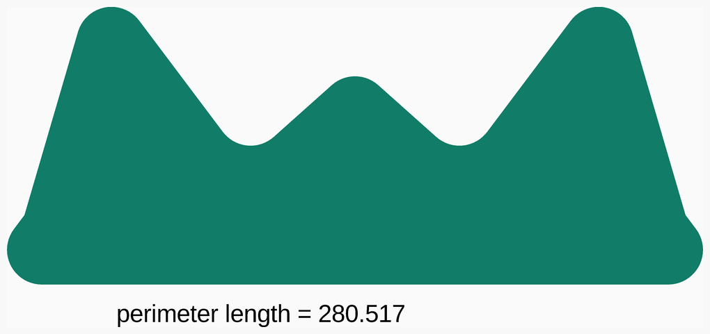

<a href="#top">Top</a>

---

## Rounded_triangle
Draw a 3D right triangle with rounded edges. Intended to be embedded in other parts. Can be optionally offset by the filleted amount.

[utils/rounded_triangle.scad](utils/rounded_triangle.scad) Implementation.

[tests/rounded_triangle.scad](tests/rounded_triangle.scad) Code for this example.

### Modules
| Module | Description |
|:--- |:--- |
| `rounded_right_triangle(x, y, z, fillet, center = true, offset = false)` | Draw a 3D right triangle with rounded edges. |

<a href="#top">Top</a>

---

## Sector
A sector of a circle between two angles.

[utils/sector.scad](utils/sector.scad) Implementation.

[tests/sector.scad](tests/sector.scad) Code for this example.

### Modules
| Module | Description |
|:--- |:--- |
| `sector(r, start_angle, end_angle)` | Create specified sector given radius `r`, `start_angle` and `end_angle` |

<a href="#top">Top</a>

---

## Sweep
Utility to generate a polhedron by sweeping a 2D profile along a 3D path and utilities for generating paths.

The initial orientation is the Y axis of the profile points towards the initial center of curvature, Frenet-Serret style.
Subsequent rotations use the minimum rotation method.

The path can be open or closed. If closed sweep ensures that the start and end have the same rotation to line up.
An additional twist around the path can be specified. If the path is closed this should be a multiple of 360.

[utils/sweep.scad](utils/sweep.scad) Implementation.

[tests/sweep.scad](tests/sweep.scad) Code for this example.

### Functions
| Function | Description |
|:--- |:--- |
| `after(path1, path2)` | Translate `path2` so its start meets the end of `path1` and then concatenate |
| `arc_points(r, a = [90, 0, 180], al = 90)` | Generate the points of a circular arc |
| `before(path1, path2)` | Translate `path1` so its end meets the start of `path2` and then concatenate |
| `cap(facets, segment = 0, end)` | Create the mesh for an end cap |
| `circle_points(r = 1, z = 0, dir = -1)` | Generate the points of a circle, setting z makes a single turn spiral |
| `helical_twist_per_segment(r, pitch, sides)` | Calculate the twist around Z that rotate_from_to() introduces |
| `path_length(path, i = 0, length = 0)` | Calculated the length along a path |
| `rectangle_points(w, h)` | Generate the points of a rectangle |
| `skin_faces(points, npoints, facets, loop, offset = 0)` | Create the mesh for the swept volume without end caps |
| `sweep(path, profile, loop = false, twist = 0)` | Generate the point list and face list of the swept volume |

### Modules
| Module | Description |
|:--- |:--- |
| `sweep(path, profile, loop = false, twist = 0, convexity = 1)` | Draw a polyhedron that is the swept volume |

<a href="#top">Top</a>

---

## Thread
Utilities for making threads with sweep. They can be used to model screws, nuts, studding, leadscrews, etc, and also to make printed threads.

The ends can be tapered, flat or chamfered by setting the `top` and `bot` parameters to -1 for tapered, 0 for a flat cut and positive to
specify a chamfer angle.

Threads are by default solid, so the male version is wrapped around a cylinder and the female inside a tube. This can be suppressed to just get the helix, for
example to make a printed pot with a screw top lid.

A left hand thread can be made by using mirror([0,1]).

Threads with a typical 60 degree angle appear too bright with OpenSCAD's primitive lighting model as they face towards the lights more than the top and sides of
a cylinder. To get around this a colour can be passed to thread that is used to colour the cylinder and then toned down to colour the helix.

Making the ends requires a CGAL intersection, which make threads relatively slow. For this reason they are generally disabled when using the GUI but can
be enabled by setting `$show_threads` to `true`. When the tests are run, by default, threads are enabled only for things that feature them like screws.
This behaviour can be changed by setting a `NOPSCADLIB_SHOW_THREADS` environment variable to `false` to disable all threads and `true` to enable all threads.
The same variable also affects the generation of assembly diagrams.

Threads obey the $fn, $fa, $fs variables.

[utils/thread.scad](utils/thread.scad) Implementation.

[tests/thread.scad](tests/thread.scad) Code for this example.

### Functions
| Function | Description |
|:--- |:--- |
| `metric_coarse_pitch(d)` | Convert metric diameter to pitch |
| `thread_profile(h, crest, angle, overlap = 0.1)` | Create thread profile path |

### Modules
| Module | Description |
|:--- |:--- |
| `female_metric_thread(d, pitch, length, center = true, top = -1, bot = -1, colour = undef)` | Create female thread with metric profile |
| `male_metric_thread(d, pitch, length, center = true, top = -1, bot = -1, solid = true, colour = undef)` | Create male thread with metric profile |
| `thread(dia, pitch, length, profile, center = true, top = -1, bot = -1, starts = 1, solid = true, female = false, colour = undef)` | Create male or female thread, ends can be tapered, chamfered or square |

<a href="#top">Top</a>

---

## Tube
Simple tube or ring

[utils/tube.scad](utils/tube.scad) Implementation.

[tests/tube.scad](tests/tube.scad) Code for this example.

### Modules
| Module | Description |
|:--- |:--- |
| `rectangular_tube(size, center = true, thickness = 1, fillet = 0.5)` | Create a retangular tube with filleted corners |
| `ring(or, ir)` | Create a ring with specified external and internal radii |
| `tube(or, ir, h, center = true)` | Create a tube with specified external and internal radii and height `h` |
| `woven_tube(or, ir, h, center= true, colour = grey(30)` | Create a woven tube with specified external and internal radii, height `h`, colours, warp and weft |

<a href="#top">Top</a>

---

## BOM
Bill Of Materials generation via echo and the `bom.py` script. Also handles exploded assembly views and posing.
Assembly instructions can precede the module definition that makes the assembly.

Assembly views shown in the instructions can be large or small and this is deduced by looking at the size of the printed parts involved and if any routed
parts are used.
This heuristic isn't always correct, so the default can be overridden by setting the `big` parameter of `assembly` to `true` or `false`.

Setting the `ngb` parameter of `assembly` to `true` removes its column from the global BOM and merges it parts into its parent assembly column of the global BOM.
This is to prevent the global BOM page becoming too wide in large projects by having it include just the major assemblies.

The example below shows how to define a vitamin and incorporate it into an assembly with sub-assemblies and make an exploded view.
The resulting flat BOM is shown but heirachical BOMs are also generated for real projects.

If the code to make an STL or DXF is made a child of the `stl()` or `dxf()` module then the STL or DXF will be used in the assembly views generated by `views.py` instead of generating
it with code.
This can speed up the generation of the build instructions greatly but isn't compatible with STLs that include support structures.

The `pose()` module allows assembly views in the readme to be posed differently to the default view in the GUI:

* Setting the `exploded` parameter to `true` allows just the exploded version to be posed and setting to `false` allows just the assembled view to be posed, the default is both.
* If the `d` parameter is set to specify the camera distance then the normal `viewall` and `autocenter` options are suppressed allowing a small section to be zoomed in to fill the view.
* To get the parameter values make the GUI window square, pose the view with the mouse and then copy the viewport parameters from the Edit menu and paste them into the pose invocation.
* Two `pose()` modules can be chained to allow different poses for exploded and assembled views.

[utils/core/bom.scad](utils/core/bom.scad) Implementation.

[tests/BOM.scad](tests/BOM.scad) Code for this example.

### Functions
| Function | Description |
|:--- |:--- |
| `arg(value, default, name = "")` | Create string for arg if not default, helper for `vitamin()` |
| `bom_mode(n = 1)` | Current BOM mode, 0 = none, 1 = printed and routed parts and assemblies, 2 includes vitamins as well |
| `exploded()` | Returns the value of `$exploded` if it is defined, else `0` |
| `show_supports()` | True if printed support material should be shown |
| `value_string(value)` | Convert `value` to a string or quote it if it is already a string |

### Modules
| Module | Description |
|:--- |:--- |
| `assembly(name, big = undef, ngb = false)` | Name an assembly that will appear on the BOM, there needs to a module named `<name>_assembly` to make it. `big` can force big or small assembly diagrams. |
| `dxf(name)` | Name a dxf that will appear on the BOM, there needs to a module named `<name>_dxf` to make it |
| `explode(d, explode_children = false, offset = [0,0,0])` | Explode children by specified Z distance or vector `d`, option to explode grand children |
| `hidden()` | Make item invisible, except on the BOM |
| `no_explode()` | Prevent children being exploded |
| `no_pose()` | Force children not to be posed even if parent is |
| `not_on_bom(on = false)` | Specify the following child parts are not on the BOM, for example when they are on a PCB that comes assembled |
| `pose(a = [55, 0, 25], t = [0, 0, 0], exploded = undef, d = undef)` | Pose an STL or assembly for rendering to png by specifying rotation `a`, translation `t` and optionally `d`, `exploded = true for` just the exploded view or `false` for unexploded only. |
| `pose_hflip(exploded = undef)` | Pose an STL or assembly for rendering to png by flipping around the Y axis, `exploded = true for` just the exploded view or `false` for unexploded only. |
| `pose_vflip(exploded = undef)` | Pose an STL or assembly for rendering to png by flipping around the X axis, `exploded = true for` just the exploded view or `false` for unexploded only. |
| `stl(name)` | Name an stl that will appear on the BOM, there needs to a module named `<name>_stl` to make it |
| `stl_colour(colour = pp1_colour, alpha = 1)` | Colour an stl where it is placed in an assembly. `alpha` can be used to make it appear transparent. |
| `use_dxf(name)` | Import a DXF to make a build panel |
| `use_stl(name)` | Import an STL to make a build platter |
| `vitamin(description)` | Describe a vitamin for the BOM entry and precede it with a module call that creates it, eg. "widget(42): Widget size 42" |

### Vitamins
| Qty | Module call | BOM entry |
| ---:|:--- |:---|
|   1 | `insert(F1BM3)` |  Heatfit insert M3 |
|   1 | `widget(3)` |  Rivit like thing for 3mm sheets |
|   1 | `screw(M3_cap_screw, 8)` |  Screw M3 cap x  8mm |
|   1 | `sheet(PMMA3, 20, 20, 1)` |  Sheet acrylic 20mm x 20mm x 3mm |
|   1 | `washer(M3_washer)` |  Washer  M3 x 7mm x 0.5mm |
|   1 | `star_washer(M3_washer)` |  Washer star M3 x 0.5mm |

### Printed
| Qty | Filename |
| ---:|:--- |
|   1 | widget.stl |

### Routed
| Qty | Filename |
| ---:|:--- |
|   1 | widget.dxf |

### Assemblies
| Qty | Name |
| ---:|:--- |
|   1 | widget_assembly |
|   1 | widget_base_assembly |
|   1 | widget_top_assembly |

<a href="#top">Top</a>

---

## Clip
Construct arbirarily large box to partition 3D space and clip objects, useful for creating cross sections to see the inside when debugging.

Original version by Doug Moen on the OpenSCAD forum

[utils/core/clip.scad](utils/core/clip.scad) Implementation.

[tests/clip.scad](tests/clip.scad) Code for this example.

### Modules
| Module | Description |
|:--- |:--- |
| `box(xmin, ymin, zmin, xmax, ymax, zmax)` | Construct a box given its bounds |
| `clip(xmin = -inf, ymin = -inf, zmin = -inf, xmax = inf, ymax = inf, zmax = inf)` | Clip child to specified boundaries |

<a href="#top">Top</a>

---

## Global
Global constants, functions and modules. This file is used directly or indirectly in every scad file.

[utils/core/global.scad](utils/core/global.scad) Implementation.

[tests/global.scad](tests/global.scad) Code for this example.

### Functions
| Function | Description |
|:--- |:--- |
| `Len(x)` | Returns the length of a list or 0 if `x` is not a list |
| `cm(x)` | cm to mm conversion |
| `echoit(x)` | Echo expression and return it, useful for debugging |
| `foot(x)` | Foot to mm conversion |
| `in(list, x)` | Returns true if `x` is an element in the `list` |
| `inch(x)` | Inch to mm conversion (For fractional inches, 'inch(1 + 7/8)' will work as expected.) |
| `limit(x, min, max)` | Force x in range min <= x <= max |
| `m(x)` | m to mm conversion |
| `mm(x)` | Explicit mm specified |
| `no_point(str)` | Replace decimal point in string with 'p' |
| `r2sides(r)` | Replicates the OpenSCAD logic to calculate the number of sides from the radius |
| `r2sides4n(r)` | Round up the number of sides to a multiple of 4 to ensure points land on all axes |
| `slice(list, start = 0, end = undef)` | Slice a list or string with Python type semantics |
| `sqr(x)` | Returns the square of `x` |
| `yard(x)` | Yard to mm conversion |

### Modules
| Module | Description |
|:--- |:--- |
| `circle4n(r, d = undef)` | Circle with multiple of 4 vertices |
| `ellipse(xr, yr)` | Draw an ellipse |
| `extrude_if(h, center = true)` | Extrudes 2D object to 3D when `h` is nonzero, otherwise leaves it 2D |
| `hflip(flip=true)` | Invert children by doing a 180&deg; flip around the Y axis |
| `render_if(render = true, convexity = 2)` | Renders an object if `render` is true, otherwise leaves it unrendered |
| `right_triangle(width, height, h, center = true)` | A right angled triangle with the 90&deg; corner at the origin. 3D when `h` is nonzero, otherwise 2D |
| `semi_circle(r, d = undef)` | A semi circle in the positive Y domain |
| `translate_z(z)` | Shortcut for Z only translations |
| `vflip(flip=true)` | Invert children by doing a 180&deg; flip around the X axis |

<a href="#top">Top</a>

---

## Polyholes
A method of making 3D printed holes come out the right size regardless of the printer, providing
it gets the linear dimensions right. See <https://hydraraptor.blogspot.com/2011/02/polyholes.html>

The module provides `poly_circle()`, `poly_cylinder()` and `poly_ring()` that is useful for making printed washers and pillars.

`poly_cylinder()` has a `twist` parameter which can be set to make the polygon rotate each layer.
This can be used to mitigate the number of sides being small and make small holes stronger and more round, but is quite slow due to the
large increase in the number of facets.
When set to 1 the polygons alternate each layer, when set higher the rotation takes `twist + 1` layers to repeat.
A small additional rotation is added to make the polygon rotate one more side over the length of the hole to make it appear round when
veiwed end on.

When `twist` is set the resulting cylinder is extended by `eps` at each end so that the exact length of the hole can be used without
leaving a scar on either surface.

[utils/core/polyholes.scad](utils/core/polyholes.scad) Implementation.

[tests/polyholes.scad](tests/polyholes.scad) Code for this example.

### Functions
| Function | Description |
|:--- |:--- |
| `corrected_diameter(d, n = undef)` | Adjusted diameter to make flats lie on the circle |
| `corrected_radius(r, n = undef)` | Adjusted radius to make flats lie on the circle |
| `sides(r, n = undef)` | Optimium number of sides for specified radius |

### Modules
| Module | Description |
|:--- |:--- |
| `drill(r, h = 100, center = true)` | Make a cylinder for drilling holes suitable for CNC routing, set h = 0 for circle |
| `poly_circle(r, sides = undef)` | Make a circle adjusted to print the correct size |
| `poly_cylinder(r, h, center = false, sides = undef, chamfer = false, twist = 0)` | Make a cylinder adjusted to print the correct size |
| `poly_drill(r, h = 100, center = true)` | Make a cylinder for drilling holes suitable for CNC routing if cnc_bit_r is non zero, otherwise a poly_cylinder. |
| `poly_ring(or, ir, sides = undef)` | Make a 2D ring adjusted to have the correct internal radius |
| `poly_tube(or, ir, h, center = false)` | Make a tube adjusted to have the correct internal radius |
| `slot(r, l, h = 100)` | Make a horizontal slot suitable for CNC routing, set h = 0 for 2D version |

### Vitamins
| Qty | Module call | BOM entry |
| ---:|:--- |:---|
|   1 | `sheet(Steel06, 20, 20, 1)` |  Sheet mild steel 20mm x 20mm x 0.6mm |
|   1 | `rod(1.5, 11)` |  Smooth rod 1.5mm x 11mm |
|   1 | `rod(10.5, 47)` |  Smooth rod 10.5mm x 47mm |
|   1 | `rod(10, 45)` |  Smooth rod 10mm x 45mm |
|   1 | `rod(1, 9)` |  Smooth rod 1mm x 9mm |
|   1 | `rod(2.5, 15)` |  Smooth rod 2.5mm x 15mm |
|   1 | `rod(2, 13)` |  Smooth rod 2mm x 13mm |
|   1 | `rod(3.5, 19)` |  Smooth rod 3.5mm x 19mm |
|   1 | `rod(3, 17)` |  Smooth rod 3mm x 17mm |
|   4 | `rod(3, 3)` |  Smooth rod 3mm x 3mm |
|   1 | `rod(4.5, 23)` |  Smooth rod 4.5mm x 23mm |
|   1 | `rod(4, 21)` |  Smooth rod 4mm x 21mm |
|   1 | `rod(5.5, 27)` |  Smooth rod 5.5mm x 27mm |
|   1 | `rod(5, 25)` |  Smooth rod 5mm x 25mm |
|   1 | `rod(6.5, 31)` |  Smooth rod 6.5mm x 31mm |
|   1 | `rod(6, 29)` |  Smooth rod 6mm x 29mm |
|   1 | `rod(7.5, 35)` |  Smooth rod 7.5mm x 35mm |
|   1 | `rod(7, 33)` |  Smooth rod 7mm x 33mm |
|   1 | `rod(8.5, 39)` |  Smooth rod 8.5mm x 39mm |
|   1 | `rod(8, 37)` |  Smooth rod 8mm x 37mm |
|   1 | `rod(9.5, 43)` |  Smooth rod 9.5mm x 43mm |
|   1 | `rod(9, 41)` |  Smooth rod 9mm x 41mm |

### Printed
| Qty | Filename |
| ---:|:--- |
|   1 | polyhole.stl |

<a href="#top">Top</a>

---

## Rounded_rectangle
Rectangle with rounded corners.

[utils/core/rounded_rectangle.scad](utils/core/rounded_rectangle.scad) Implementation.

[tests/rounded_rectangle.scad](tests/rounded_rectangle.scad) Code for this example.

### Modules
| Module | Description |
|:--- |:--- |
| `rounded_cube_xy(size, r = 0, xy_center = false, z_center = false)` | Like `cube()` but corners rounded in XY plane and separate centre options for xy and z. |
| `rounded_cube_xz(size, r = 0, xy_center = false, z_center = false)` | Like `cube()` but corners rounded in XZ plane and separate centre options for xy and z. |
| `rounded_cube_yz(size, r = 0, xy_center = false, z_center = false)` | Like `cube()` but corners rounded in YX plane and separate centre options for xy and z. |
| `rounded_rectangle(size, r, center = false, xy_center = true)` | Like `cube()` but corners rounded in XY plane and separate centre options for xy and z. |
| `rounded_square(size, r, center = true)` | Like `square()` but with with rounded corners |

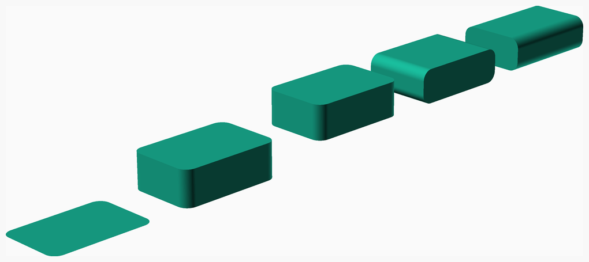

<a href="#top">Top</a>

---

## Sphere
Redefines `sphere()` to always have a vertex on all six half axes I.e. vertices at the poles and the equator and `$fn` a multiple of four.
This ensures `hull` and `minkowski` results have the correct dimensions when spheres are placed at the corners.

[utils/core/sphere.scad](utils/core/sphere.scad) Implementation.

[tests/sphere.scad](tests/sphere.scad) Code for this example.

### Modules
| Module | Description |
|:--- |:--- |
| `sphere(r = 1, d = undef)` | Override `sphere` so that has vertices on all three axes. Has the advantage of giving correct dimensions when hulled |

<a href="#top">Top</a>

---

## Teardrops
For making horizontal holes that don't need support material.
Small holes can get away without it, but they print better with truncated teardrops.

Using teardrop_plus() or setting the plus option on other modules will elongate the teardrop vertically by the layer height, so when sliced the staircase tips
do not intrude into the circle. See <https://hydraraptor.blogspot.com/2020/07/horiholes-2.html>

[utils/core/teardrops.scad](utils/core/teardrops.scad) Implementation.

[tests/teardrops.scad](tests/teardrops.scad) Code for this example.

### Modules
| Module | Description |
|:--- |:--- |
| `semi_teardrop(h, r, d = undef, center = true, chamfer = 0, chamfer_both_ends = true, plus = false)` | A semi teardrop in the positive Y domain |
| `teardrop(h, r, center = true, truncate = true, chamfer = 0, chamfer_both_ends = true, plus = false)` | For making horizontal holes that don't need support material, set `truncate = false` to make traditional RepRap teardrops that don't even need bridging |
| `teardrop_chamfer(h, center, chamfer, chamfer_both_ends)` | Helper module for adding chamfer to a teardrop |
| `teardrop_plus(h, r, center = true, truncate = true, chamfer = 0, chamfer_both_ends = true)` | Slightly elongated teardrop to allow for the 3D printing staircase effect |
| `tearslot(h, r, w, center = true, chamfer = 0, chamfer_both_ends = true, plus = false)` | A horizontal slot that doesn't need support material |
| `vertical_tearslot(h, r, l, center = true, chamfer = 0, chamfer_both_ends = true, plus = false)` | A vertical slot that doesn't need support material |

<a href="#top">Top</a>

---
